# pyreplay — the feature catalog

Every shipped feature of the two tools, one entry each, **ordered the
way you meet them** — the funnel, wide and cheap first: map the
codebase (free, nothing executes), record a run, heat the map and let
it aim you, then descend into the replayer's depth as questions get
harder. Read top to bottom the first time; jump by number after that.
The user guide (TUTORIAL.md) follows the same part structure.

Five fields per feature, always the same five:

- **Measured** — the mechanism: where the information comes from, what
  data is recorded.
- **Displayed** — where and how it appears in the replayer or the map.
- **Why** — what understanding it buys.
- **Use case** — one concrete situation where you reach for it.
- **Command** — the exact invocation (and, for viewer features, the
  gesture inside the page) that produces the feature.

Plus a **Screenshot** under most features (click to enlarge), captured
from a real run. Replayer shots use the in-repo examples (tinyshop and
the `example_*.py` fleet). The map shots use larger **external**
open-source codebases — not bundled here, to keep the repo small;
clone them if you want to reproduce those shots:
[PyTheus](https://github.com/artificial-scientist-lab/PyTheus),
[nengo](https://github.com/nengo/nengo),
[brian2](https://github.com/brian-team/brian2),
[pymdp](https://github.com/infer-actively/pymdp). A few features are
terminal reports or plumbing and honestly carry no shot.

The two tools, one contract:

- `tracer.py` records a real execution into a self-contained
  `trace_*.html` (the **replayer** — open in any browser, no server).
- `mapper.py` reads source with `ast` — nothing executes — into a
  self-contained `map_*.html` (the **map**), which adopts traces as a
  heat overlay (the **cockpit**).
- The event log embedded in the HTML is the contract between them.

House rule everywhere (**the honesty contract**): mark exactly what is
known; partial = unknown = unmarked; degrade gracefully, never show a
dead or invented panel; every cap and truncation is announced.

---

## Part 1 — The static map

The second tool: a codebase's geography from pure `ast` — nothing executes. Structure, cycles, walls, and graph theory over it all.

### 1. The map — a codebase's geography from pure `ast`
- **Measured:** every `.py` file parsed with `ast` — **nothing is
  executed, no dependencies needed**; imports resolved to project
  modules (relative imports included); layout by import depth.
- **Displayed:** `map_<name>.html`: modules as boxes in dependency
  layers, arrows toward dependencies, drag to pan, wheel to zoom,
  `fit` frames everything; a stats bar summarizes the codebase.
- **Why:** the wide, cheap end of the funnel — orientation in a foreign
  codebase for the price of a parse.
- **Use case:** first minute with a cloned repo: map it and see its
  layers before reading a single file.
- **Command:** `python3 mapper.py PyTheus` → open `map_PyTheus.html`
  (`--out NAME.html` names it explicitly).
- **Screenshot** — a whole-codebase map (PyTheus), zoomed to fit.

  [](screenshots/42-map.png)

### 2. Module expand — inventories on demand
- **Measured:** per module: top-level functions with their line
  numbers, classes with methods and bases.
- **Displayed:** click a box: function list plus classes drawn as a
  grid of chips; click again to fold back.
- **Why:** semantic zoom — the map answers "what's in here?" without a
  file open.
- **Use case:** hover the hot module the heat exposed, expand it, and
  pick the function to microscope — without leaving the map.
- **Command:** in the map: click any module box (click again to fold).
- **Screenshot** — an expanded module: function rows + class chips.

  [](screenshots/43-module-expand.png)

### 3. Class ancestry view
- **Measured:** base-class names extracted per class; local ancestry
  resolved inside the file/project.
- **Displayed:** click a class chip: its whole local ancestry lights
  green with inheritance edges; a panel lists the selected class's
  bases and methods.
- **Why:** in a monolith ("2000 lines of base classes + 50 subclasses
  in one file") this *is* the architecture view.
- **Use case:** tinyshop: click a cart class chip and see the
  inheritance spine light up to its root.
- **Command:** in the map: expand a module → click a class chip.
- **Screenshot** — a selected chip with its green ancestry and the bases/methods panel.

  [](screenshots/44-class-ancestry.png)

### 4. Override map via search
- **Measured:** method names indexed across all classes.
- **Displayed:** searching a method name highlights every class that
  defines or overrides it.
- **Why:** "who overrides `save()`?" answered in one keystroke — the
  question that otherwise needs an IDE and N clicks.
- **Use case:** search `export` and instantly see the three classes
  offering their own version.
- **Command:** in the map: type the method name in the header search
  box.
- **Screenshot** — a searched method lighting several class chips at once.

  [](screenshots/45-override-map.png)

### 5. Intra-file call graph
- **Measured:** static call extraction inside each file: direct calls
  resolved between its functions; entry points = functions called at
  module level (import time or under `__main__`); recursion detected.
  Calls through variables (`obj.method()`, dispatch tables) are not
  statically resolvable — the bottom note reports how many, always.
- **Displayed:** click a function name in an expanded module: **green**
  arrows fan out to its callees (rows light green), **amber dashed**
  arrows come in from its callers; **▸** marks entry points, **↺**
  marks recursion. Click the name again to clear; click the `:line`
  number instead for the scoped tracer command (see 60).
- **Why:** turns a single 900-line script from a dead list into its
  actual structure.
- **Use case:** atcoderhard.py: click `solve` and see exactly which
  helpers it drives and what calls *it*.
- **Command:** `python3 mapper.py .` (or any root) → expand a module →
  click a function *name* (the `:line` number composes the tracer
  command instead).
- **Screenshot** — a focused function with green callees and amber callers.

  [](screenshots/46-call-graph.png)

### 6. Module-level call routes
- **Measured:** static calls that cross module boundaries, with
  call-site counts.
- **Displayed:** toggleable dashed arrows between modules, labeled with
  counts.
- **Why:** import arrows say "knows about"; call routes say "actually
  uses" — different questions.
- **Use case:** two modules import `utils`; the routes show one calls
  into it 40 times, the other once.
- **Command:** in the map: tick the call-routes checkbox in the header.
- **Screenshot** — dashed call routes over the import arrows, counts visible.

  [](screenshots/47-call-routes.png)

### 7. Package folding — semantic zoom v2
- **Measured:** package membership from directory structure; folded
  metrics rolled up: module count, loc, heat share (summed, same
  palette), ⚠N exceptions, parse errors; edges into hidden modules
  re-attach to the package box and aggregate.
- **Displayed:** maps over 50 modules start folded (brian2's 309
  modules arrive as 49 readable boxes); click to unfold (members then
  behave like normal boxes); `fold pkgs` / `unfold` work the whole
  map; aggregated edges are thicker, tooltip lists the member-level
  imports; search sees inside folded packages.
- **Why:** the difference between "readable at first sight" and a
  hairball — scale without loss (roll-ups keep folded truth visible).
- **Use case:** map brian2: 49 package boxes tell the story; unfold
  only the subsystem you care about.
- **Command:** `python3 mapper.py brian2/brian2` (any >50-module root
  starts folded) → click a package box; `fold pkgs` / `unfold` in the
  header work the whole map.
- **Screenshot** — a big map folded, one package unfolded.

  [](screenshots/48-package-folding.png)

### 8. Import cycles — found and spotlit
- **Measured:** strongly connected components (Tarjan) on the static
  import graph.
- **Displayed:** three ways: the stats bar counts cycles; folded boxes
  hiding cycle edges carry a red **⭯N** pip; the bottom note lists
  every cycle — click one to spotlight it (members highlighted, edges
  red, all else dimmed). A header checkbox paints *every* cyclic edge
  red at once — off by default, because a codebase whose core is one
  big SCC would drown in red, and red must mean "look here".
- **Why:** cycles are the classic hidden architecture debt; detail on
  demand keeps the signal meaningful.
- **Use case:** the bottom note lists a 3-module cycle you didn't know
  about; one click isolates it on the map.
- **Command:** in the map: click a cycle in the bottom note (spotlight),
  or tick the `cycles` checkbox in the header (paint all).
- **Screenshot** — a spotlit cycle: red edges, dimmed surroundings.

  [](screenshots/49-cycles.png)

### 9. Sibling-edge suppression (⇄N)
- **Measured:** imports between two modules of the same package —
  the densest noise on a big map — counted instead of drawn.
- **Displayed:** an unfolded package shows an honest **⇄N** in its
  header; the edges appear exactly when you care: expand a member,
  search, click a cycle, or flip the cycles toggle. Cross-package
  edges always draw.
- **Why:** killed the "edge river" that made big unfolded packages
  unreadable — without hiding the truth (the count stays).
- **Use case:** unfold nengo's core package: readable boxes and "⇄41"
  instead of forty-one crossing arrows.
- **Command:** in the map: unfold a package and read the ⇄N in its
  header; expand a member module to make its sibling edges appear.
- **Screenshot** — an open package header with its ⇄N count.

  [](screenshots/50-sibling-edges.png)

### 10. Hover & expand edge focus
- **Measured:** each box's incident edges are indexed.
- **Displayed:** hovering any box — module or package, folded or open —
  lights its arrows instantly on a top layer (tail dot, bright head,
  fattened) while the rest recede; no click needed. Expanding a module
  selects its edges the same way, with `.rel` outlines on both endpoint
  boxes.
- **Why:** on a map with hundreds of edges, "whose arrows are whose"
  must be answerable by pointing.
- **Use case:** hover a suspicious module and see, in one motion,
  everything it touches and everything that touches it.
- **Command:** in the map: hover any box (no click); expanding a module
  selects its edges the same way.
- **Screenshot** — a hovered box with its edges lit and the rest faded.

  [](screenshots/51-hover-focus.png)

### 11. Walls — the load-bearing modules
- **Measured:** fan-in / fan-out per module from the static import
  graph (how many modules import me ←N vs how many I import →M).
- **Displayed:** a header-button panel: top-10 by fan-in; click a row
  to highlight that module on the map.
- **Why:** how you find a codebase's load-bearing walls before touching
  anything.
- **Use case:** brian2: `brian2/__init__` ←164, `utils.logger` ←55 —
  now you know what *everything* depends on.
- **Command:** in the map: click the `walls` header button; click a row
  to highlight that module.
- **Screenshot** — the walls panel with a clicked row highlighted on the map.

  [](screenshots/52-walls.png)

### 12. Search / spotlight
- **Measured:** all module, function and class names indexed —
  including inside folded packages.
- **Displayed:** the search box highlights matches on the map; a match
  living in a folded package lights the package box.
- **Why:** "where does sleep live?" is one keystroke on a 300-module
  map.
- **Use case:** search `canonicalize` on the PyTheus map and land on
  the right module without opening a file.
- **Command:** in the map: type any module/function/class name in the
  header search box.
- **Screenshot** — a search hit lighting a module (or a folded package).

  [](screenshots/53-search.png)

### 13. Parse-error tolerance & mixed-language honesty
- **Measured:** only `.py` files are read; a Python file that fails to
  parse (Python 2, templates) is recorded as an error, with
  `ast.parse(filename=…)` so warnings name the real file.
- **Displayed:** a red-dashed "parse error" box instead of a dead map;
  non-Python halves of a hybrid codebase are simply absent, stated in
  the notes.
- **Why:** real codebases are messy; one bad file must never kill the
  map, and what the map can't see it must say it can't see.
- **Use case:** mapping a repo with vendored Python-2 scripts: two red
  boxes, everything else maps normally.
- **Command:** `python3 mapper.py <repo-with-a-py2-file>` — automatic;
  the bad file becomes a red-dashed box, the run survives.
- **Screenshot** — a map containing a red-dashed parse-error box.

  [](screenshots/54-parse-errors.png)

### 14. External-dependency preflight
- **Measured:** every external import statically collected, then
  checked with `importlib.util.find_spec` — nothing executes; stdlib
  names (e.g. platform-guarded `msvcrt`) skipped.
- **Displayed:** a bottom-note line: "⚠ not importable here: numpy, …"
  — re-map inside the venv and the line disappears.
- **Why:** tomorrow's crash, announced today, for free.
- **Use case:** it predicted 2 of PyTheus's 3 first-run failures before
  any code ran.
- **Command:** `python3 mapper.py PyTheus` from *outside* the venv →
  read the ⚠ line in the bottom note; re-map inside the venv and it
  disappears.
- **Screenshot** — the ⚠ line on a map made outside the venv.

  [](screenshots/55-dep-preflight.png)

### 15. The graph lens — graph theory over the map's own graphs
- **Measured:** four instruments, pure stdlib, computed at map time:
  **betweenness centrality** (Brandes, directed — the modules import
  paths route THROUGH, not merely INTO); **communities** (label
  propagation, deterministic sweep, ties to the smallest label —
  singletons carry none); **percolation** (remove the top-k
  most-between modules by initial ranking, track the giant
  component's share of the original module count — the
  attack-tolerance curve); and the **degree distribution**. When a
  trace is adopted, betweenness is ALSO computed on the observed
  call-pair graph — every number names its graph.
- **Displayed:** lens select → **graph (structure)**: boxes tint
  violet by betweenness, and each module wears its detected
  community's border color — compare the borders against the package
  boxes and "is the architecture real?" becomes a picture (folded
  packages hide community borders; communities are module-level;
  said in the banner). The walls panel gains the ⛓ betweenness
  ranking beside fan-in ("fan-in counts doors, this counts
  corridors"), the observed-graph ranking when heat is adopted, the
  💥 dependency-fragility curve, and the degree line.
- **Why:** the map is a graph analyzed with a fraction of graph
  theory — fan counts degree, Tarjan finds cycles; bridges, clusters
  and fragility were invisible. Betweenness routinely crowns a
  different (and truer) load-bearing wall than fan-in does.
- **Use case:** nengo: fan-in crowns `nengo.exceptions` (←95 — a
  leaf everyone politely imports), betweenness crowns `nengo`,
  `nengo.base`, `nengo.simulator` — the actual corridors. On
  PyTheus, label propagation puts the tests in the SAME community as
  the code they test: the package boundary is real, the dependency
  boundary is not.
- **Command:** automatic on any map of ≥2 modules → lens
  **graph (structure)**, walls panel for the rankings. Honesty:
  percolation states its ranking is initial (not recomputed); the
  degree line says a straight line on log-log over this few points
  proves nothing; a single-module map carries no lens, never
  fiction.
- **Screenshot** — nengo's walls panel: fan-in top-10 above,
  betweenness crowning different modules below, the fragility curve
  sliding 95% → 77% over ten removals, the degree caution in fine
  print.

  [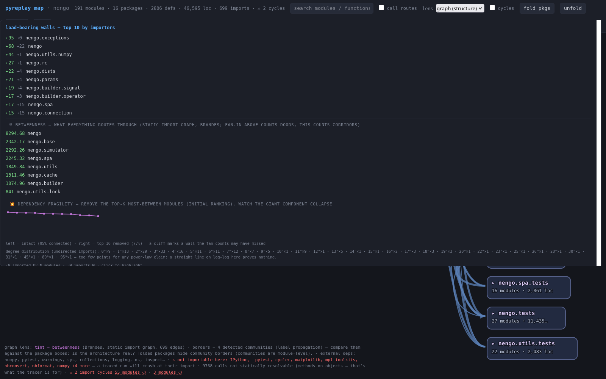](screenshots/129-graph-lens.png)

---

### 16. The project-wide call graph — def→def, resolved or labeled
- **Measured:** the same recorded call sites the map always scanned,
  kept at FUNCTION resolution instead of module counts: `from x
  import f; f()` and `x.f()` resolve to `module:def` edges when the
  name is among the target module's defs; `self.method()` resolves
  within its own class (same class only — inherited methods are
  runtime's job and stay unresolved, honestly). Every edge is
  labeled: **resolved** (`direct`/`self`) or **guessed** (internal
  module, name not found there — a re-export the parse can't
  confirm); `obj.method()` and dynamic dispatch stay in the
  unresolved counter, named as the trace's job (#39).
- **Displayed:** the walls panel gains **☎ load-bearing functions** —
  the top defs by cross-module fan-in (call sites × caller modules,
  resolved edges only), click to spotlight the module — plus the
  full honesty line (resolved · guessed · module-only · cannot
  attribute) and a banner count. The full edge list rides the
  payload (capped at 4000, stated) for anything downstream.
- **Why:** "who can reach this function from where?" across the
  whole codebase — the static skeleton the dynamic trace is drawn
  onto, finished. And function fan-in names different load-bearing
  walls than module fan-in does.
- **Use case:** nengo: 3,106 def→def sites resolve; the top
  functions are `exceptions:ValidationError` (←135 sites from 26
  modules) and `builder.signal:Signal` (←133) — the validation
  gate and the core datatype, invisible in module-level counts.
- **Command:** automatic on every map → walls panel. Honesty: 2,228
  guessed and 9,550 unattributable sites are COUNTED next to the
  3,106 resolved — the graph never pretends to be complete.
- **Screenshot** — nengo's walls: the load-bearing functions ranked,
  the four-way honesty line beneath.

  [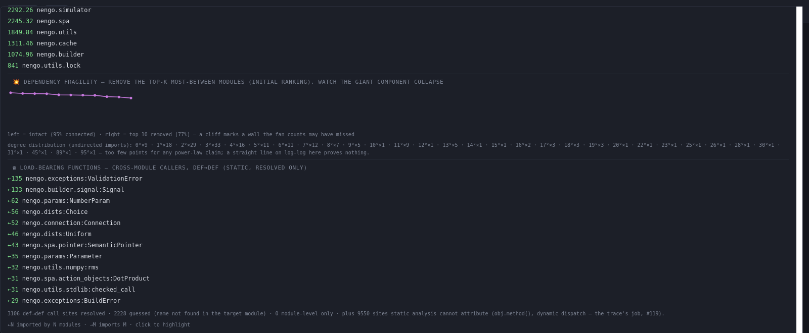](screenshots/94-callgraph.png)

## Part 2 — Record a run

Everything starts with one command over your own script. These are the recorder's controls: what gets traced, at which granularity, through which entry, and what protects the run.

### 17. Line-level recording
- **Measured:** `sys.settrace` hooks every line execution, call, return
  and exception in project files; each variable's value is fingerprinted
  per line so changes are detected element-by-element. ~8k events/s
  worst case; the target runs ~100× slower than normal at this level.
- **Displayed:** the whole run becomes a scrubbable film in the
  replayer: current line highlighted in the source, event badge
  (CALL/LINE/RETURN/EXCEPTION), live call stack, all frame variables.
- **Why:** the ground truth. Nothing is sampled or skipped — a complete,
  gapless record of what Python actually did, replayable forever.
- **Use case:** an AtCoder solution gives a wrong answer on sample 2;
  trace it with the sample piped to stdin and watch the exact iteration
  where the state diverges from your mental model.
- **Command:** `python3 tracer.py example_sort.py` → open
  `trace_example_sort.html` (line level is the default for scripts).
- **Screenshot** — replayer open on `trace_example_sort.html`, mid-run, all three panels visible.

  [](screenshots/01-line-recording.png)

### 18. Script entry — behaves exactly like `python3 script.py`
- **Measured:** the script runs with its own `__main__` guard firing,
  its own argv (pass arguments after the path), stdin piped through
  (`< input.txt`); output paths are anchored absolute at startup, so a
  target that `chdir`s can't misplace the trace.
- **Displayed:** output is `trace_<scriptname>.html` in the launch
  directory; re-runs never overwrite (`_2`, `_3`, …); `--out NAME.html`
  picks an explicit name (that one does overwrite). A hint prints when
  the program is probably waiting on stdin.
- **Why:** zero ceremony and zero surprises — if the script runs under
  python, it runs under the tracer.
- **Use case:** `python3 tracer.py solution.py < sample1.txt` — the
  competitive-programming loop, one command.
- **Command:** `python3 tracer.py solution.py arg1 arg2 < sample1.txt`
  · explicit name: `python3 tracer.py --out trace_run1.html solution.py`.
- **Screenshot** — terminal: the command and the "wrote trace_….html" line.

  [](screenshots/10-script-entry.png)

### 19. Project scoping (automatic)
- **Measured:** the tracer traces the entry script **plus every file
  imported from its own directory tree**; stdlib and site-packages are
  never traced (their frames are filtered at `call` time).
- **Displayed:** one source tab per traced file; foreign code simply
  doesn't appear — a call into numpy is one event, not ten thousand.
- **Why:** the trace stays about *your* code and stays small; tracing
  the stdlib would bury the signal and multiply the cost.
- **Use case:** tracing `tinyshop/main.py` records `main.py`, `cart.py`,
  `discounts.py` — and none of the `json` module internals.
- **Command:** `python3 tracer.py tinyshop/main.py` — no flag needed;
  the scope is the entry's directory tree (see 11 for `--root`).
- **Screenshot** — the file tabs of a tinyshop trace: project files only.

  [](screenshots/02-project-scoping.png)

### 20. Function granularity (`--granularity fn`)
- **Measured:** call/return/exception events only — no line events, no
  locals fingerprinting (shallow call arguments and return values are
  recorded). Near-free compared to line tracing.
- **Displayed:** same replayer; stepping moves call-to-call, returns
  show values and durations.
- **Why:** this is how a 200k-line codebase becomes traceable end-to-end
  in seconds — and it's the honest home of wall-clock time (see 05).
- **Use case:** first contact with a foreign library: fn-trace its test
  suite, load the heat onto the map, see which 5 of 300 modules did the
  work.
- **Command:** `python3 tracer.py --granularity fn tinyshop/main.py`
  (`-m` entries default to fn already — see 11).
- **Screenshot** — fn trace of tinyshop: the whole run in a few hundred events.

  [](screenshots/04-fn-granularity.png)

### 21. Module & pytest entry (`-m MODULE`, `--root DIR`)
- **Measured:** `-m MODULE [args…]` runs modules via
  `runpy.run_module`; `--root DIR` decouples the traced scope from the
  entry's folder. `-m pytest` traces a library's own test suite — the
  natural entry for code nothing runnable imports. Un-importable
  modules are refused up front with the full dotted name; with no test
  path named, pytest discovery is scoped to `--root` (not the CWD).
- **Displayed:** same trace/replayer; `-m` runs default to fn
  granularity (an explicit flag or a trigger keeps line level).
- **Why:** library code has no `main.py` — its tests are the honest
  entry point. This was the unlock for tracing foreign libraries.
- **Use case:** trace a research library through its own tests, scoped
  to its repo only.
- **Command:** `python3 tracer.py --root pymdp -m pytest
  pymdp/test/test_inference.py -n0 -q` (fn is the `-m` default) ·
  plain module: `python3 tracer.py --root pkg -m pkg.tool --its-args`.
- **Screenshot** — terminal: a `-m pytest` trace command completing with the trace path.

  [](screenshots/11-pytest-entry.png)

### 22. `--include` / `--exclude` scoping globs
- **Measured:** glob patterns matched against project-relative paths in
  the tracer's `call` filter; the mapper accepts the same vocabulary for
  its skip logic, so both tools speak one scoping language.
- **Displayed:** excluded files never produce events or tabs; an
  `--include` microscope records only the named files.
- **Why:** turns a whole-codebase trace into a targeted one — the
  difference between 2M events and 50k.
- **Use case:** the map shows `custom_loss.py` is hot; re-trace with
  `--include 'custom_loss.py'` at line level to see it breathe without
  paying for the rest of the codebase.
- **Command:** `python3 tracer.py --include 'cart.py' tinyshop/main.py`
  · `python3 tracer.py --exclude 'tests/*' main.py` · same flags on
  `mapper.py`. Repeatable; patterns are relative to the trace root.
- **Screenshot** — terminal command plus the resulting single-tab trace.

  [](screenshots/03-include-exclude.png)

### 23. Trace doctor — reactive guards (in every run)
- **Measured:** before running, the entry's imports are preflighted —
  a missing module is announced with the exact `pip install …` line;
  the same hint reappears after a `ModuleNotFoundError` crash; running
  the system python with a `.venv` present prints the activate line; a
  30-second stderr heartbeat reports elapsed time and events recorded
  (`PYREPLAY_HEARTBEAT=seconds` tunes it, `0` disables).
- **Displayed:** stderr, before/during/after the run — the trace itself
  stays clean.
- **Why:** the four first-run failure modes on a foreign codebase, each
  converted from a mystery into an instruction. "Frozen or working?"
  is never a guess again.
- **Use case:** first run of a cloned repo dies on imports — the
  message already contains the pip line to paste.
- **Command:** automatic on every run — no flag. Tune the heartbeat:
  `PYREPLAY_HEARTBEAT=10 python3 tracer.py script.py` (`0` disables).
- **Screenshot** — terminal: the preflight pip hint (or the 30s heartbeat lines).

  [](screenshots/13-trace-doctor.png)

### 24. `--doctor` — proactive environment report
- **Measured:** prefix any invocation with `--doctor`: runs nothing,
  writes nothing. Reports python/venv state (+ activate line), entry
  blockers (un-importable module/script → exit 3), codebase-wide
  missing dependencies with the recipe (`pip install -e <root>` when
  the root is a pip package, else the pip list), and pytest `addopts`
  traps — multi-line TOML parsed, forced xdist detected ("append
  `-n0`").
- **Displayed:** a plain-text setup report in the terminal, instead of
  the run.
- **Why:** tomorrow's crash announced today, without executing a line
  of foreign code.
- **Use case:** before tracing pymdp: `--doctor` flags that its
  pyproject forces `pytest-xdist` workers (which a tracer can't
  follow) and tells you to append `-n0` — verified on the real case.
- **Command:** `python3 tracer.py --doctor --root pymdp -m pytest
  pymdp/test/test_inference.py` — the exact run you intend, with
  `--doctor` prefixed; nothing executes.
- **Screenshot** — the full `--doctor` report for a codebase with a missing dep.

  [](screenshots/14-doctor.png)

### 25. In-process `watch()` — trace without the CLI
- **Measured:** `from tracer import watch` — `with watch():` brackets a
  block; `@watch()` records a function's first call (`once=False`:
  every call). The caller's frame is hand-registered so the block's own
  lines record; a block exception is recorded *and* re-raised; hitting
  the cap stops recording but **the host program runs on**; nested
  watch no-ops with a message; any prior debugger's `settrace` is
  restored on exit; `root=` overrides scope (notebooks).
- **Displayed:** the same self-contained `trace_watch*.html`, line
  granularity and provenance by default.
- **Why:** notebook cells, servers, long scripts — places you can't
  relaunch under a CLI — get the same film.
- **Use case:** wrap one suspicious cell of a Jupyter analysis in
  `with watch():` and get a full replayable trace of just that cell.
- **Command:** in the code itself —
  `from tracer import watch` then `with watch(): …` or `@watch()` on a
  def (`@watch(once=False)` for every call; `watch(root="…")` in
  notebooks); run the host normally: `python3 host.py`.
- **Screenshot** — a script with the `with watch():` block and the trace it produced.

  [](screenshots/12-watch.png)

### 26. Microsecond timestamps — only where time is true
- **Measured:** µs timestamps on call/return/exception events at fn
  granularity. **Honesty rule:** line-level traces carry *no*
  timestamps — under ~100× slowdown, wall times would be fiction.
- **Displayed:** every return shows "took 1.24 ms"; asyncio slices show
  per-slice and active-across-slices times; heat on the map becomes
  TIME (self) instead of event counts.
- **Why:** time attribution you can trust — and the explicit absence of
  numbers that would lie.
- **Use case:** "is the loss function or the graph setup eating the
  run?" — fn trace, read the cumulative times on the returns.
- **Command:** `python3 tracer.py --granularity fn example_tasks.py` →
  step to any RETURN event (timestamps come free with fn mode; there is
  no flag to add them to line traces, on purpose).
- **Screenshot** — a RETURN event with its "took … ms" annotation.

  [](screenshots/05-timestamps.png)

### 27. Threads
- **Measured:** all Python threads are traced (one process;
  `multiprocessing` children are a documented limit).
- **Displayed:** the call-stack panel is per-thread; events say which
  thread drove them.
- **Why:** interleaving is where the nastiest bugs live; per-thread
  stacks keep each story straight.
- **Use case:** a worker thread mutates a shared list while the main
  thread reads it — step through the interleaving and watch both stacks
  alternate.
- **Command:** `python3 tracer.py your_threaded_script.py` — automatic;
  no flag. (The permanent examples are single-threaded; use any
  `threading` script.)
- **Screenshot** — two thread stacks in the stack panel of a threaded trace.

  [](screenshots/09-threads.png)

### 28. Triggers — conditional recording
- **Measured:** `--start-at file.py:LINE`, `--start-count N`,
  `--start-when "EXPR"` (a Python expression over the frame's
  variables; combinable). Watching for the trigger is ~100× cheaper
  than recording; when it fires, the live call stack and all current
  variables are reconstructed as the first events.
- **Displayed:** the trace begins at the interesting moment with full
  context already populated; a banner reminds you pre-trigger execution
  is not in the film. If the trigger never fires, the tracer says so.
- **Why:** the "red dot that starts the camera" — skip millions of
  boring events for almost nothing, keep line-level detail where it
  matters. (Triggers need line events, so they don't combine with fn
  mode.)
- **Use case:** `--start-when "current_sum > 6000"` to begin filming at
  the exact moment a running total goes wrong, hours of loop later.
- **Command:** `python3 tracer.py --start-at solution.py:30 solution.py`
  · `--start-at solution.py:30 --start-count 57` (its 57th execution) ·
  `--start-when "x < 0"` (anywhere) · combined:
  `python3 tracer.py --start-at sol.py:13 --start-when "d[k] > q[k]"
  --start-count 2 sol.py`. The label is `filename:line` — it names an
  imported file when the trigger lives there
  (`--start-at helpers.py:42 main.py`).
- **Screenshot** — trace starting mid-program: stack already deep, trigger banner visible.

  [](screenshots/08-triggers.png)

### 29. Event cap (`--max-events`, default 200k)
- **Measured:** a hard counter; at the cap the recording *and the run*
  stop (CLI) — the film is gapless from the start, it just ends early.
  Input validated; ~2M events is the practical browser ceiling.
- **Displayed:** a banner in the replayer announces the truncation;
  Ctrl-C likewise keeps a valid partial trace and says so.
- **Why:** a runaway loop can't produce an unopenable 40 GB file; and a
  capped trace never silently pretends to be complete.
- **Use case:** tracing an optimizer that would run for hours — cap at
  200k, study the first phase, then use a trigger (08) to film a later
  one.
- **Command:** `python3 tracer.py --max-events 1000000 script.py`
  (default 200000; ~2M practical max). To see the banner cheaply:
  `python3 tracer.py --max-events 500 example_sort.py`.
- **Screenshot** — the truncation banner at the top of a capped trace.

  [](screenshots/07-max-events.png)

### 30. Chunked traces + keyframes (automatic past 100k events)
- **Measured:** past 100k events the artifact changes gear: the event
  JSON leaves the single embedded string and moves into gzip+base64
  chunk tags (a 245k-event trace: 29 MB → 1.16 MB, 25×), and the
  replayer builds **keyframes** — full state snapshots every 64k
  events, made lazily on the first deep jump. `--chunked` forces the
  format on, `--no-chunked` off.
- **Displayed:** invisible when healthy — the trace boots with a brief
  decompression progress note and replays identically; a deep jump
  resumes from the nearest keyframe instead of replaying from event
  zero (first jump ~115 ms while keyframes build, single-digit ms
  after). A missing chunk is announced loudly in the banner, never
  silently skipped. The Python readers — `--runs`, `--diverge`, map
  heat, `checks.py` — all read chunked artifacts transparently.
- **Why:** the single-JSON-string wall was the ceiling on everything
  big: whole-suite traces, flight-recorder dumps, long fn-level runs.
  Chunks remove the file-size wall; keyframes remove the
  seek-from-zero cost. (Video codecs' I-frames — literally that.)
- **Use case:** a whole-suite fn trace crosses 100k events; the file
  stays small enough to attach to an issue, opens in seconds, and a
  jump to event 200,000 doesn't replay 199,999 predecessors first.
- **Command:** automatic past 100k events; `--chunked` / `--no-chunked`
  to force. Replay needs `DecompressionStream` (Chrome 80+ /
  Firefox 113+ / Safari 16.4+). (Plumbing — no screenshot; its visible
  surface is the boot progress line and the banner.)

### 31. The black-box flight recorder (`--black-box`)
- **Measured:** recording becomes a ring buffer holding the LAST
  `--max-events` events (fn granularity by default); older events are
  rotated out and **counted** — the ring never truncates the run, only
  its own memory, so the usual cap machinery stays silent. `kill -USR1
  <pid>` dumps the current window as a normal trace WITHOUT stopping
  the run; the end (or crash) writes the final window as usual.
  In-process: `watch(ring=N)`.
- **Displayed:** ordinary traces, honest about what they are: the
  banner says how many early events rotated out — "the film starts
  mid-run" — and snapshot dumps are separate files you can open while
  the target keeps running.
- **Why:** the bug that takes an hour to appear does not need an
  hour-long trace. Pay ~nothing forever, have the film when it
  matters — and photograph a live process mid-flight without killing
  it.
- **Use case:** a long spin traced with `--black-box`: 60 rounds in,
  `kill -USR1` snapshots the live window (41 events already rotated
  out, says the banner), the run continues, and the crash at the end
  writes its own final window — the last moments, not the first.
- **Command:** `python3 tracer.py --black-box server.py`, window size
  set by `--max-events`; `kill -USR1 <pid>` for a mid-flight snapshot.
- **Screenshot** — the banner tells the story: 175,883 events rotated out of a 120-event ring; the film starts mid-run, on a YIELD.

  [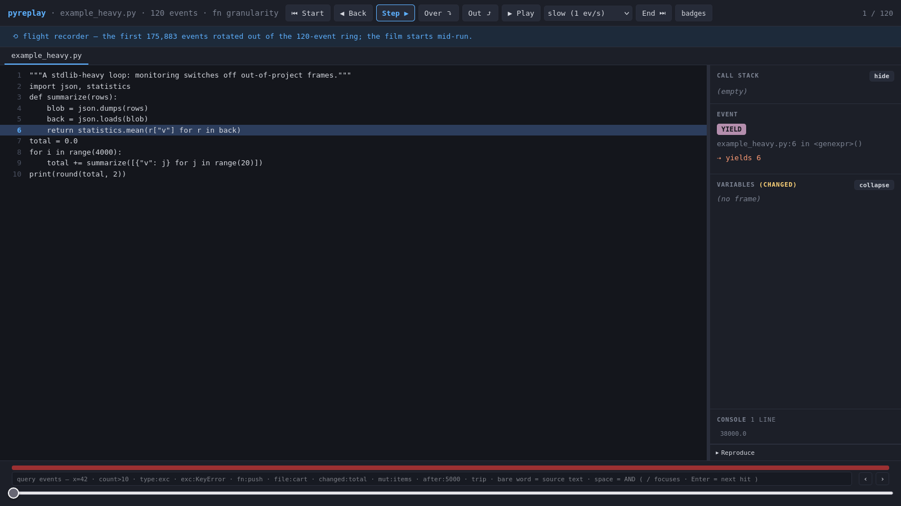](screenshots/103-black-box.png)

---

### 32. `sys.monitoring` backend (`--backend monitoring`, 3.12+)
- **Measured:** the same fn-level events recorded through PEP 669
  `sys.monitoring` instead of `settrace`; code outside the project is
  switched off at its first event and never pays again (~3× less
  overhead, more on stdlib-heavy runs). Exception parity with settrace
  is verified event-for-event in the regression suite (reraise,
  StopIteration, generator unwind — all byte-identical).
- **Displayed:** identical trace, identical viewer — the flag changes
  the engine, not the product.
- **Why:** speed on big runs today; the future-proof engine (suspensions
  arrive as first-class interpreter events there).
- **Use case:** fn-tracing a test suite that imports half of scipy —
  monitoring stops paying for scipy after one event per function.
- **Command:** `python3 tracer.py --granularity fn --backend monitoring
  script.py` (fn-only; needs Python ≥ 3.12).
- **Screenshot** — two terminal timings of the same run, settrace vs monitoring.

  [](screenshots/06-monitoring-backend.png)

### 33. LINE tracing on sys.monitoring — the microscope at engine prices
- **Measured:** `--backend monitoring` now records line granularity
  too (3.12+, PEP 669). LINE is registered but kept OUT of the
  global event mask; the first `PY_START` of each in-scope code
  object arms it with per-code `set_local_events` — the whole trick:
  out-of-scope code pays one DISABLEd `PY_START` instead of a
  callback per line. Line-mode callbacks route through the same
  dispatcher settrace uses, so triggers, `--check`, chaos pulses and
  snapshot lifecycle behave identically — parity by construction,
  verified event-for-event (changed-variable keys, generator
  suspensions, verdicts included) across generators, exceptions,
  match, dunder methods, aliasing and threads.
- **Displayed:** the same trace — plus, when it applies, the
  engine's one stated blind spot in the banner: *N comprehension(s)
  in scope run within ONE line event each; their per-iteration
  variables are not re-observed (the settrace engine shows every
  iteration).* PEP 709 inlines comprehensions; PEP 669 fires LINE
  once per line transition. The payload carries `engine` and the
  comprehension count.
- **Why:** every line-level feature — verdicts, provenance, the
  decision table, the CFG weights — gets cheaper exactly where big
  codebases hurt: the out-of-scope bulk. Honest numbers: with
  everything in scope the recording tax dominates (engine ~12%
  faster); where out-of-scope Python dominates, total overhead
  halves (deepcopy fixture: 7.0× → 3.4× untraced).
- **Use case:** a line microscope on one module of a large service:
  the stdlib and site-packages cost one disabled event per code
  object instead of a Python callback per executed line.
- **Command:** `python3 tracer.py --backend monitoring app.py`
  (line is the script default; `--granularity fn` still composes).
- **Screenshot** — the visible part is the honesty: the engine
  banner naming itself and its one blind spot, over an
  otherwise-identical trace:

  [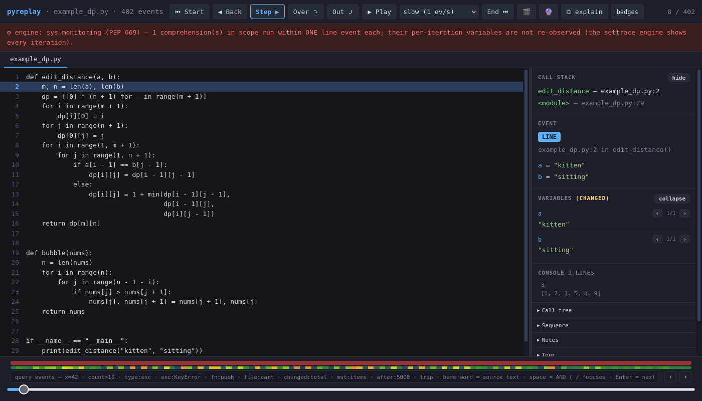](screenshots/102-monitoring-line.png)

### 34. The reproducibility capsule (Tier 1)
- **Measured:** every trace embeds the run's identity: the exact
  command and argv, cwd, python/platform versions, `PYTHONHASHSEED`
  (with a random-order warning when unset), a curated subset of env
  keys, a timestamp — and the stdin bytes the run actually
  **consumed**, captured by a lazy tee: only what was read is stored,
  and a pipe that never closes cannot hang the start.
- **Displayed:** the viewer's **Reproduce** box — the rerun command
  with a copy button, the environment facts, and the consumed stdin
  downloadable as `stdin.bin`. `watch()` traces carry a host capsule.
- **Why:** a trace answers "what happened"; the capsule answers "can
  anyone make it happen again" — the difference between a report and
  a specimen. Every issue this tool produces becomes a rerunnable one.
- **Use case:** a colleague sends `trace_solver.html`. The Reproduce
  box hands you the exact command and the exact input bytes; one
  paste and you are looking at the same bug live, not a description
  of it.
- **Command:** automatic in every trace — open the Reproduce box in
  the viewer. (Seed capture and deterministic replay are this
  feature's roadmap sequels — Tiers 2–3.)
- **Screenshot** — the Reproduce box open: the exact rerun command
  (`… < stdin.bin`), cwd, python/platform, the PYTHONHASHSEED
  warning, and the consumed stdin as a download.

  [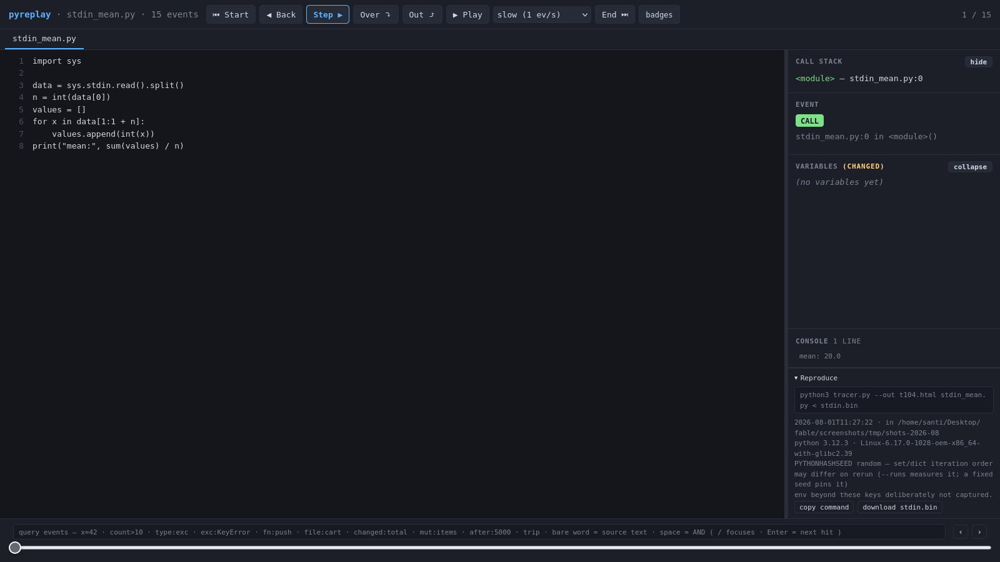](screenshots/104-capsule.png)

---

## Part 3 — The cockpit: heat & the funnel

Adopt a trace onto the map and the geography gains weather — where the run actually lived, what the parse couldn't see, and the ⌖ that writes your next command.

### 35. Heat overlay — the trace drawn onto the map
- **Measured:** a trace is aggregated per module: event counts (line
  traces) or self-time (fn traces), first-touch order, exception
  counts, per-function counts and times.
- **Displayed:** modules tinted on a weather-radar palette by their
  ABSOLUTE share of the run (0% no tint → faint blue → teal → green →
  yellow → orange → red at 100%); the exact % printed on every box;
  the bottom note names the metric honestly — **EVENT COUNTS** or
  **TIME (self)** — plus a legend; untouched modules fade; **#1, #2…**
  badges show execution order; **⚠N** pips mark modules where hard
  exceptions fired; expanded function rows show **×N** calls and
  cumulative time (self/cum in the tooltip); class chips tint by their
  methods' heat; a `heat` checkbox toggles the overlay.
- **Why:** one glance answers "which part of this codebase actually
  executes, in what order, and where do time and exceptions
  concentrate?" — honest details included (imports execute top-level
  code, so "cold" modules legitimately show a few events).
- **Use case:** PyTheus: the heat verdict was
  `custom_loss.assembly_index` = 6.28 s = 94% of the run — the whole
  investigation aimed itself.
- **Command:** `python3 tracer.py --granularity fn app/main.py` then
  `python3 mapper.py app` (auto-heat adopts the trace — see 57); the
  `heat` checkbox toggles the overlay.
- **Screenshot** — a heated map: palette, #order badges, ⚠ pips, one expanded module with ×counts.

  [](screenshots/56-heat.png)

### 36. Auto-heat — the map finds its own trace
- **Measured:** with no `--trace` flag, the mapper scans for the newest
  `trace_*.html` (working dir + mapped root) whose traced files belong
  to the codebase being mapped — suffix-aware, never guessed across
  codebases; microscope traces (`--include`, 1-module) and duds are
  skipped so they can't swamp the colors.
- **Displayed:** adoption announced on stdout; `--trace FILE` picks
  explicitly; `--no-trace` refuses automation.
- **Why:** the funnel becomes self-contained: trace once, and every
  later map of that codebase carries heat and complete ⌖ commands by
  itself.
- **Use case:** trace once, then map — two commands, heated map, no
  plumbing.
- **Command:** `python3 mapper.py repo` (adopts automatically, announced
  on stdout) · `python3 mapper.py --trace trace_run.html repo`
  (explicit) · `python3 mapper.py --no-trace repo` (off).
- **Screenshot** — mapper stdout announcing which trace(s) it adopted.

  [](screenshots/57-auto-heat.png)

### 37. Multi-trace heat aggregation
- **Measured:** `--trace` is repeatable; `aggregate_heat()` sums
  per-module events, self-time, exceptions and per-function stats
  across runs; auto-heat adopts ALL matching broad traces.
- **Displayed:** one combined heat overlay; the note reflects the
  aggregate.
- **Why:** heat is workload-relative — a unit test over-weights imports
  (measured on brian2: a module 0.3% under one test vs 11.3% under a
  real simulation). The tool can't guess a representative workload,
  but it *can* combine the runs you make.
- **Use case:** trace the test suite AND a real simulation, map once —
  the palette now reflects both workloads.
- **Command:** `python3 mapper.py --trace trace_tests.html --trace
  trace_sim.html repo` (or just `python3 mapper.py repo` — auto-heat
  adopts all matching broad traces).
- **Screenshot** — mapper adopting two traces; the combined overlay.

  [](screenshots/58-multi-trace.png)

### 38. Heat as data (`--heat-out agg.json`)
- **Measured:** the same per-module/per-function aggregate the overlay
  uses.
- **Displayed:** written as plain JSON next to the map — layer-2
  contract discipline: the aggregate is an artifact, not just pixels.
- **Why:** downstream analysis (diff two aggregates, plot, feed CI)
  without scraping HTML.
- **Use case:** save `agg.json` before and after an optimization and
  diff the module shares.
- **Command:** `python3 mapper.py --heat-out agg.json repo`.
- **Screenshot** — the JSON file opened beside the heated map.

  [](screenshots/59-heat-out.png)

### 39. Dark edges — what the run saw that the parse couldn't (v1)
- **Measured:** while a trace's heat is adopted, every cross-module
  call the run made is collected (per thread·task lane, direct caller
  only) and diffed against the static routes — imports AND resolvable
  call edges. Pairs with no static route are DARK: dispatch tables,
  callbacks, plugin registries, `importlib` loads. On the AST side,
  every `__import__` / `import_module` call site is flagged up front
  ("target unknown until a run is traced"). Aggregates across all
  adopted traces.
- **Displayed:** dashed **⚡ dark edges** arcing over the boxes with
  call counts, on their own toggle beside call routes; the banner
  counts them (top-200 drawn, the cap stated); flagged modules wear ⚡
  with the site count in their tooltip. Every dark edge's tooltip
  repeats the rule: observed in the adopted run(s) — the absence of a
  dark edge is never evidence of absence.
- **Why:** the map's documented blind spot is dynamic binding — an
  event-driven codebase can look disconnected statically while being
  densely wired at runtime. The overlay makes the map stop
  under-reporting exactly where under-reporting is most dangerous,
  and the honesty count ("N calls not statically resolvable") finally
  becomes a picture.
- **Use case:** a plugin registry: `core.dispatch` calls
  `plugins.double` through a dict, so the parse sees core touching
  plugins never. The trace draws core ⤳ plugins dashed ×1 — and
  main's `importlib.import_module("…plugins")` shows as its own dark
  edge, with main flagged ⚡.
- **Command:** any map with adopted heat — `python3 mapper.py --trace
  trace_x.html path/`, or auto-heat. fn traces give the cleanest
  pairs. (Runtime-import reconciliation against static import edges
  is the roadmap remainder.)
- **Screenshot** — the registry demo: two dashed dark edges with ⚡
  counts over the blue static imports, main flagged, the banner
  counting them.

  [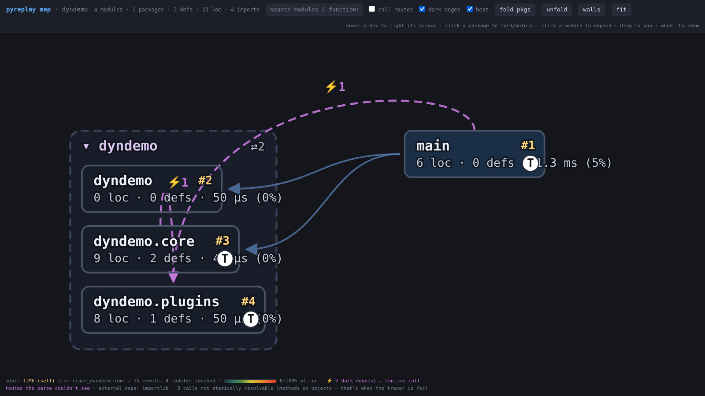](screenshots/119-dark-edges.png)

### 40. Import-cost view — the startup autopsy
- **Measured:** nothing new is recorded — a lens over any adopted fn
  trace: the cumulative time inside each module's `<module>` frame IS
  its import cost (cumulative on purpose: a slow import's children
  are the point, not an accounting detail). Sums across all adopted
  runs; line traces carry no wall times, so the autopsy is honestly
  absent there.
- **Displayed:** the walls panel grows a **⚙ startup autopsy**
  section — total import time and the ranked offenders, each row a
  click-to-spotlight on the map; the heat banner carries the total.
  The mapper's terminal prints the top three.
- **Why:** slow CLI and test startup is pure import cost and nobody
  knows whose. `python -X importtime` answers in a wall of text;
  this lands the same answer on the map, with jump links, from data
  every fn trace already had.
- **Use case:** "161.5 ms before main() — main 81.3 ms, slowmod
  80.2 ms, fastmod 20 µs": the sleeper import named and clickable,
  the trivial one exonerated at a glance.
- **Command:** any map with an adopted fn trace — open **walls**.
  `python3 mapper.py --trace trace_x.html path/` or auto-heat.
- **Screenshot** — the walls panel: load-bearing walls above, the
  startup autopsy ranked below.

  [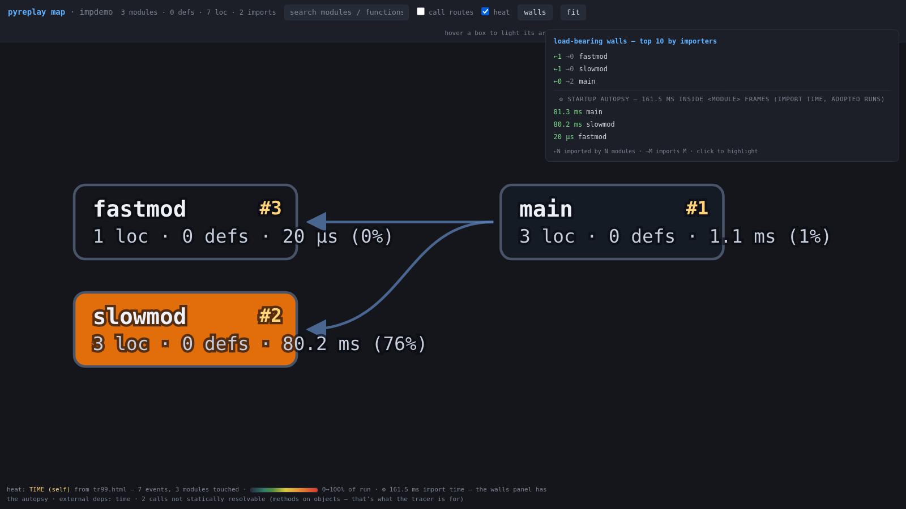](screenshots/99-import-cost.png)

---

### 41. ⌖ funnel handoff — the map writes your next command
- **Measured:** composition logic per box: a module with an
  `if __name__ == "__main__"` block gets a complete self-run command;
  a library module **borrows** the nearest runnable importer as entry
  (import graph walked backwards); test-reachable modules get real
  `--granularity fn --root … -m pytest <testfile>` commands; only true
  orphans show a `YOUR_SCRIPT.py` placeholder — honestly labeled, with
  a note when pytest-style tests import the module. Entry paths are
  absolute; function rows add `--include` scoping and `--start-at` at
  the def's line.
- **Displayed:** a white **T** disc on boxes with real code (never on
  parse-error or empty scaffolding boxes); clicking it — or any
  function row's `:line` — fills a copy box with the exact runnable
  tracer command.
- **Why:** the map tells you WHERE; the ⌖ writes the HOW. The funnel's
  steps teach themselves, and composed commands default to fn — a
  line-level whole-suite trace once cost 7 minutes and 663 MB before
  this lesson.
- **Use case:** click ⌖ on a PyTheus module, paste the command, get the
  scoped microscope trace — no manual flag archaeology.
- **Command:** in the map: click the white **T** disc on a module box
  (whole-module command), or a function row's `:line` (adds `--include`
  + `--start-at`); paste from the copy box into a terminal.
- **Screenshot** — the copy box showing a composed command for a clicked module.

  [](screenshots/60-funnel-handoff.png)

## Part 4 — Read the replay

Open the generated HTML. Before any instrument, learn to move: step, scrub, search, share a moment.

### 42. Playback controls & scrubber
- **Measured:** every event is indexed; the scrubber maps the whole
  timeline; play speeds are events/second (crawl 0.5 · slow 1 · normal
  3 · fast 12 · turbo 66).
- **Displayed:** `⏮ ◀ Step▶ Over⤵ Out⤴ ▶Play speed ⏭` plus the
  bottom scrubber; keyboard `←/→`, `Space`, `Home/End`.
- **Why:** a debugger only walks forward; a film scrubs both ways at
  any speed — and "let it play" is a real way to *watch* an algorithm.
- **Use case:** play a sort at speed 3 and watch the bars organize
  themselves; scrub back when something odd flashes by.
- **Command:** any trace; in the viewer: `←`/`→` step, `Space`
  play/pause, `Home`/`End` jump, drag the scrubber, pick a speed.
- **Screenshot** — the control bar and scrubber under a trace.

  [](screenshots/15-playback.png)

### 43. Step-over / step-out
- **Measured:** O(1) jumps on the frame-id index: *over* = next event
  in the same frame; *out* = the caller's next event.
- **Displayed:** `Over ⤵` / `Out ⤴` buttons, keys `O` / `U`.
- **Why:** a 500-event helper call becomes one click — the single
  biggest navigation upgrade for deep traces.
- **Use case:** stepping through `main()` without drowning in a
  `parse()` you already trust: `O`, `O`, `O`.
- **Command:** in the viewer: `O` (over) / `U` (out), or the `Over ⤵` /
  `Out ⤴` buttons.
- **Screenshot** — before/after an `Over` on a call line (event counter jumped past the callee).

  [](screenshots/16-step-over-out.png)

### 44. Event panel — the line's own cast, before it acts
- **Measured:** per line, the variables that line mentions, with their
  values as of *before* the line executes (a line's effect appears on
  the next event); return values ride on RETURN events.
- **Displayed:** the Event panel lists them next to the badge — read
  the inputs, predict, then step. An object mentioned only through
  specific attributes (`self.G`) shows just those attribute rows, not
  the whole object; a bare mention (or anything the static pass can't
  see) keeps the full object — and the badges menu's "full objects in
  line panel" toggle restores the old behavior.
- **Why:** matches how you reason about a line: what does it see, what
  will it do.
- **Use case:** before stepping an `if`, read the operands it's about
  to compare and call the verdict in your head first.
- **Command:** automatic on every LINE event of any line-level trace —
  read the Event panel before pressing `→`.
- **Screenshot** — a LINE event showing the mentioned variables' pre-values.

  [](screenshots/30-event-panel.png)

### 45. Status banner — the trace tells you its own caveats
- **Measured:** run outcome recorded at write time: crashed (trace kept
  up to the crash), event cap hit, trigger used, trigger never fired.
- **Displayed:** a banner across the top of the replayer stating
  exactly which caveat applies.
- **Why:** the honesty contract at file level — a partial film never
  masquerades as a complete one.
- **Use case:** opening a trace from last week: the banner alone tells
  you it stopped at the cap and where.
- **Command:** produce any caveated trace, e.g.
  `python3 tracer.py --max-events 500 example_sort.py` (cap banner) or
  `python3 tracer.py example_exceptions.py` (crash banner).
- **Screenshot** — a crashed run's banner ("trace kept up to the crash").

  [](screenshots/20-banner.png)

---

### 46. Density strip — the trace's shape at a glance
- **Measured:** events bucketed along the timeline, colored by source
  file.
- **Displayed:** a thin colored band above the scrubber; click any
  region to jump there.
- **Why:** the macro-structure of a big trace *before* scrubbing — you
  see the phases of the run like geological strata.
- **Use case:** red band then green band = "main ran, then cart took
  over" — click the boundary to land exactly at the handoff.
- **Command:** automatic on every trace (informative on multi-file
  ones): `python3 tracer.py tinyshop/main.py` → click a colored region
  of the strip.
- **Screenshot** — a multi-file trace (tinyshop) showing distinct colored phases.

  [](screenshots/18-density-strip.png)

### 47. Bookmarks
- **Measured:** `B` marks the current event; the jump list persists in
  browser localStorage per trace.
- **Displayed:** cyan marks above the scrubber; `[` / `]` jump between
  them; marks survive a page reload.
- **Why:** long study sessions become resumable; "the three moments
  that matter" stay one keypress away.
- **Use case:** mark the setup, the first anomaly and the crash, then
  bounce between them while forming a hypothesis.
- **Command:** in the viewer: `B` to mark/unmark, `[` / `]` to jump
  between marks; reload the page to confirm they persist.
- **Screenshot** — scrubber with three cyan bookmark ticks.

  [](screenshots/17-bookmarks.png)

### 48. Collapse mode & layout controls
- **Measured:** at each event the set of just-changed variables is
  known (same diff machinery as highlighting).
- **Displayed:** `C` (or the collapse button) shows only the variables
  changing *now* and hides the call stack (which also has its own
  hide/show); drag the code/sidebar divider to resize, double-click to
  reset.
- **Why:** functions with many locals push the action off-screen;
  collapse keeps the change in view.
- **Use case:** a solver with 15 locals — collapse, press play, and
  only the moving parts remain visible.
- **Command:** in the viewer: `C` (or the collapse button in the
  Variables panel); drag the divider, double-click it to reset.
- **Screenshot** — same event, normal vs collapsed variables panel.

  [](screenshots/19-collapse.png)

### 49. Deep links — a URL that opens a moment
- **Measured:** nothing new — the viewer state (event index, open
  variable, view choice, graph overlay) is serialized into the URL
  fragment on every navigation (debounced `replaceState`; history and
  the back button stay clean).
- **Displayed:** the address bar follows the replay:
  `trace_x.html#ev=8412&var=dist&view=graph&ov=seen`. Pasting such a
  link into a fresh page — or editing the hash of an open one — lands
  exactly there: event, life strip open, view set, overlay tinted.
- **Why:** debugging is collaborative; a screenshot shows a moment, a
  deep link IS the moment. A trace file plus a fragment is a pointer
  into an execution.
- **Use case:** reviewing a BFS with a friend: send the trace plus
  `#ev=81&var=adj&view=graph&ov=dist` — they open it mid-frontier,
  graph view on, distance tint applied, zero clicks.
- **Command:** any trace; navigate, then copy the address. Out-of-range
  events clamp; unknown variables/views degrade to cells — no dead
  panel. Every feature below that names a moment composes with this.
- **Screenshot** — a pasted `#ev=100&var=adj&view=graph&ov=dist` link, freshly opened: mid-BFS, graph view up, distance tint applied, zero clicks.

  [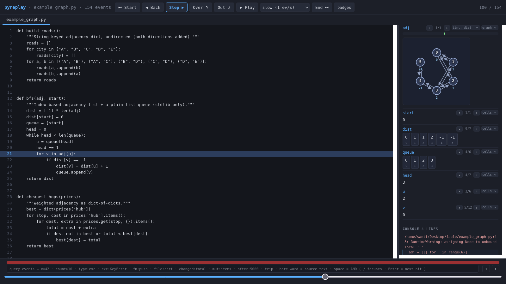](screenshots/106-deep-links.png)

### 50. The query bar — omniscient search
- **Measured:** a fixed grammar evaluated over the recorded events —
  `type:` `exc:` `fn:` `file:` `line:` `after:` `before:` `changed:`
  `mut:` `task:` `thread:` `trip`, `VAR=value`, `VAR<n` / `VAR>n`, and
  a bare word matches the source line's text — terms AND-composed.
  Value tests look at recorded CHANGE moments: the facts, never
  interpolation between them.
- **Displayed:** `/` focuses the bar; every hit becomes a magenta pin
  on the scrubber; Enter cycles through hits in order. A typo'd prefix
  is reported as a typo — never a silent zero-hit.
- **Why:** scrubbing answers "what does the run look like"; querying
  answers questions: *when* did total first go negative, *which*
  exceptions were born in this file — one line each, over the whole
  recorded history at once.
- **Use case:** `changed:total total<0` pins the first moment `total`
  went negative — Enter, and you are there. `type:exc file:cart.py`
  pins every exception cart.py ever raised in the run.
- **Command:** in any trace: press `/`, type, Enter. Composes with
  deep links (#49) — a queried moment is a shareable URL.
- **Screenshot** — `changed:dist` typed: 7 hits pinned magenta on the
  scrubber, Enter parked on the fourth change of `dist`, the changed
  cell highlighted.

  [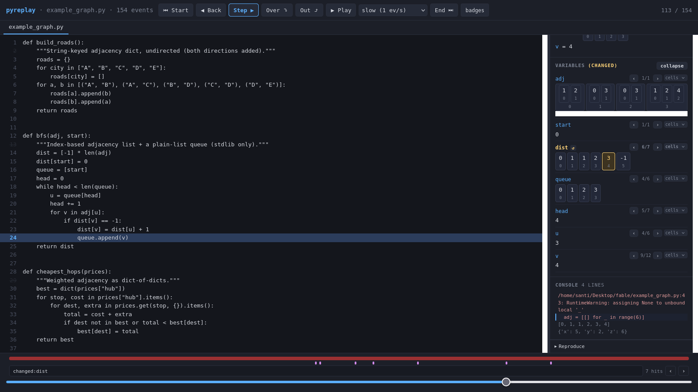](screenshots/109-query-bar.png)

### 51. Per-test chapters — the suite dissected
- **Measured:** `-m pytest` runs auto-inject a one-file plugin (passed
  on the plugin module's handle — `runpy` swaps `__main__`, so the
  obvious handoff fails); each test emits chapter events: start/end,
  nodeid, outcome. At the end the tracer joins per-test coverage with
  per-test outcomes — Ochiai suspiciousness (#113's math) from ONE
  suite run.
- **Displayed:** colored chapter spans over the scrubber (green pass,
  red fail); the current event always labeled with its owning test;
  TEST ▶/✓/✗ badges in the event stream; and when tests failed, THE
  SUSPECTS appear in the banner — each ranked line clickable.
- **Why:** a suite trace without chapters is one undifferentiated
  river of events. With them, every event belongs to a test, a failing
  test is a colored region you can scrub, and the pass/fail pattern
  becomes fault localization for free.
- **Use case:** on the verification mini-suite, the planted bug's line
  scored 1.00 suspiciousness — trace open to bug in two clicks: click
  the suspect, land on the line inside the failing test's span.
- **Command:** `python3 tracer.py -m pytest tests/` — automatic for
  pytest entries; fn granularity by default.
- **Screenshot** — three tests as scrubber spans (green · green · red); the failing suite's suspects ranked and clickable in the banner.

  [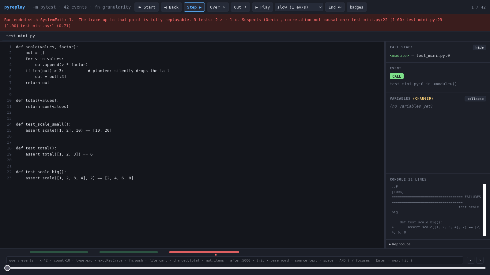](screenshots/98-per-test-chapters.png)

### 52. The compressibility strip — the run's regularity, measured
- **Measured:** at write time the event stream is cut into ≤120
  buckets and each bucket's JSON is gzipped: **bits per event**, per
  bucket and overall. A tight loop is low-entropy; data-dependent
  wandering is high — and a marked change in compressibility marks a
  **phase change** in the run. Traces under 50 events carry no strip
  (120 buckets of noise would claim precision that isn't there).
- **Displayed:** a thin strip directly under the density strip,
  colored by bits/event normalized to this trace's own range — dark
  = regular, bright = wandering. Hover any bucket for its exact
  bits/event and compression ratio; click to jump there. The strip's
  own tooltip carries the totals and the rule.
- **Why:** the run's regularity is a real observable no panel showed:
  where the program settled into a rhythm, and where it started
  doing something new — visible before you know what to look for.
- **Use case:** a two-phase script — a tight counting loop, then
  hash-string juggling: 235 bits/event dark stretch, a bright spike
  where the first hashes are born, ~499 through the wandering half.
  The phase boundary is findable by eye from the strip alone.
- **Command:** automatic in every trace of ≥50 events. Honesty,
  verbatim in the tooltip: gzip length is an *upper bound on the
  entropy rate* — the strip says "compressibility", never bare
  "entropy".
- **Screenshot** — the two-phase run: the density strip above, the
  compressibility strip below it — dark loop, bright transition
  spike, mid-bright wandering.

  [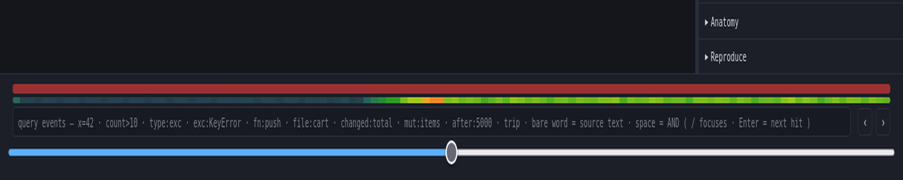](screenshots/130-compressibility.png)

## Part 5 — Variables & data structures

The right half of the screen: every value rendered by its shape, every change marked surgically, every variable with a navigable life.

### 53. Semantic rendering by type
- **Measured:** each value is encoded structurally (type, elements,
  keys, nesting, real length), not as a repr string.
- **Displayed:** lists/tuples as rows of indexed cells (tuples rounded,
  sets dashed), dicts as key→value rows, nesting recursive; hover any
  value for its Python type and real container size. Reprs are
  truncated (~120 chars, 20 items) — truncation always visible.
- **Why:** you read the *structure*, not a string; the same glance
  works for a matrix and a queue.
- **Use case:** a dict of lists in `example_histogram.py` reads as a
  table of rows instead of a 300-character repr.
- **Command:** `python3 tracer.py example_histogram.py` → hover values
  in the Variables panel for type + real size.
- **Screenshot** — variables panel with a list, a dict and a set side by side.

  [](screenshots/21-semantic-rendering.png)

### 54. Surgical change highlighting
- **Measured:** per-element fingerprint diffing between consecutive
  events — down to the deepest changed leaf; sets diff by membership
  (only truly-added elements), never by position.
- **Displayed:** only the changed thing lights up: the one swapped
  cell, the one dict entry, the one leaf in a nested structure.
- **Why:** "what did this line actually change?" answered visually,
  with no false flashes to chase.
- **Use case:** a swap in bubble sort lights exactly two cells; if a
  third lights up, you just found the bug.
- **Command:** `python3 tracer.py example_sort.py` → step across a swap
  line; automatic, no flag.
- **Screenshot** — a list with exactly two cells lit after a swap.

  [](screenshots/22-change-highlight.png)

### 55. Large containers — honest windows
- **Measured:** the first 30 elements are encoded, plus a "+K"
  remainder; when a change lands beyond the head, the encoding windows
  around it (±10 elements with real indices). Containers up to ~4096
  elements are change-tracked; beyond that (and for deep mutations
  inside dict values) changes past the head may go unseen — a
  documented cost/honesty trade-off, and anything unknown is unmarked
  rather than guessed (`chi`/`na` flags in the event data).
- **Displayed:** "…before / +after" edge cells around the window;
  change element 1500 of a 2000-list and you see cells 1490–1510 with
  1500 lit.
- **Why:** big data without lying about it — you always know what
  you're not seeing.
- **Use case:** a 2000-element sieve array — the view jumps to the
  region being written, real indices intact.
- **Command:** automatic — trace any script writing past index 30 of a
  big list (e.g. a sieve); the window follows the change with no flag.
- **Screenshot** — a windowed list showing real indices ~1500 with the changed cell lit.

  [](screenshots/27-windowing.png)

- **The global per-value budget (✂).** The per-level caps above bound
  each nesting level, but object attributes are deliberately
  depth-transparent and the cycle guard is path-local — so
  graph-shaped data (a grid node whose `connections` hold nodes whose
  `connections` hold nodes…) used to multiply those caps together:
  measured at 193 KB single events and a 105 MB trace on a real
  pathfinding library. Every top-level value (and every change
  window) now carries one total budget (~8 KB): when it runs out,
  descent stops and the value degrades to its repr **marked ✂**, with
  the same mark on the top-level value and a `[✂ budget-cut]` note in
  the explain bundle. Honesty rules: the cut is *announced at every
  node where structure was withheld* (`bt` in the event data), leaf
  fidelity is never cut (a primitive always shows whole), a plain
  opaque that would repr anyway is never stamped, and values that fit
  encode byte-identically to before. To see a cut region whole, step
  to where the inner object is its own variable — a fresh value gets
  a fresh budget.

  [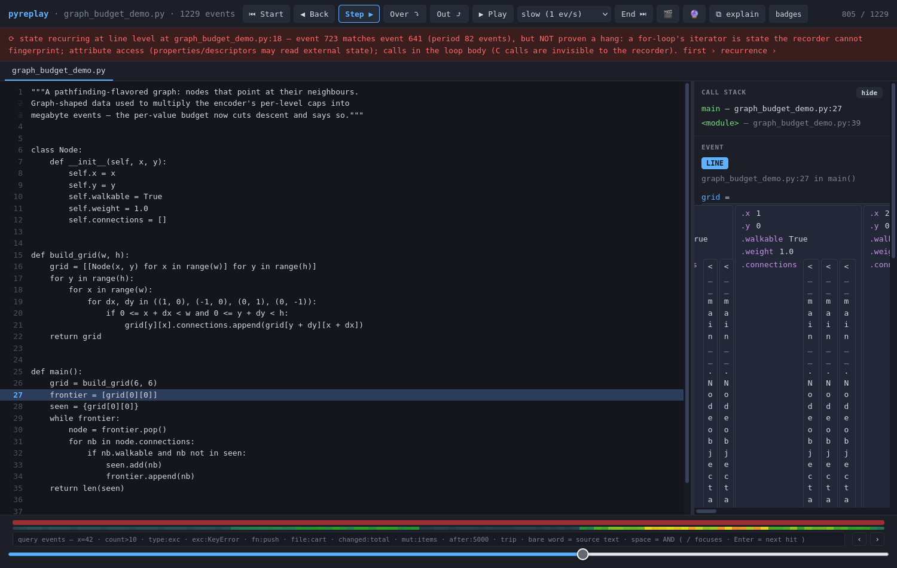](screenshots/55-enc-budget.png)

### 56. Alternate views: grid · bars · graph · edges
- **Measured:** shape detection on the encoded value: list-of-lists →
  grid; numeric list → bars; adjacency structures → graph; list of
  [u, v] pairs → edges. The choice is remembered per variable per
  script (localStorage).
- **Displayed:** a dropdown next to the variable name; change
  highlighting carries over (the updated grid cell, the swapped bars,
  the just-added edge glow).
- **Why:** a DP table *is* a grid, a sort *is* bars — rendering the
  shape the algorithm thinks in makes the algorithm visible.
- **Use case:** `example_dp.py`: watch the DP table fill diagonally in
  grid view — the recurrence pattern is suddenly obvious.
- **Command:** `python3 tracer.py example_dp.py` (grid) ·
  `python3 tracer.py example_sort.py` (bars) → pick the view in the
  dropdown next to the variable's name.
- **Screenshot** — the same list shown as cells and as bars (or the DP grid mid-fill).

  [](screenshots/23-alt-views.png)

### 57. The records table — rows-of-records in their native habitat
- **Measured:** nothing new — a `table` view offered by shape: every
  visible row a dict with the SAME key set (compared exactly), or a
  tuple of the same, fully visible length. Ragged key sets refuse —
  no invented columns; windowed inner tuples refuse — an absent cell
  must never read as data.
- **Displayed:** a real table beside `cells`/`grid` in the view
  select: one column per key (capped at 14, the cut announced), one
  row per record with its true index as the row header, the changed
  cell highlighted alone — dict rows diff by key against the old
  row, tuple rows positionally — and the container's `+K rows
  before/after` windowing honesty inherited. Click a column header
  to sort: ascending, descending, off. Sorting is DISPLAY order
  only; the row numbers scramble (the honest tell) and the note
  under the table says it verbatim — the data order is unchanged,
  and with a windowed container "only the visible window sorts".
- **Why:** rows-of-records is THE shape of real program data —
  query results, CSV rows, API responses — and nested cells render
  it as noise. A table is its native habitat, and per-cell diffing
  across time is the part no dataframe viewer has.
- **Use case:** an orders list where `restock()` mutates one record:
  at the mutation event the table lights exactly one `qty` cell;
  sort by price to read the table your way while the row indices
  keep telling the truth about where the data actually lives.
- **Command:** trace anything holding a uniform list-of-dicts →
  the variable's view select gains **table**.
- **Screenshot** — the restock moment, sorted by price descending:
  the mutated cell lit, the row indices scrambled, the honesty note
  under the table:

  [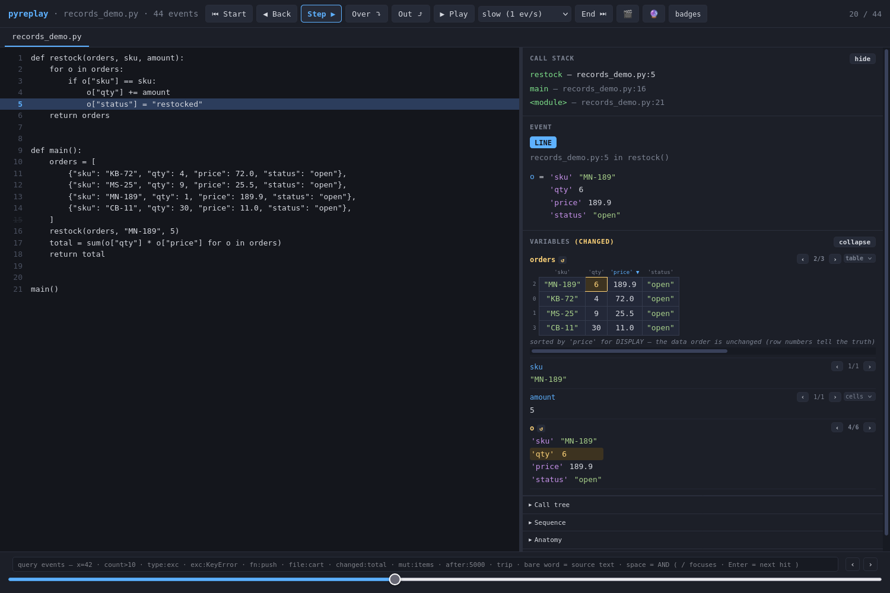](screenshots/112-records-table.png)

### 58. Graph view — generic shape recognition
- **Measured:** five adjacency shapes recognized with zero algorithm
  knowledge: `{node: [neighbors]}`, weighted `{u: {v: w}}` (weights on
  edges), index-based `adj[i] = [j, k]`, weighted index-based
  `[(nbr, w), …]` (neighbor position auto-detected), and `[[u, v], …]`
  edge lists (ambiguous with adjacency — both options offered).
- **Displayed:** real nodes and directed arrows; reciprocal pairs as
  two offset arrows; self-loops as arcs. Offered only up to 60 nodes —
  beyond that a node-link diagram is a hairball and the tool declines
  honestly.
- **Why:** graph algorithms stop being lists of numbers and become
  graphs.
- **Use case:** `example_graph.py`: `adj` drawn as the actual network
  while BFS walks it.
- **Command:** `python3 tracer.py example_graph.py` → choose `graph` in
  the dropdown next to `adj` (or `edges` on a `[[u, v], …]` list).
- **Screenshot** — an adjacency dict rendered as a directed graph.

  [](screenshots/24-graph-view.png)

### 59. Traversal overlay — tint a graph by another variable
- **Measured:** the frame's other variables are candidate overlays; per
  node the overlay value is resolved by membership (set/list) or lookup
  (dict/array).
- **Displayed:** a second dropdown ("tint: …") on a graph-viewed
  variable: a `visited` set turns members green (new ones flash), a
  distance array badges every node with its current value (changes
  flash amber), a queue/path highlights its members.
- **Why:** this is how you *watch* BFS/DFS/Dijkstra traverse — the
  algorithm's state painted onto the structure it walks.
- **Use case:** graph view on `adj`, tint by `dist`, press play: watch
  Dijkstra's frontier advance node by node.
- **Command:** `python3 tracer.py example_graph.py` → graph view on
  `adj`, then pick `visited` (or `dist`) in the second "tint:"
  dropdown, then `Space` to play.
- **Screenshot** — the graph mid-BFS: green visited region, amber just-updated badge.

  [](screenshots/25-traversal-overlay.png)

### 60. The oscilloscope — strip-charts & phase portraits
- **Measured:** nothing new — the per-frame change index already holds
  every value a numeric variable took; the chart is a pure projection
  of it (numpy-style float subclasses recognized by class-name suffix).
- **Displayed:** a `chart` entry in the view dropdown of any numeric
  scalar: value vs event-axis drawn as the STEP function a variable
  really is (it holds its value between changes). Change points are
  clickable (jump to the moment); NaN/±Inf get edge ticks, never fake
  positions; non-numeric changes break the line as counted gaps; crash
  (red) and trip (amber ☢) moments tick the top edge, time-aligned;
  the cursor splits past (solid) from future (dim). `log` scale is
  offered honestly — refused with a note unless every value > 0.
  Choosing a partner variable ("vs …") turns the panel into a PHASE
  PORTRAIT: the x-vs-y trajectory, opacity fading into the past, the
  bright dot where the replay stands.
- **Why:** the life strip shows WHEN a value changed; the chart shows
  HOW it evolved — drift, plateaus, oscillation, blow-up. A phase
  portrait shows a RELATIONSHIP: convergence spirals, limit cycles,
  the moment two quantities decouple. The physicist's instrument
  panel, aimed at code.
- **Use case:** `example_prefix.py`: `running` charts as a staircase;
  "vs i" turns accumulation into a clean diagonal. On
  `example_nan.py`, the chart of `total` shows the exact step where
  finite becomes −∞ becomes NaN.
- **Command:** `python3 tracer.py example_prefix.py` → variable
  `running` → view `chart`; the partner select makes the portrait.
  Composes with deep links: `#ev=30&var=running&view=chart`.
- **Screenshot** — `running` as the staircase it is, mid-`prefix_sums` (9 changes charted), with the cells views above for contrast.

  [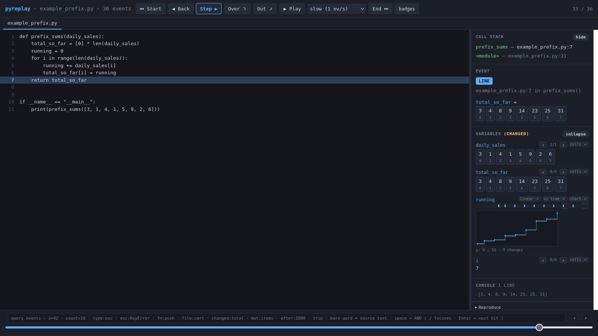](screenshots/80-oscilloscope.png)

### 61. Object transparency (`__dict__` and `__slots__`)
- **Measured:** instance attributes from `__dict__` and `__slots__`
  are encoded as first-class values; nested objects recurse; cycles
  terminate.
- **Displayed:** `self.adj_list`, `g.N` appear as their own rows, each
  with its own view selector. On a method-entry event, an attribute
  flags as changed only if it differs from the object's **last
  observation** — static config attrs stay quiet instead of re-flagging
  on every call (on the object's first appearance everything is
  honestly new and shows in full) — a graph stored inside an object gets
  the graph offer right where it lives; nested objects render as
  attribute tables.
- **Why:** OOP code stops being opaque `<Cart object at 0x…>` blobs.
- **Use case:** tinyshop's `Cart` shows its `items` dict live —
  watching it *not* change on a supposed add is the planted bug.
- **Command:** `python3 tracer.py tinyshop/main.py` → step into a
  method; the object's attributes are rows automatically, each with
  its own view dropdown.
- **Screenshot** — an object expanded into attribute rows, one attr in graph view.

  [](screenshots/26-object-transparency.png)

### 62. Per-variable life navigation
- **Measured:** every change to every variable is indexed per frame
  invocation (recursion-safe: each invocation tracked separately).
- **Displayed:** each row shows `‹ 3/6 ›` — its change ordinal/total;
  `‹`/`›` jump to the previous/next change event. Clicking the count
  unfolds the **life strip**: one clickable tick per change on the
  trace axis, birth in green, current position in amber.
- **Why:** "when did this variable change?" becomes navigation instead
  of hunting.
- **Use case:** the debugging move: click a red crash marker, then walk
  the suspicious variable's history *backward* to the moment it went
  wrong.
- **Command:** any line-level trace → `‹`/`›` on a variable's row;
  click the `3/6` count to unfold its life strip.
- **Screenshot** — a variable row with its life strip unfolded.

  [](screenshots/28-life-strip.png)

### 63. Watch expressions — observables at record time
- **Measured:** `--watch "sum(nums)" --watch "cart.total()"`
  (repeatable) — each expression is evaluated at every line event of
  every traced frame, **where Python is alive**, and recorded as a
  synthetic variable (`watch:EXPR`) through the same diff machinery
  as real locals. Not evaluable in a frame → nothing recorded there;
  a watch that was alive and stops being evaluable records
  "(not evaluable here)" — the honest hole; never evaluable anywhere
  → an end-of-run warning (a typo must never look like data).
  Expressions run inside your process — keep them pure.
- **Displayed:** an ordinary variable row — change highlighting, life
  navigation (‹n/m›), cells and the #60 chart view all come free. A
  conserved quantity shows one birth change and never again; that
  silence is the signal.
- **Why:** derived quantities — lengths, sums, ratios, invariant
  candidates — are often the real observable, and the old rejection
  stands (replay-side eval belongs to Python, not the viewer): so
  evaluate at *record* time over the whole run, not one paused
  moment.
- **Use case:** `--watch "sum(nums)"` on a sort: one change,
  value 12, then silence through every swap — conservation made
  visible. `--watch "nums[0]"` meanwhile changes exactly at the
  reorder.
- **Command:** `python3 tracer.py --watch "sum(nums)" --watch
  "nums[0]" bubble_sort.py` — line granularity only; the per-line
  cost is announced and scopable with `--include`.
- **Screenshot** — two watch rows riding beside the real variables:
  `nums[0] * 10` freshly changed by a swap, `sum(nums)` conserved.

  [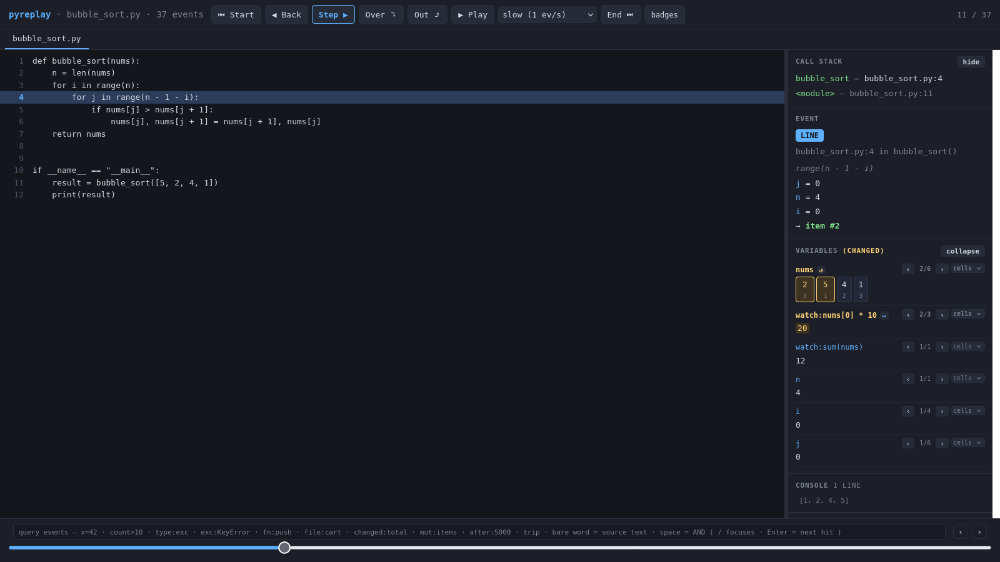](screenshots/72-watch.png)

### 64. The shape/dtype timeline — arrays at the Python boundary
- **Measured:** for objects exposing array metadata (numpy, torch,
  pandas), the encoder reads `.shape` and `.dtype` under guarded
  probes even though the internals stay C-opaque: integer-tuple
  shapes recorded Python-style (`(4,)` keeps its honest comma),
  torch.Size-like strings accepted, 0-d shapes excluded, and dtype
  only WITH a shape — a lone `.dtype` is a module or class
  attribute, not an array (the np-module trap). The metadata lives
  inside the encoding, so every transition is a first-class change.
- **Displayed:** a teal **⤢ (3, 4) · float64** chip on every array
  value, amber when it just changed; and when a name's own metadata
  transitions, the ⤢ badge with the full story: *SHAPE-CHANGE
  (3, 4) → (4, 3) — a reshape/transpose/broadcast happened here* or
  *DTYPE-CHANGE float64 → float32*. Life navigation and the explain
  bundle carry the same truth.
- **Why:** the tracer honestly cannot see inside C extensions — but
  shapes at Python boundaries are exactly where broadcasting bugs
  are visible. For scientific users this is the microscope's
  missing objective.
- **Use case:** `flipped = centered.T` — the classic silent
  transpose — reads ⤢ (4, 3) where its source read (3, 4); the
  `astype(np.float32)` precision drop wears the badge on the very
  event it happened.
- **Command:** any line trace of numpy/torch/pandas code — the
  chips appear wherever metadata exists.
- **Screenshot** — the demo at the same-name transpose: `m` wearing
  both the rebound arrow and the ⤢ badge, chips on every array:

  [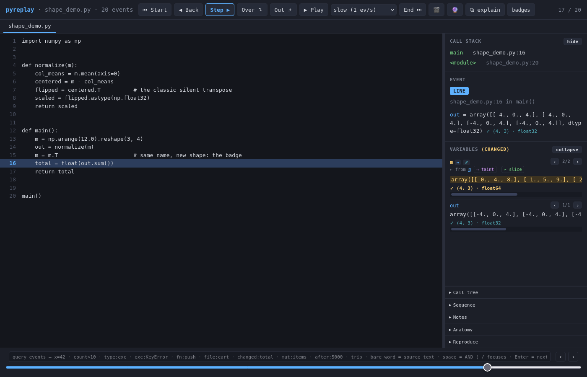](screenshots/83-shape-timeline.png)

### 65. Type-flow histograms — what the code did, not what it promised
- **Measured:** per (file, function, name), the histogram of types
  across its recorded changes, with the FIRST moment of each type —
  offline aggregation over existing encodings, zero recording cost,
  2000-entry cap by observations (marker when cut).
- **Displayed:** any row whose name held two or more types wears
  **⚠τ**; its tooltip is the histogram — `float 2× · NoneType 2× ·
  str 2× — observed across 6 changes` — and clicking jumps to the
  first occurrence of the RAREST type: the 2% case is one click
  away. The terminal ranks the unstable names after every run.
- **Why:** the sneaky None, the str that is sometimes bytes, the int
  that becomes float — type instability is where dynamic code rots.
  Observed types complement annotations: this is what the code DID.
  Beside #92 (interfaces at boundaries) the pair reads: the
  function's contract wobbles *and* here is the variable doing it.
- **Use case:** `price = catalog.get(key)` — ⚠τ on `price` says
  float/NoneType/str; one click lands on the miss that produced the
  None, three frames before anything crashed.
- **Command:** any trace — the aggregation always runs.
- **Screenshot** — the demo: ⚠τ on price at the None moment, #92's
  unstable-return signature above it agreeing:

  [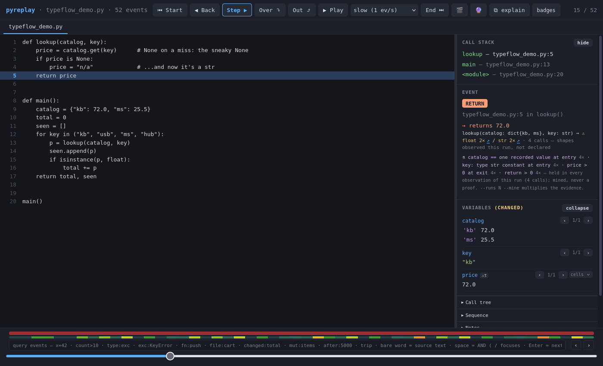](screenshots/82-type-flow.png)

## Part 6 — Control flow: what decided

Branches tell their outcomes, absent paths become visible, and the Anatomy panel dissects the current line down to the bytecode.

### 66. Conditional verdicts — every branch tells its outcome
- **Measured:** verdicts inferred from the branch the execution
  actually took (always correct, no expression re-evaluation):
  `if`/`while` → True/False; `for` → "item #N" / "exhausted after N
  iterations" / "exhausted — 0 iterations"; `except Type:` → "caught
  here" / "not this handler"; `match` cases → "matched" / "no match".
  Sub-line branching (ternaries, short-circuits) is invisible to
  line-level tracing — and says so.
- **Displayed:** the expression and its verdict in the Event panel on
  every branching line.
- **Why:** the loop that silently never ran, made loud — the classic
  invisible bug class, visible.
- **Use case:** `example_control.py`: a filter loop shows "exhausted —
  0 iterations" — the input was empty and nothing downstream ever
  executed.
- **Command:** `python3 tracer.py example_control.py` → step onto any
  `if`/`while`/`for`/`except`/`match` line; automatic.
- **Screenshot** — a for-line with "exhausted — 0 iterations".

  [](screenshots/31-verdicts.png)

### 67. Ghost branch — the road not taken
- **Measured:** nothing new — the arm that was NOT entered, derived
  from the recorded verdict plus the guards map: the `else` a True
  skipped, the `then` a False skipped, the loop body at this step's
  exhaust (the 0-iteration invisible loop included), the handler
  that didn't match. Extents are transitive — a nested `for`/`if`
  inside the untaken else belongs to it, proven by its controller
  chain. `while` guards ghost only their body on False (the exit is
  not an arm); match cases stay unresolved and the tooltip says so.
- **Displayed:** with the 👻 toggle on (badges menu, off by
  default), the untaken arm tints hatched-dim with a small ghost on
  its line numbers — for exactly one step: the ghost lives while the
  cursor sits on the deciding event and clears on the next.
- **Why:** it makes absence visible at the moment of decision — the
  gentle sibling of the whyline, and for a learner the moment
  branching *clicks*. Nothing we know of does this.
- **Use case:** step onto `for v in []:` — the body underneath dims
  with its ghost: the loop that never ran, seen not inferred.
- **Command:** any line trace → badges menu → 👻 ghost branch.
- **Screenshot** — the invisible-loop classic, dimmed at its
  deciding event:

  [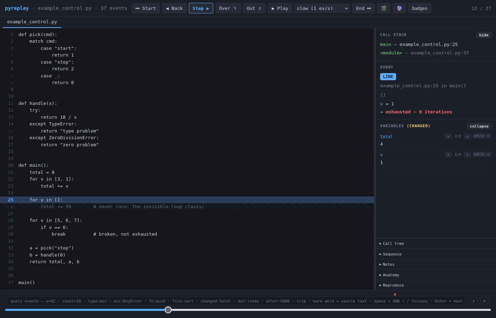](screenshots/113-ghost-branch.png)

### 68. The whyline — "why didn't this line run?"
- **Measured:** a static AST pass stamps every line with its innermost
  controlling construct (then/else/loop/loop-else/except/case/def —
  parents stamped before children, so the innermost wins by
  construction), joined at click time with the recorded verdicts of
  each controller (how often its condition ran, how often it was
  true).
- **Displayed:** click a line NUMBER. If the line executed, you jump
  to its first execution. If it never ran, the panel answers with the
  causal chain, one controller at a time — "the guard at line 12 ran
  12× — 0× true — so this branch was never chosen" — each step with a
  jump to the guard's arrivals. Bare `else:` / `try:` / `finally:`
  headers are excluded from the dead tint: they never emit events
  even when their bodies run.
- **Why:** the most natural debugging question is a negative — *why
  did nothing happen?* Negatives have no event to click. The whyline
  gives absence a cause: the exact guards that said no, and how many
  times they said it.
- **Use case:** the discount branch never fires. Click its line
  number: the eligibility guard ran 12×, true 0× — jump to an
  arrival, and the cart totals that kept it false are on screen.
- **Command:** any line-granularity trace — click the line number of
  a line that didn't run (under fn granularity the panel says why it
  can't answer).
- **Screenshot** — the answer for a dead line: "ran 3× — 0× true, 3×
  false — the guard chose against this branch", with first/last
  arrival jumps; the dead line dimmed in the source.

  [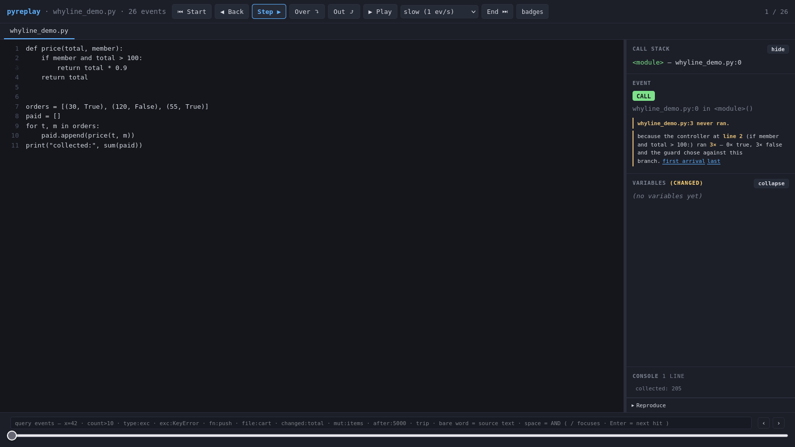](screenshots/77-whyline.png)

### 69. The anatomy panel — AST + bytecode of the current line (static tiers)
- **Measured:** at trace-write time every recorded source file is
  parsed and compiled fresh — nothing executes. Per record (`<module>`
  plus every `def`, real qualnames like `outer.<locals>.inner`): the
  AST tree (one line per node with its salient detail and line:col
  span, operators spelled out, capped at 800 nodes with the cap
  announced in-tree) and the `dis` listing (offset, opname, argument,
  source line via `co_positions`, jump-target flag), joined to the
  record by `(name, firstlineno)`.
- **Displayed:** the **Anatomy** panel in the side bar. It names the
  innermost record enclosing the current line, then two blocks:
  SYNTAX — the collapsible AST tree, ancestors of the current line
  pre-opened and its nodes lit; INSTRUCTIONS — the record's full dis
  listing auto-scrolled to the current line's rows, `»` marking jump
  targets, the line column written dis-style only where it changes.
- **Why:** the interpreter is not magic. `a < b` is two LOAD_FASTs
  and a COMPARE_OP plus dispatch; a tuple swap is a pack and an
  unpack; the layer below every stepped line is one click away, and
  the syntax layer above it in the same panel.
- **Use case:** bubble sort's compare line: the AST path lights
  If → Compare `>` → Subscript, and the listing shows the
  BINARY_SUBSCR pair feeding COMPARE_OP — then one step forward, the
  swap line is the tuple pack/unpack you always suspected it was.
- **Command:** any line-granularity trace → open **Anatomy** in the
  side panel (under fn granularity the panel says why there is no
  current line to dissect). Honesty: the header states "as compiled,
  not adaptive" with the CPython version — the run-time
  specializations of PEP 659 are Tier 2, unbuilt.
- **Screenshot** — bubble sort's compare: the AST path lit to the
  Subscript, the dis box scrolled to line 5's LOAD_FAST/BINARY_SUBSCR
  rows, » on the FOR_ITER jump target.

  [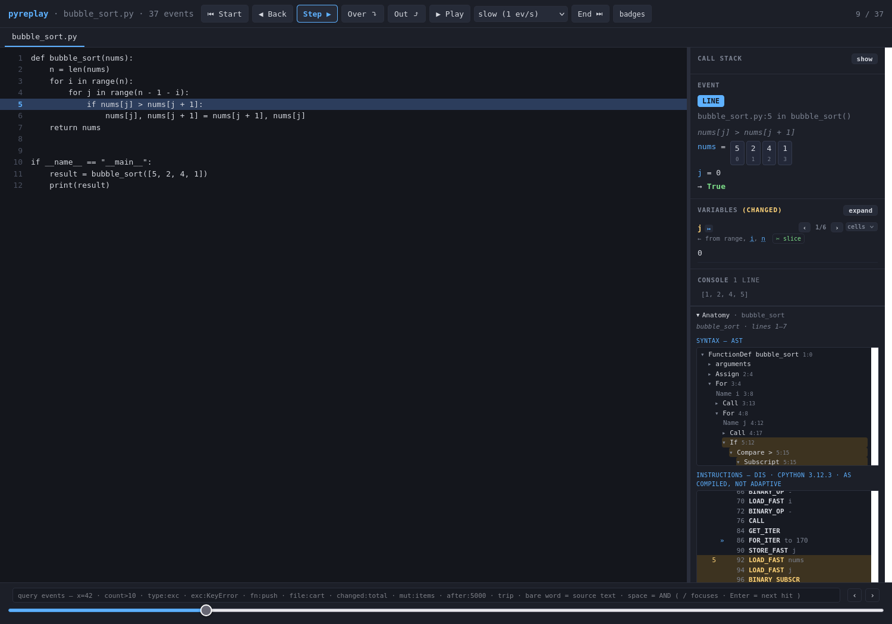](screenshots/85-anatomy.png)

---

### 70. The CFG view — the code as a graph, the run as a path
- **Measured:** a static pass builds each record's control-flow graph
  from the ast — one node per statement coalesced into basic blocks,
  edges typed `seq / true / false / loop / break / continue / exc /
  case / nomatch / return / raise`, ENTRY and EXIT explicit,
  statically unreachable blocks computed by construction. Then the
  event stream is walked with per-frame stacks (generator
  suspend/resume included): every observed block→block transition and
  block entry is counted and folded into the record.
- **Displayed:** the CONTROL FLOW section of the Anatomy panel — a
  ladder of blocks in line order (`L5 continue`, first source line as
  the label), true/false verdicts as colored straight drops, loops
  and continues as left-side back arcs, breaks/exceptions as
  right-side arcs. Observed edges are solid and wear ×N; the current
  event's block is lit — the token walking the graph. Never-observed
  edges and blocks are dashed ghosts; unreachable-by-construction
  blocks are red-dashed — the two are never conflated. Clicking a
  block asks the whyline: if it ran you jump to its first execution,
  if it didn't you get the causal chain.
- **Why:** control flow *is* a graph; source text hides it. The
  for-else, the break that skips it, the continue's back edge — every
  construct's true shape is drawn, and the run's path over it is
  measured, not imagined.
- **Use case:** a classifier loop processes two batches. The graph
  shows `continue ×1`, `break ×1`, the for-else edge `×1` — and the
  break arc visibly bypassing the else block: why `total` got its +1
  in one run and not the other, one picture.
- **Command:** any line-granularity trace → open **Anatomy** → the
  CONTROL FLOW section. Honesty (stated in-panel): exception edges
  leave the try *header* — any line inside the region may raise; a
  finally's interception of returns is not drawn.
- **Screenshot** — the classifier mid-`continue`: the current block
  amber, back arcs left, `break ×1` arcing past the for-else,
  verdict counts on every branch.

  [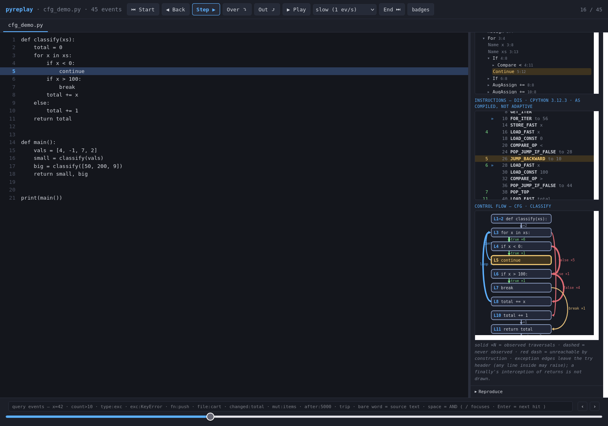](screenshots/131-cfg.png)

### 71. The observed decision table — the function's branching truth
- **Measured:** per CFG record, the guard rows are derived statically
  (the last line of every block with a true-edge out; the first line
  of every exc/case-edge target — if/elif/while/for guards, except
  clauses, case patterns), and one pass over the recorded events
  aggregates each guard line's truth: how often the line ran, how
  often the recorded verdict was true, how often false, and the first
  occurrence of each.
- **Displayed:** DECISIONS — OBSERVED TRUTH, a table in the Anatomy
  panel under the CFG: one row per guard (`L28 for v in [5, 6, 7]: ·
  2× · 2× · 0×`), counts color-split true/false, the current line's
  row lit. Flags where they are earned: **never ran**, **never
  true**, **never false** — and "no verdicts recorded" with the
  reason when a single-line body makes the next-line inference
  unknowable. Every non-zero count is a click: jump to its first
  occurrence. A never-ran row hands off to the whyline.
- **Why:** the verdicts exist per event and the whyline answers one
  line at a time; nothing showed a function's WHOLE branching
  behavior at a glance. Coverage tools count branches; this shows the
  truth summary inline with the moments — not the combinations that
  could happen, the ones that did.
- **Use case:** `for v in []:` wears **never true** — the
  invisible-loop classic, flagged without stepping; the loop that
  `break`s wears **never false** — it never exhausted. A `case _`
  that never matched anything reads **never ran**, one click from
  "why not?".
- **Command:** any line-granularity trace → **Anatomy** → DECISIONS.
  Honesty (stated under the table): on the default engine the
  sub-conditions of `a and b` are not separated — #72 records them
  under `--backend monitoring`, and the table grows ↳ sub-rows
  there; for-rows read entered/exhausted.
- **Screenshot** — example_control.py: the empty loop never true, the
  broken loop never false and lit as current, the if split 1/1:

  [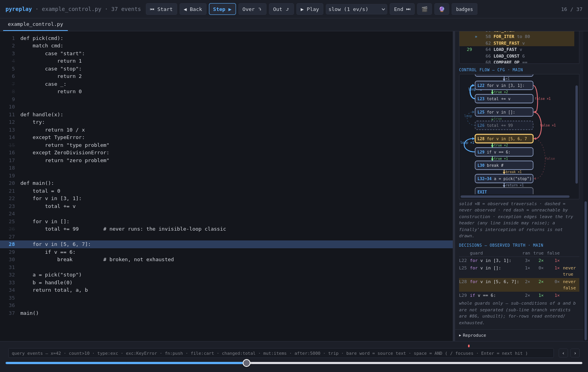](screenshots/137-decisions.png)

### 72. Sub-line branch verdicts — the blind spot, closed on 3.12+
- **Measured:** on the PEP 669 engine (`--backend monitoring`, line
  granularity), BRANCH events ride #33's per-code arming — only
  in-scope code fires them. A cached per-code map keeps exactly the
  conditional jumps worth a verdict (`POP_JUMP_IF_FALSE/TRUE/NONE/
  NOT_NONE` and the `OR_POP` pair) with their `co_positions` columns;
  FOR_ITER is excluded on purpose — iteration truth is the whole-line
  verdict's job. The condition's VALUE follows instruction
  semantics, never a guess: `POP_JUMP_IF_FALSE` jumped means the
  operand was False.
- **Displayed:** a violet **BRANCH — TRUE/FALSE** badge whose Event
  panel shows the source line with the sub-expression underlined at
  column precision in its verdict color (`if a > 0 and <u>b > 0</u>`);
  `type:br` in the query bar; and the #71 decision table grows
  **↳ sub-rows** per guard — each ternary test, and/or operand and
  comprehension `if` with its own ran/true/false counts and
  first-occurrence jumps.
- **Why:** the honesty note used to say sub-line branching is not
  visible; this deletes the caveat where the interpreter allows it.
  And an operand evaluated FEWER times than its guard ran is the
  short-circuit — measured, never inferred.
- **Use case:** `if a > 0 and b > 0:` over four calls — the table
  reads `a > 0` 4× (3T/1F), `↳ b > 0` **3×** (1T/2F): the skipped
  evaluation is the short-circuit made countable. A comprehension's
  `if` records per element even though its line event fires once.
- **Command:** `python3 tracer.py --backend monitoring app.py` →
  step onto a BRANCH event, or open **Anatomy → DECISIONS**.
  Fallback honesty: under settrace there are no br events and the
  table says where they record.
- **Screenshot** — the and-guard's sub-rows with the measured
  short-circuit, and the underlined operand at its own columns:

  [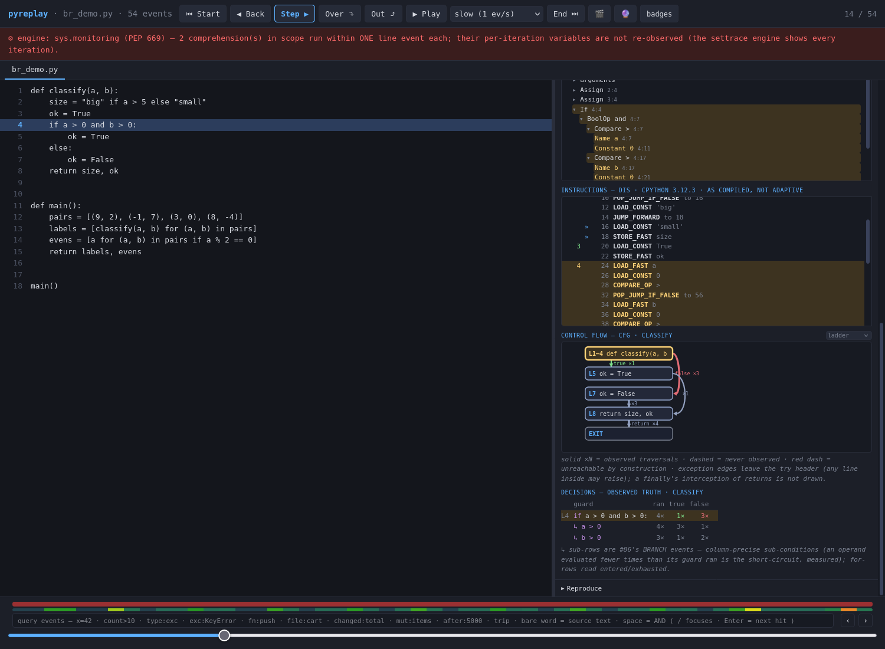](screenshots/86-branch-verdicts.png)

### 73. Grammar skins — the flowchart and the structogram
- **Measured:** nothing new — two alternate drawings of data already
  recorded. The flowchart re-draws the #70 CFG record; the
  structogram rebuilds statement nesting from the guards map (every
  line's innermost controller, already in the payload) and reads
  truth counts from the recorded verdicts.
- **Displayed:** two selects in the Anatomy panel, persisted across
  sessions. CONTROL FLOW `ladder | flowchart`: diamonds for the
  CFG's verdict blocks (a multi-line block splits its straight-line
  prefix into a process box above the diamond), yes/no for
  true/false, stadium terminals for entry/exit, orthogonal side
  channels for jumps and loop-backs — with the observed ×N weights,
  ghost dashes, unreachable red and the lit current block carried
  over unchanged. SYNTAX `tree | structogram`: Nassi–Shneiderman
  bands — if splits into T|F columns (an absent else is an honest
  "—"), loops wrap their bodies in bands, except/match/def get
  bordered boxes, every guard wears its recorded T×/F× badge,
  never-ran lines are dim, the current line is lit.
- **Why:** readability and teaching — these are the grammars people
  already know how to read; the ladder is denser but unfamiliar. No
  new information, and the note under each skin says exactly that:
  the skin changes, the truth doesn't.
- **Use case:** in the structogram, example_control's empty loop is
  a band whose body is dim with `T×0 F×1` on the head — the
  invisible loop as a picture a first-year can read; the flowchart
  shows the break edge leaving the `if` diamond and bypassing the
  loop's exhaust path.
- **Command:** any line trace → **Anatomy** → the selects on the
  SYNTAX and CONTROL FLOW headers. Honesty: try/with bodies draw
  flat in the structogram (their nesting is not a guard); #69's tree
  holds the full syntax.
- **Screenshot** — example_control.py wearing both skins: the
  structogram's dim never-ran band and T|F split, the flowchart's
  diamonds with yes ×2 / no ×1 and the loop channels:

  [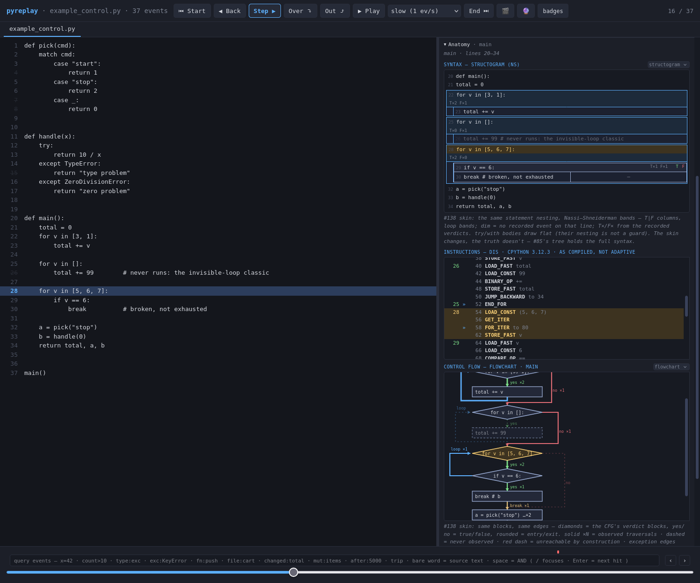](screenshots/138-skins.png)

## Part 7 — Causality: where values come from

From "what changed" to "why": one hop of provenance, the transitive slice backward, taint forward, and the dependency DAG of a memo table.

### 74. Provenance panel — "why is this value what it is?"
- **Measured:** two halves. Static: `build_dataflow()` extracts
  target←sources per line from the ast (positional tuple unpack
  understood: `a, b = b, a` reads a←b, b←a; attribute/subscript
  targets honestly skipped). Dynamic: the change index locates where
  each source variable was last set (reading the *previous* same-frame
  line, because settrace reports a change on the line after the
  statement that made it).
- **Displayed:** under a changed variable: "← from a, b" — each source
  is a link; click to jump to where it was last set, then repeat: you
  walk the value's ancestry backwards through the trace.
- **Why:** the causal chain behind a value, without bytecode tricks
  (the Cyberbrain idea, minus its version-fragile value-stack).
- **Use case:** a wrong prefix sum: click ← through `b[i] ← b[i-1], a[i]`
  ancestors until you land on the one addition that used a stale value.
- **Command:** `python3 tracer.py example_prefix.py` → step to a change;
  the "← from …" links appear under the changed variable (automatic at
  line level, including inside `watch()` traces).
- **Screenshot** — a changed variable with its "← from …" links visible.

  [](screenshots/29-provenance.png)

---

### 75. The backward slice — transitive provenance (v1)
- **Measured:** the provenance panel's one hop, iterated to closure.
  From a clicked value, the walk resolves its assignment line's
  source names (the static dataflow, which now also tracks `return`
  expressions, loop targets and walrus bindings), finds where each
  source was last set *in that frame instance* (the change index),
  and recurses — crossing call boundaries through return values into
  the callee's own chain. Name-flow only, and it says so: attribute/
  subscript writes, in-place mutation, C-level effects and caller
  arguments become **frontier stops**, listed, never silently
  crossed. Capped at 400 events, the cap stated.
- **Displayed:** a **✂ slice** button beside every "← from …" row.
  Click it: the scrubber grows a strip of green pins — the trace
  reduced to the events that contributed to this value — the slice
  bar names the seed, the event count and the frontier stops (hover
  lists each with its reason), and ←/→ plus the step buttons walk
  the slice instead of the stream. Esc exits.
- **Why:** "how did this wrong answer come to be" as a navigation
  mode. A 10k-event trace collapses to the dozen events that matter
  for one value — Weiser's program slicing, standing on ast dataflow
  and the recorded change index instead of fragile bytecode stacks.
- **Use case:** `d = scale(b) + a` computed wrong. Slice `d`: eight
  green pins — `d`, `c`, `a`, `b`, the def of `scale`, and inside
  the call, `return m + 1` back through `m` — with two honest
  frontier stops (`k` is an argument; the def-binding isn't an
  assignment). Walk them with → and the story tells itself.
- **Command:** any line-granularity trace — click ✂ slice on a
  changed variable's provenance row. (Caller-argument crossing and
  container-element flow are the roadmap remainder.)
- **Screenshot** — the slice of `d`: green pins on the scrubber, the
  slice bar counting 8 events and 2 frontier stops.

  [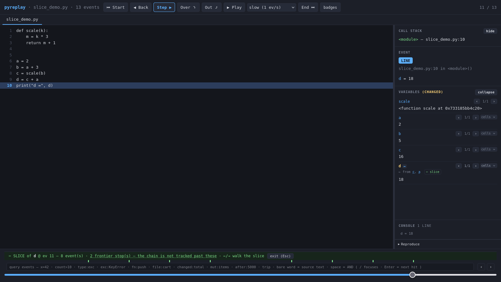](screenshots/75-slice.png)

### 76. Forward taint — descendants of an input
- **Measured:** the #75 walk, transposed. Mark a value at one of its
  changes and everything DOWNSTREAM lights up: data influence flows
  through the same static dataflow edges — same-frame assignments
  and through-call lines (`y = f(x)` taints `y`) — and dies honestly:
  a name overwritten from untainted sources loses its taint, while
  an untracked write to a tainted name keeps it (in-place mutation
  cannot be proven clean). A verdict that READ a tainted name is a
  tainted decision; the events on lines that guard controls are
  CONTROL-marked — and control marks are display only, never
  propagated as data: influence is not a copy, and the bar says so
  verbatim.
- **Displayed:** ⇢ taint on every changed variable row — including
  literal inputs, which have no backward chain and are exactly what
  taint is for. Violet pins = data descendants, pink = tainted
  verdicts, hollow = control-marked; the taint bar counts the three
  kinds plus frontier notes (v1 does not bind parameters at call
  entry — through-call results ARE tracked), ←/→ walks the marked
  events, Esc exits; one walk mode at a time with the ✂ slice.
- **Why:** "if I change this config, what is affected?" — impact
  analysis and data lineage in one gesture; the backward slice
  answers "where did this come from", this answers "where did it
  go". The data/control split is the honest heart: a value copied
  and a value that merely steered a branch are different claims.
- **Use case:** taint `raw = 6.5`: `result` (through the call) and
  `total` glow violet, the `raw > 5` verdict glows pink, and
  `label = "hot"` — chosen by that verdict but holding no copy of
  raw — wears the hollow control mark. After `raw = 0.0`, nothing
  downstream is marked: the kill is part of the truth.
- **Command:** any line trace → any changed row → **⇢ taint**.
- **Screenshot** — the demo mid-walk: the bar counting 3 data /
  1 verdict / 1 control, label wearing its ⇢ chip:

  [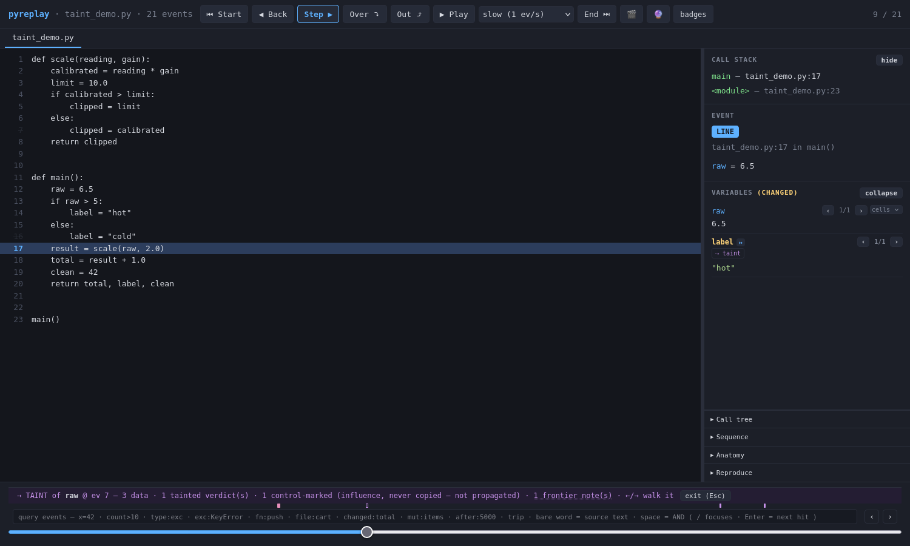](screenshots/76-forward-taint.png)

### 77. The subproblem DAG (`--memo NAME`) — fill causality, drawn
- **Measured:** bind one memo structure and its dependency DAG is
  mined from the trace: a static pass finds every subscript READ and
  WRITE of the bound name with its index expressions (calls inside an
  index are refused — no eval side effects, ever); the dynamic pass
  reconstructs each frame's scalar namespace event by event and
  evaluates those indexes at the exact moment each site ran — read
  cells → written cell, per statement. This is the #75
  container-element remainder scoped to the bound name. Edge classes,
  honest by construction: **normal** (read after the cell's first
  tracked write), **base** (gray dashed — a bulk-initialized,
  never-computed cell: knapsack's zeros), and **pre** (amber ⚠ — the
  read saw the *initialization* value of a cell computed later;
  physically identical whether it's a rolling array on purpose or a
  wrong-evaluation-order bug, so the tool states the fact and never
  guesses the intent).
- **Displayed:** the **Subproblem DAG** panel. Cells with 2-integer
  keys lay out as the DP table itself; anything else lays out
  linearly. The replay fills it causally: unwritten cells dim, the
  just-written cell lit, edges appearing as they happen — the grid
  view shows fill *order*, this shows fill *causality*. Click any
  cell or edge to jump to its moment. Frontiers are counted in the
  note: slice/starred/call-bearing/unevaluable indexes, plus the
  aliasing caveat.
- **Why:** dynamic programming is shortest-paths-in-DAGs and the DAG
  is the part nobody ever sees. It is also a drift detector: a
  forward recurrence full of amber pre-write reads is usually the
  wrong evaluation order — visible at the moment it happens.
- **Use case:** `count_paths(4,5)`: the 4×5 grid fills row by row,
  every inner cell wearing exactly two edges (left + above), zero
  amber. Flip the recurrence to read `dp[i+1]` in an ascending loop:
  every compute edge turns amber ⚠ — the bug's signature, one glance.
- **Command:** `python3 tracer.py --memo dp algo.py` (one plain name,
  line granularity). Honesty in-panel: only subscript writes through
  the name are tracked — aliases and C-level routes are not, and a
  dependency routed *through a call* (`memo[n] = fib(n-1) + …`) shows
  its cells but not the cross-frame edge: that is the #75 remainder,
  stated, never guessed.
- **Screenshot** — the paths table mid-fill: written cells solid,
  the frontier dim, `dp[2][2]` just lit, dependency arrows trailing
  behind the fill wave.

  [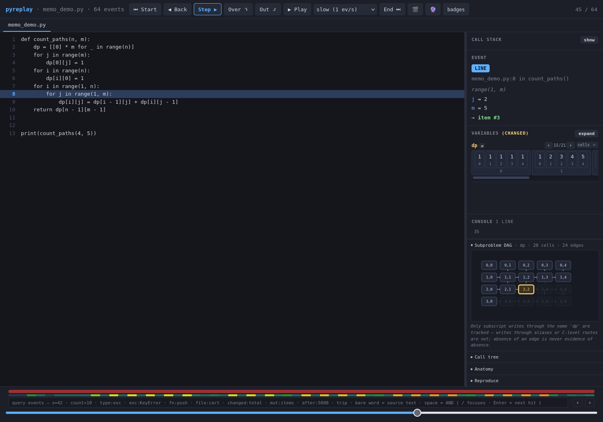](screenshots/134-memo-dag.png)

---

## Part 8 — The interpreter's hidden machinery

Python's behind-the-scenes moves — aliasing, closures, shared defaults, generators, imports, dunders, the MRO — made visible exactly where they act.

### 78. Mutation vs rebinding + aliasing
- **Measured:** `id()` recorded beside each fingerprint; the diff
  distinguishes a name pointing at a new object from an object changed
  in place, and detects two names holding the same object.
- **Displayed:** **↦** = name rebound (old object untouched); **↺** =
  object mutated (every alias changed too); **🔗** on variables that
  are the same object under different names (hover lists the aliases).
  Toggleable in the viewer's badges menu (on by default).
- **Why:** kills the "why did `a` flash when I touched `b`" confusion
  at the root — the single most common Python mental-model gap.
- **Use case:** `b = a; b.append(x)` — both variables flash with 🔗 and
  ↺: one object, two names, now provable at a glance.
- **Command:** `python3 tracer.py example_machinery.py` → the aliasing
  section; hover 🔗 to list the aliases. Automatic in every line trace.
- **Screenshot** — two rows sharing 🔗, both lit with ↺ after one append.

  [](screenshots/34-alias-mutation.png)

### 79. Closure cells
- **Measured:** `co_freevars` / `co_cellvars` identify variables shared
  between enclosing and inner frames.
- **Displayed:** **⛓↑** = lives in the enclosing frame (nonlocal);
  **⛓↓** = shared with inner functions defined here (hover names the
  partner frame).
  Toggleable in the viewer's badges menu (on by default).
- **Why:** decorators, factories, callbacks — and the late-binding
  loop-of-lambdas trap — depend on cells nobody can see. Now visible.
- **Use case:** the classic loop-of-lambdas bug: every lambda shows ⛓↑
  to the *same* cell, so "they all print 4" stops being a mystery.
- **Command:** `python3 tracer.py example_machinery.py` → the closure
  section; automatic.
- **Screenshot** — a counter factory: maker's ⛓↓ and inner function's ⛓↑.

  [](screenshots/35-closure-cells.png)

### 80. Mutable-default-argument detector
- **Measured:** call arguments compared by identity against the
  function's default objects.
- **Displayed:** **⚠def** on an argument that *is* the shared mutable
  default (`def f(x, acc=[])`).
  Toggleable in the viewer's badges menu (on by default).
- **Why:** the def-time-evaluation trap persists state across calls and
  is invisible in source; the badge makes it jump out.
- **Use case:** a "fresh" accumulator arrives already holding last
  call's items — ⚠def is sitting right on it.
- **Command:** `python3 tracer.py example_machinery.py` → the second
  call to the defaulted function; automatic.
- **Screenshot** — second call to `f`: `acc` pre-filled and wearing ⚠def.

  [](screenshots/36-mutable-default.png)

### 81. Generators & coroutines tell the truth
- **Measured:** `co_flags` identifies generator/coroutine/async-gen
  frames; suspension and wake-up are recorded as YIELD (with the
  yielded value) and RESUME on the *same* frame identity — not as fake
  returns and fresh calls.
- **Displayed:** purple **YIELD** badge ("⇢ yields 0"), **RESUME**
  re-shows the frame's full live state (quietly — fresh info is not
  "changed"); life navigation and step-over follow the frame across
  naps.
- **Why:** one sleeping frame no longer masquerades as five separate
  invocations — the actual lifecycle of lazy code, visible.
- **Use case:** `example_machinery.py`: `squares(5)` replays as one
  frame sleeping and waking five times, locals intact between naps.
- **Command:** `python3 tracer.py example_machinery.py` → step through
  the generator section; automatic.
- **Screenshot** — a YIELD badge and the same frame's later RESUME.

  [](screenshots/33-yield-resume.png)

### 82. Import-time context badge
- **Measured:** events executing beneath a `<module>` frame of another
  module's import are flagged.
- **Displayed:** **⚙ import time** next to the event badge while inside
  import execution.
  Toggleable in the viewer's badges menu (on by default).
- **Why:** the interpreter's two lives — loading vs running — kept
  permanently distinct; explains "why did this run before main?".
- **Use case:** a module-level `registry.append(...)` fires during
  import of a neighbor — the ⚙ badge says *when* you are, not just
  where.
- **Command:** `python3 tracer.py tinyshop/main.py` → the first events
  (imports executing); automatic.
- **Screenshot** — an event wearing ⚙ while a module body executes.

  [](screenshots/37-import-badge.png)

### 83. Dunder-call labeling
- **Measured:** name-based recognition of `__lt__`/`__eq__`/
  `__getitem__`/… frames (approximate and labeled as such).
- **Displayed:** a hint on the call: "invoked implicitly by Python — <".
  Off by default — enable it in the viewer's badges menu.
- **Why:** operators secretly calling methods is core Python; the hint
  connects `a < b` to the `__lt__` frame that appears.
- **Use case:** sorting a list of custom objects — each comparison
  visibly enters `__lt__` with the hint naming the operator.
- **Command:** `python3 tracer.py example_machinery.py` → a comparison
  entering `__lt__`; automatic.
- **Screenshot** — a `__lt__` CALL with its "invoked implicitly" hint.

  [](screenshots/38-dunder-hint.png)

### 84. MRO panel — method resolution made visible
- **Measured:** on method calls with `self`/`cls` bound:
  `type(obj).__mro__`, the supplier found by locating the frame's code
  object in the chain (cached per class+code); the event carries
  {chain, supplier}.
- **Displayed:** the class chain in the Event panel: searched-and-passed
  classes struck through, the supplier lit green — "started at
  Exporter, passed ZipMixin and JsonMixin, found export on Serializer".
  Cooperative `super()` chains show successive suppliers walking the
  chain.
  Off by default — enable it in the viewer's badges menu.
- **Why:** multiple inheritance stops being folklore — you watch C3
  resolution happen call by call.
- **Use case:** `example_mro.py`: successive `super().speak()` calls
  light successive classes down the chain.
- **Command:** `python3 tracer.py example_mro.py` → step onto any
  method CALL; automatic when inheritance is involved.
- **Screenshot** — the chain with two passed classes struck through and the supplier green.

  [](screenshots/39-mro.png)

## Part 9 — Truth & alarms

Instruments that watch the run for lies: exceptions, printed output, numerical poison, broken contracts, mined guarantees, state machines, interface drift, nontermination.

### 85. Exceptions as first-class events
- **Measured:** every raise is recorded — including ones an `except`
  catches; an uncaught exception records one EXCEPTION event per frame
  it unwinds through, from raise to crash. Generator/iterator
  control-flow raises (StopIteration etc.) are flagged soft.
- **Displayed:** red EXCEPTION badge with type and message; the raising
  line turns red; soft raises are dimmed, not red; red markers above
  the scrubber flag every hard exception — click one to jump straight
  to it.
- **Why:** silently caught exceptions are the classic "why is this
  None?" — no longer silent; propagation paths become walkable.
- **Use case:** `example_exceptions.py` (or tinyshop's planted bug): a
  swallowed KeyError appears as a red badge exactly where a value
  quietly became a default.
- **Command:** `python3 tracer.py example_exceptions.py` → click the
  red markers above the scrubber; automatic in every trace.
- **Screenshot** — a caught exception's red badge + the scrubber's crash markers.

  [](screenshots/32-exceptions.png)

---

### 86. The console lane — stdout/stderr as events
- **Measured:** the target's `stdout`/`stderr` are tee'd at the Python
  layer during the run: fragmented `print()` writes joined into lines,
  each line attributed to the nearest in-project frame that wrote it,
  unterminated tails flushed at the end. The tracer's own heartbeat
  and trigger prints go to the RAW streams — never recorded as target
  output. Caps announced (20k lines); writes below the Python layer
  (`os.write` to fd 1) bypass the tee, and the trace says so.
- **Displayed:** a Console panel that fills as the replay advances —
  the program's output appears when it appeared, WARNING/ERROR levels
  colored from the recorded text (recorded, not interpreted). Click a
  line to land on the event that wrote it; emitting events wear
  CONSOLE badges; `type:log` finds lines in the query bar; log lines
  become timeline instants in the Perfetto export.
- **Why:** the print statement is the world's most-used debugger.
  Recording the console as events makes every printed line a link
  into the exact machine state that printed it — output and execution
  finally on one clock.
- **Use case:** "WARNING: negative total" scrolls by somewhere in a
  10k-line log. Click it in the Console panel: you are at the write —
  the stack that produced it live, the variables that made it true on
  screen.
- **Command:** automatic in every trace; `--no-console` disables the
  lane.
- **Screenshot** — the Console panel at the run's end: seven lines, the stderr WARNING colored, the current write highlighted — each one a jump.

  [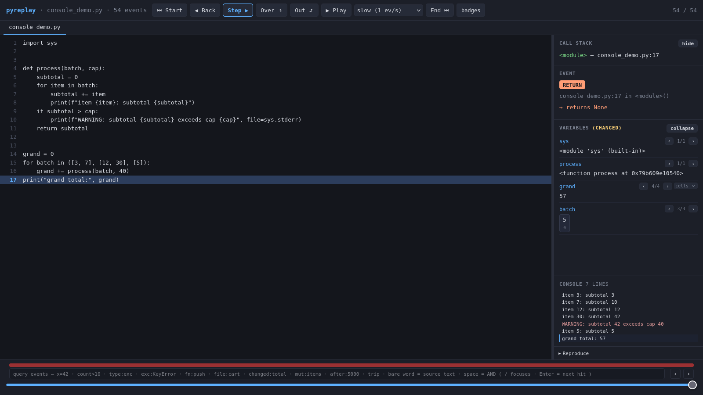](screenshots/118-console-lane.png)

### 87. NaN/Inf tripwire — where the poison was born
- **Measured:** with `--trip nan`, the encoder's own bounded output is
  scanned for NaN/Inf leaves. An event records a trip when a
  variable's poison KIND changes (clean→inf, clean→nan, and inf→nan —
  an inf collapsing to nan IS a first NaN), when a recovered variable
  relapses, and when a return value carries poison out of a frame
  (visible even if the caller never assigns it). A sleeping generator
  keeps its poison memory across yields — no false rebirth on resume.
- **Displayed:** a banner naming the FIRST birth (click to jump),
  amber ☢ pins over the scrubber for every birth, and a ☢ glyph on
  exactly the rows whose displayed value carries the poison at that
  event (an object trip lands on the poisoned attribute, not every
  attribute).
- **Why:** for numerical code the question is never "is there a NaN" —
  the crash (if any) tells you — but WHERE IT WAS BORN, usually
  thousands of operations upstream. The provenance panel then answers
  "from what".
- **Use case:** `example_nan.py` prints `mean signal: nan` and never
  raises. The banner: first Inf born in `amplify()`'s return value at
  event 18; the ☢ trail walks the spread through `detrend`'s mean into
  every downstream value — the report was a lie four functions before
  it was printed.
- **Command:** `python3 tracer.py --trip nan example_nan.py`. Line
  granularity only (values live in line events). Honesty: only what
  encoded values visibly show is judged — beyond a cap or window is
  unknown = unmarked; C-object internals (arrays) stay invisible.
- **Screenshot** — the banner names the first Inf's birth in `amplify()` (click to jump); amber ☢ pins mark every poison event on the scrubber.

  [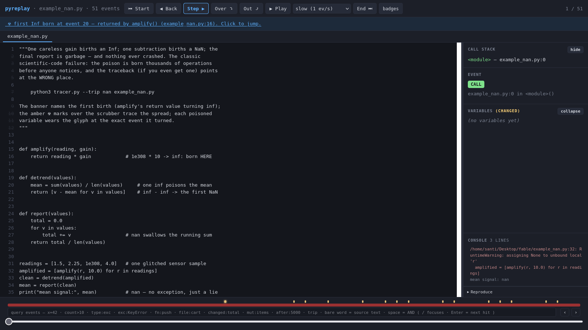](screenshots/79-nan-tripwire.png)

### 88. Float-hygiene probes — the equality trap and the ordering wobble
- **Measured:** two instruments. (a) **Float equality, where it
  executed**: every recorded guard whose `==`/`!=` operand names held
  a float at that exact moment (frame states reconstructed event by
  event; operand names parsed from the recorded expression — no
  claim when unparseable; `int == int` never flags), plus the static
  tier: float literals inside `==`/`!=`, provable from source. (b)
  **`--probe-reduction NAME`**: the bound list's last full recorded
  value re-summed as recorded, sorted both ways, and under 20 seeded
  permutations — beside `math.fsum` and the EXACT rational sum
  (floats are exact binary rationals; `Fraction` adds them without
  error).
- **Displayed:** the ≈ banner pair — "float equality executed 9×
  (total held float) — == on floats compares bit patterns, not
  mathematics" with pink pins at each moment, and the reduction
  report: as-recorded · fsum · exact rational · the orderings' span,
  with the verdict verbatim: *spread 1.85 — ill-conditioned at this
  data (evidence of sensitivity, not proof of error)*.
- **Why:** precision errors accumulate silently and bite numerical
  code hardest; float `==` is the classic silent trap. pyreplay
  cannot fix floating point, but it can measure the wobble and show
  the door it came in through.
- **Use case:** a sum crossing 1e16 absorbs the small terms — the
  program's own answer reads 4.35 while fsum and the exact rational
  agree on 3.49, and twenty orderings span [2.5, 4.25]. The
  accumulation order IS the bug, measured.
- **Command:** any line trace arms (a) ·
  `--probe-reduction values` arms (b). Refusals with reasons:
  windowed containers (permuting a window would claim the whole),
  NaN elements, fn granularity.
- **Screenshot** — the demo mid-guard: `total == 0.5` with
  `total = 1e+16`, both banners telling the whole story:

  [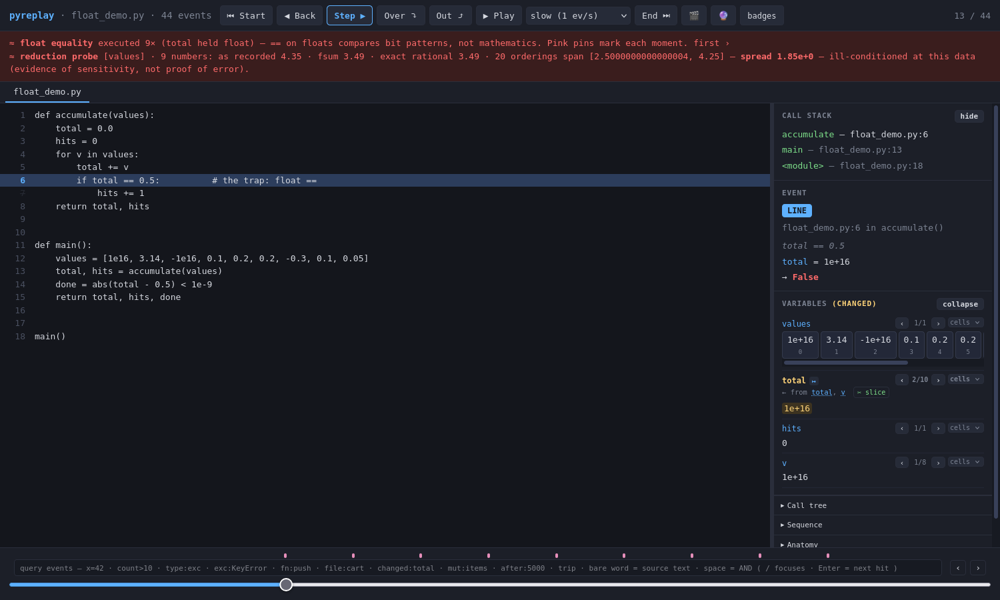](screenshots/123-float-hygiene.png)

### 89. Continuous invariants (`--invariant`)
- **Measured:** `--invariant "balance >= 0"` (repeatable) — the
  contract is checked at every line event where its names are in
  scope, and every TRANSITION into falsehood is recorded as its own
  soft VIOLATION event carrying the values of the expression's
  names. Recovery re-arms (the tripwire pattern), so a contract that
  stays broken records one entry, not a flood; unevaluable = out of
  scope = unknown, never a violation; never evaluable anywhere warns
  at the end. The run always continues.
- **Displayed:** an amber **⚖ INVARIANT VIOLATED** badge with the
  broken expression and its offending values in the event panel;
  amber pins on the tripwire strip (click to jump); a banner verdict
  per invariant — "VIOLATED 2× — first at event 9 (click)", "held
  everywhere it was evaluable", or the typo warning; `type:viol` in
  the query grammar; the same verdicts in the terminal.
- **Why:** assertions you don't have to edit into the code, checked
  everywhere at once, with the full machine state replayable at each
  violation — Design by Contract without touching the target.
- **Use case:** `--invariant "balance >= 0"` on a transfer loop: two
  amber pins — balance hit −3, recovered, hit −5 — each one click
  from the exact state that broke it, while `balance <= 100` reports
  "held everywhere".
- **Command:** `python3 tracer.py --invariant "balance >= 0"
  script.py` — line granularity only. Composes with `--check`
  (bisect the commit that first violates a contract).
- **Screenshot** — the first violation: amber badge, the contract
  with its value, all three verdicts in the banner, two pins.

  [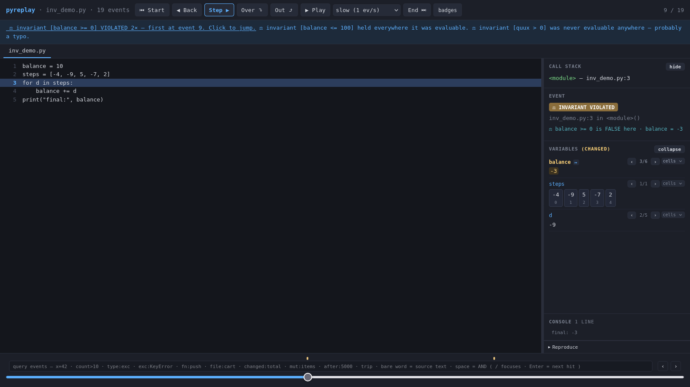](screenshots/73-invariant.png)

### 90. Invariant mining — what the code actually guaranteed (Daikon-lite)
- **Measured:** offline, zero run-time cost: a template library is
  checked against recorded observations — per function, at entry
  (arguments), at exit (final frame state + return value) and over
  each frame's value sequence. Templates: `== C` constants, type
  constant, sign (`> 0` / `>= 0`), `len(v) == K`, sorted (ascending)
  at return, monotonically non-decreasing/-increasing per call, and
  order pairs among numeric arguments (`cap >= k`). A candidate dies
  on its FIRST counterexample and never revives; survivors carry
  their support (evaluable observations). Noise control is the
  craft: a constant suppresses the facts it implies, function/class/
  module objects are machinery and never mined, containers are
  judged only when FULLY recorded (window honesty), NaN kills order
  facts for that observation.
- **Displayed:** three surfaces. Every line trace mines itself at
  write time — the ⚗ row appears on a function's call/return events
  ("cap == 100 at entry 5× · return value sorted (ascending) 5× —
  held in every observation of this run; mined, never a proof").
  `--runs N --mine` multiplies the evidence across the run set: the
  mined section lands in the runs report and the terminal, support
  counted per call across all runs. `tracer.py --mine a.html b.html`
  mines existing traces offline and writes a JSON sidecar.
- **Why:** mined invariants are executable documentation — what this
  code *actually* guarantees, extracted from what it actually did —
  and bug detectors: a run that breaks an invariant that held
  everywhere else is your suspect; feed the pair to `--diverge`.
- **Use case:** five calls of a scaler: `cap == 100 at entry`,
  `cap >= k`, `return value sorted (ascending)`, `total
  monotonically nondecreasing` — then one call passes `k=-1` and the
  sign and monotone facts die, exactly as they should: the mined set
  IS the behavioral diff.
- **Command:** automatic in every line trace (⚗ on boundary events) ·
  `--runs 20 --mine app.py` for the multi-run set · `--mine t1.html
  t2.html` offline. Honesty, verbatim on every surface: held in N
  observations — an observation, NEVER a proof.
- **Screenshot** — a return event: the observed signature above, the
  ⚗ mined row below — constants, the pair fact, sortedness at
  return, each with its support count.

  [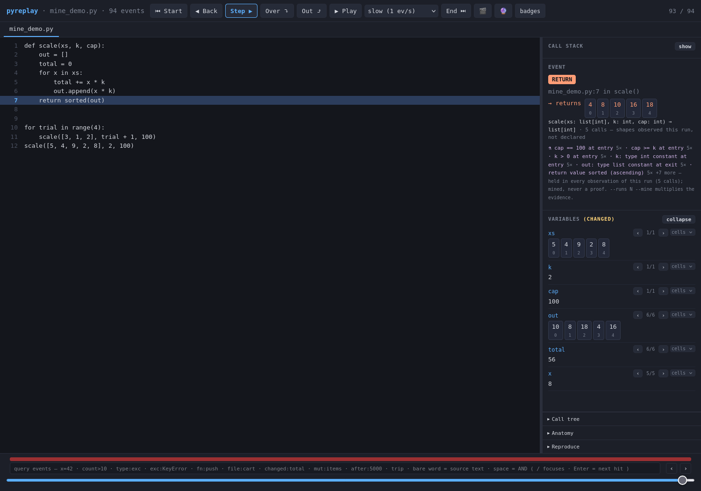](screenshots/74-mined.png)

### 91. The observed state machine (`--fsm EXPR`)
- **Measured:** one declared name — `--fsm order.status` — rides the
  watch machinery (#63): the expression is evaluated per line event
  into the change stream, and the post-pass mines the machine from it
  in global stream order: states = observed values (first-seen
  order), dwell = events spent in each, edges = observed transitions
  with counts and first-occurrence indices. A value that dies
  mid-frame leaves the honest hole; a transition across an
  unobservable stretch wears a **gap** flag. With `--fsm-declare
  FILE` (`FROM -> TO` lines, `#` comments) the view becomes a
  checker: every undeclared transition is spliced into the stream as
  a derived **viol event** — badge, amber pins and `type:viol`
  queries all work through the #89 machinery, and the event says it
  is derived.
- **Displayed:** the **State machine** panel: the transition diagram
  with nodes sized by dwell share, edges weighted ×N (click = jump
  to the first occurrence), forbidden edges red, gap-crossers
  dashed, and the current state lit as the replay advances —
  `current: paid`. Over 40 distinct values the diagram declines and
  says why ("is this really a state variable?"). `--runs N` merges
  all runs into ONE machine in the runs report — states, edges ×N
  across k runs, forbidden marked.
- **Why:** state machines are how half of real systems are designed
  and almost never how they are observed. The mined diagram is
  executable documentation and a drift detector — the general
  instrument for every automata-shaped mental model, bound by one
  flag, never an authored scene.
- **Use case:** an order lifecycle: `new → paid → shipped →
  delivered` — and one red edge, `delivered → paid ×1`, the refund
  path nobody drew on the whiteboard, with a viol event pinned at
  the exact moment it happened.
- **Command:** `python3 tracer.py --fsm "order.status" [--fsm-declare
  lifecycle.txt] app.py` (line granularity; one name — the machine
  of one state variable, not a dashboard). Honesty, verbatim under
  the diagram: *observed machine ⊆ true machine — a missing edge is
  never evidence of absence.*
- **Screenshot** — the violation moment: ⚖ INVARIANT VIOLATED naming
  `fsm: delivered -> paid not declared`, the red edge in the
  diagram, `current: paid` lit, the honesty line below.

  [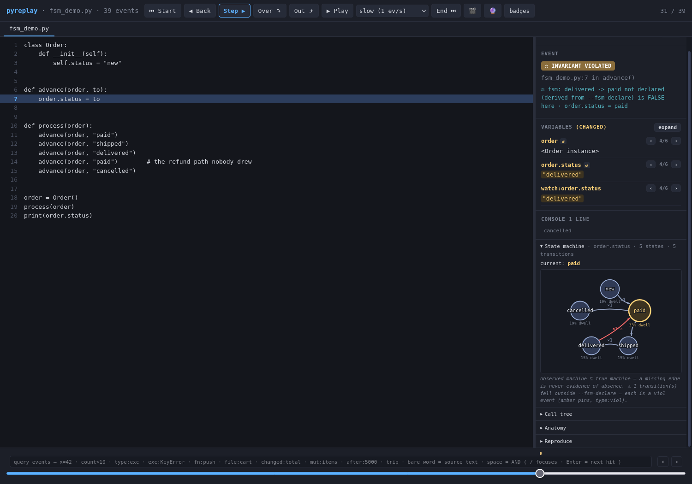](screenshots/132-fsm.png)

### 92. Boundary schemas — observed interfaces at the borders (v1)
- **Measured:** every trace (both granularities — call events carry
  the arguments in each) aggregates, per function, the structural
  SHAPE of its observed arguments and returns: types, dict keys,
  nesting — `list[dict{sku, qty}]` — never values, honest to the
  recorded depth. Per shape: how many calls, and the first event that
  showed it. Comprehension frames are excluded (machinery, not
  interfaces), generator resumes are not calls, and yields are not
  return contracts.
- **Displayed:** call and return events carry the function's
  observed-signature panel. A function whose contract wobbled wears ⚠
  with the distribution — `lookup(...) → dict{qty, price} 13× /
  NoneType 1×` — and jump links to each deviant call. After the run,
  the terminal prints a summary of every unstable interface.
- **Why:** the wrong-shape payload — the guessed dict key, the API
  that returns a list one day and a dict the next — crashes far
  downstream of its cause. A schema checkpoint at the border catches
  it at the door; in the LLM era this may be the most common bug
  class of all.
- **Use case:** a function returned `dict{qty, price}` thirteen times
  and `NoneType` once. The ⚠ names the odd call out; one click and
  you are at the arguments that produced it.
- **Command:** automatic in every trace — watch for ⚠ on call/return
  events, or read the terminal summary. (Cross-run schema diffing,
  declared-schema checks and map rows are the roadmap sequel.)
- **Screenshot** — a RETURN event wearing its observed signature: `lookup(sku: str) → ⚠ dict{qty, price} 3× / NoneType 2×`, with jump links to the deviants.

  [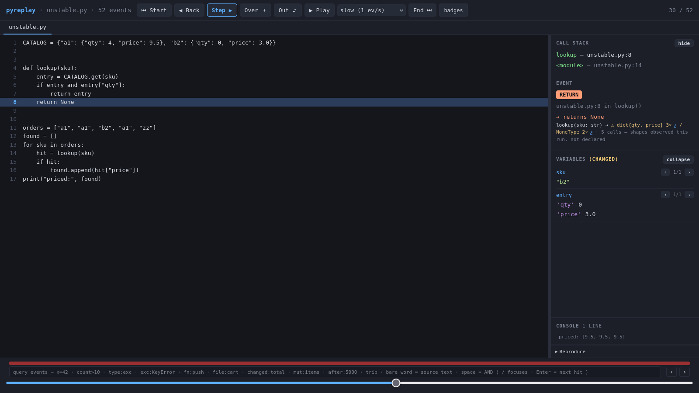](screenshots/120-boundary-schemas.png)

### 93. The nontermination detector — Poincaré's rule as a banner
- **Measured:** at every loop-head event the frame's recorded state
  is fingerprinted (all variables, canonical encodings); an exact
  repeat is a cycle. **PROVEN** is claimed only when the recorder
  could see the whole system: a `while` loop whose extent is
  statically free of calls, attribute access and suspension points
  (C calls are invisible to settrace — `time.time()` in a condition
  would fake purity), every fingerprinted encoding complete, and a
  quiet window (no traced calls, no console I/O, no other lanes, no
  exceptions). Anything less downgrades to "state recurring at line
  level" with every reason named. Impurities are counted per
  window, so noise before the cycle never taints the verdict.
- **Displayed:** the banner: "⟳ PROVEN CYCLE at file:2 — iteration
  state at event 23 is identical to event 8 (period 15 events · 5
  iterations): a pure recorded state that returns must repeat
  forever", with first/recurrence jump links. The hang itself is
  caught the natural way: the run hits the event cap and the trace
  holds the cycle.
- **Why:** the heartbeat already says "it seems stuck"; this says
  "it IS stuck, here is the cycle" — with the cycle's events right
  there to study. For-loops are never PROVEN (the iterator is state
  the recorder cannot fingerprint), and the banner says so.
- **Use case:** `while a != b: a = (a+2) % 10; b = (b+2) % 10`
  called with parity-mismatched arguments — five iterations in, the
  state returns exactly and the banner names the period. Add a
  `print` inside and the same cycle honestly downgrades: "calls in
  the loop body; console I/O inside the loop window".
- **Command:** automatic in every line trace; pair with
  `--max-events` (the cap catches the hang) or `--black-box` (the
  ring keeps the cycle). Honesty: proven means proven ABOUT THE
  RECORDED STATE — the reasons list is the boundary of that claim.
- **Screenshot** — the parity trap: PROVEN CYCLE banner with period
  and iteration count, jump links, the truncation note above it.

  [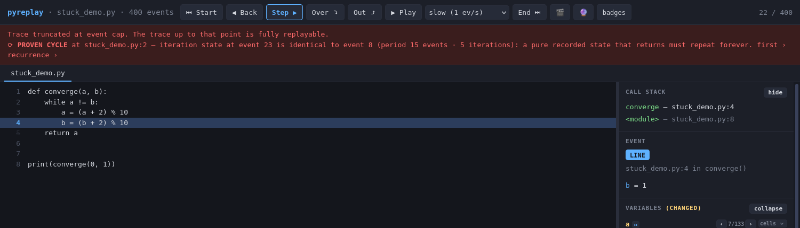](screenshots/78-nonterm.png)

## Part 10 — Concurrency & time

Tasks as lanes, wake edges as arrows, the critical path in gold, the frozen loop caught — and the Perfetto bridge when you need a million-event timeline.

### 94. asyncio task lanes — tasks as pseudo-threads
- **Measured:** when asyncio is loaded, every event records the driving
  task; `await` suspensions reuse the YIELD/RESUME machinery, so a
  suspended coroutine is ONE sleeping frame that re-emits its full
  state on resume (never stale after another task's mutations).
- **Displayed:** each task gets its own lane with its own call stack;
  the badge says `in task producer`; task names from
  `asyncio.create_task(coro, name="worker-A")` label the lanes
  (unnamed → Task-1, Task-2…); a task frame's Out button honestly
  stays put (its caller is the event loop, not your code). At fn
  granularity a yield reports "slice took X" and the final return
  "last slice X · active Y across N slices".
- **Why:** cooperative concurrency is invisible in source order; lanes
  show the event loop actually switching.
- **Use case:** `example_tasks.py`: two tasks over shared state — step
  and watch the stacks alternate at each await.
- **Command:** `python3 tracer.py example_tasks.py` (line level) or
  `python3 tracer.py --granularity fn example_tasks.py` (slice
  durations); automatic when asyncio is loaded.
- **Screenshot** — two task lanes with alternating stacks mid-trace.

  [](screenshots/40-task-lanes.png)

### 95. Happens-before arrows — who woke whom (v1)
- **Measured:** the wake primitives are wrapped for the run —
  `threading.Thread.start`/`join` and the event loop's `create_task`
  (the funnel for `create_task`, `ensure_future`, `gather` and
  `TaskGroup`) — and each wake lands in the stream as a first-class
  event at the moment it happened, attributed to the wake site. A
  start edge is recorded BEFORE the OS gets the child: a started
  thread can live its whole life before `start()` returns, and a wake
  must precede its consequences. Thread labels and task names
  late-bind at write time — the OS reuses thread idents the moment a
  thread dies, and tasks get renamed after creation; both would
  mislabel the edge if bound eagerly. v1 records create/start/join;
  cancel edges and queue put→get correlation are the roadmap
  remainder.
- **Displayed:** a **⤳ WAKE** badge in the replayer with the edge
  spelled out — "main ⤳ Thread-2 (transfer) — thread started",
  "worker finished ⤳ main continues" — and a *jump to the other end*
  link. In the Perfetto export every wake is an instant AND a flow
  arrow drawn between the lanes: creation arrows run from the waking
  slice to the woken lane's first slice, join arrows from the joined
  lane's last slice back to the waiter.
- **Why:** lanes show interleaving; they don't show **causation**.
  Race debugging is precisely the arrows — who released whom, which
  start explains which activity. This is Lamport's happens-before,
  imported into a single process.
- **Use case:** in `example_race.py`, click the wake at `t1.start()`
  and land on the worker's first event; at the join, jump back to its
  last. In `example_tasks.py`'s Perfetto timeline the arrows run
  main → Task-1 → producer/consumer.
- **Command:** automatic in every trace. For the drawn arrows:
  `python3 tracer.py --granularity fn --export-perfetto out.json
  example_tasks.py` → ui.perfetto.dev.
- **Screenshot** — the WAKE panel at `t1.start()`: the edge named, the
  jump ready.

  [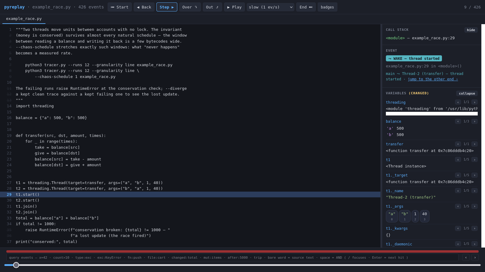](screenshots/88-wake.png)

### 96. The critical path — what actually determined wall time (v1)
- **Measured:** every microsecond of a concurrent fn trace is
  attributed to the INNERMOST slice open anywhere in the process at
  that instant. Under the GIL one thread computes at a time, so this
  spine IS the computation's critical chain — it crosses lanes
  exactly where awaits, wakes (#95) and joins handed control over.
  Instants where nothing traced was open are **untracked external
  waits** (sleep, network, OS, untraced libraries) — counted, never
  hidden. Sequential runs abstain: one lane's critical path is the
  whole run, a claim with no content. (True multi-core DAG analysis
  for genuinely overlapping threads is the stated remainder.)
- **Displayed:** a banner verdict — "★ critical path: 16 slices
  across 4 lanes determined the 62.3 ms run — 28.5 ms of it untracked
  external waits" — with **gold pins** on the scrubber walking the
  spine. The Perfetto export gains a dedicated **★ critical path**
  row (the spine read left to right, segment-exact, gaps = the waits)
  and a ★ in the args of every critical slice.
- **Why:** "we are 40% async" is trivia; *these five awaits are your
  runtime, everything else overlaps for free* is an optimization
  order. Speeding up anything off the path is wasted work — now the
  path is drawn.
- **Use case:** `example_tasks.py`: the spine reads module → Task-1 →
  producer → make_item → consumer → producer → … — the actual
  hand-off chain — and the 28.5 ms of `asyncio.sleep` shows up as
  attributed waits, not invisible time.
- **Command:** automatic in every fn trace with ≥ 2 lanes;
  `--granularity fn --export-perfetto out.json` for the drawn row.
- **Screenshot** — the banner naming the path and the waits, gold
  pins below.

  [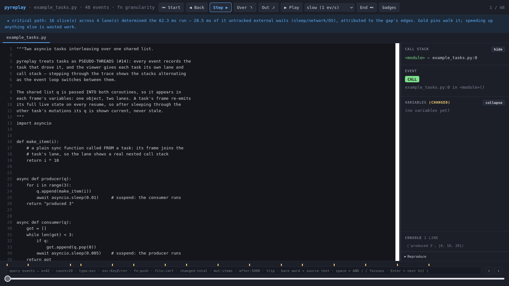](screenshots/89-critical.png)

---

### 97. The event-loop starvation detector — who froze the loop
- **Measured:** on fn traces with task lanes, every contiguous
  same-task stretch of recorded inter-event deltas is summed; past
  the threshold (default 100 ms — asyncio's own slow-callback
  duration; `--starve-ms N` configures) it held the loop that long.
  A coroutine yield RELEASES the loop and ends the stretch — awaited
  sleep time can never flag; generator yields return to their caller
  and do not end it. The largest single delta names the frame the
  wall time actually sat in (a call-stack walk of the stretch).
  Starved = the other tasks alive during it, birth taken from the
  #95 create event, so created-and-still-waiting counts; a task that
  never ran traced code cannot claim starvation. Refused at line
  granularity with the reason: line events carry no wall timestamps.
- **Displayed:** the ⏳ LOOP STARVATION banner — worst incident
  first: "task worker-A held the loop 361 ms inside parse() while
  Task-1, worker-B waited", with stretch-start and the-block jumps —
  plus one teal scrubber pin per incident and a terminal summary.
- **Why:** a blocked loop is the "program frozen" bug class and is
  invisible in source — the code *looks* async. asyncio's own debug
  mode logs a line nobody sees; this lands on the moment, jumpable.
- **Use case:** a coroutine calls a synchronous `parse()` that does
  `time.sleep(0.18)` twice without yielding between — one unbroken
  361 ms stretch, attributed to `parse()`, with both waiting tasks
  named. The fix (`await asyncio.to_thread(parse, item)`) clears the
  banner.
- **Command:** `python3 tracer.py --granularity fn app.py` (asyncio
  runs arm automatically) · `--starve-ms 250` to tune.
- **Screenshot** — the demo: banner naming worker-A, 361 ms,
  parse(), and both starved tasks; the teal pin on the strip:

  [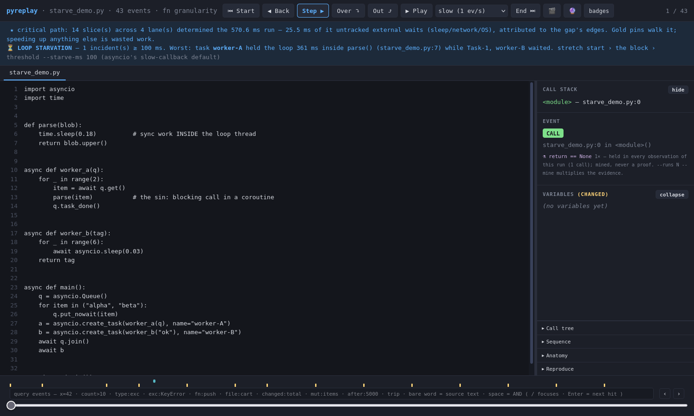](screenshots/124-starvation.png)

### 98. Perfetto export (`--export-perfetto out.json`)
- **Measured:** fn-granularity call/return pairs converted to Chrome
  Trace Event Format begin/end slices; exceptions become instant
  markers; thread·task lanes become timeline rows; an awaiting
  coroutine's slice closes at the yield and reopens on resume —
  suspension is a real gap. Refuses to run without `--granularity fn`
  (line traces carry no timestamps — the honesty rule again).
- **Displayed:** open https://ui.perfetto.dev and drag the JSON in (the
  trace is processed locally, it never leaves your machine): a
  professional million-event timeline with slice durations, args and
  return summaries.
- **Why:** hands your trace to an industrial timeline UI for free —
  Phase 5's first bridge to external tooling.
- **Use case:** an asyncio pipeline that stalls: the Perfetto row shows
  a 2-second gap in exactly one task's lane.
- **Command:** `python3 tracer.py --granularity fn --export-perfetto
  out.json example_tasks.py` → drag `out.json` into ui.perfetto.dev.
- **Screenshot** — ui.perfetto.dev showing the exported lanes and gaps.

  [](screenshots/41-perfetto.png)

## Part 11 — The run at a glance

Three projections of the same recorded events: the call tree, the sequence diagram, and motion at play speed.

### 99. The call tree — the recurrence, drawn
- **Measured:** nothing new — a pure projection of recorded
  call/return nesting. Each call event opens a node carrying the
  frame's arguments (they already ride the call event) and, when its
  return arrives, the return value; per-lane stacks attribute every
  event to the node executing it; per-level call counts and event
  totals are summed as the tree builds. A resumed generator/coroutine
  re-enters its ORIGINAL node — resumes counted, never phantom calls.
- **Displayed:** the **Call tree** panel: the run's whole call tree
  as nested collapsible nodes — `fib(n=3) → 2 · 4 ev ⤷` — the current
  frame lit and its ancestors auto-opened as the replay descends,
  live. Above it, the level line: `L3 4× / 16 ev` — calls at each
  depth × events recorded there. ⤷ jumps to that call's moment. A
  frame that never returned says so (`↯ no return recorded`); a
  suspended generator reads `⇢ suspended`. Render cap 4000 nodes,
  announced in-tree.
- **Why:** the stack panel shows ONE path; a flame graph aggregates
  identity away. For divide-and-conquer the call tree IS the
  canonical object — the recurrence, drawn, with "work per level ×
  number of levels" countable on screen.
- **Use case:** `fib(5)`: fifteen nodes, level counts
  1·2·4·6·2 — the exponential blowup visible before you measure it;
  both `fib(3)` subtrees on screen at once, each with its own
  arguments and value.
- **Command:** any trace, any granularity → open **Call tree** in
  the side panel. Composes with fn-granularity traces of real
  codebases (calls and returns are all it needs).
- **Screenshot** — fib(5) mid-descent: the current `fib(n=2) → 1`
  node lit amber inside its ancestors, level counts above, one
  subtree collapsed.

  [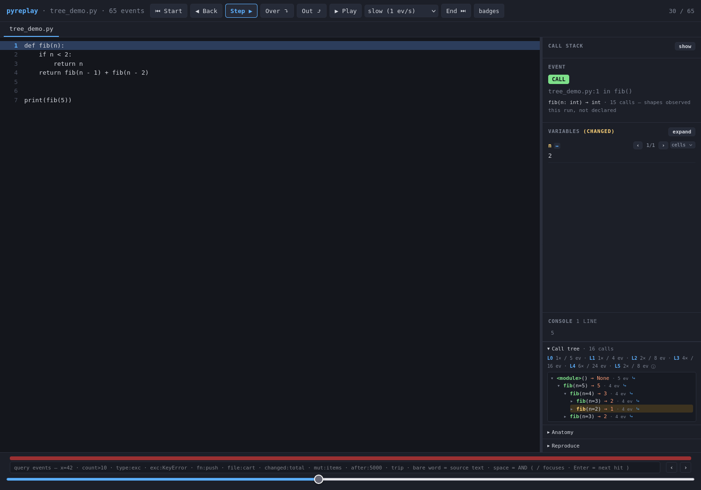](screenshots/133-call-tree.png)

### 100. The sequence diagram — lifelines from the log
- **Measured:** nothing new — the third projection of the same
  recorded call/return events (the call tree keeps identity, the
  lanes keep interleaving, this keeps the interaction grammar). A
  window is chosen — the chapter under the cursor, the current
  frame's extent, the span between the bookmarks flanking the
  cursor, or the whole run — and its call events are projected onto
  lifelines.
- **Displayed:** the Sequence panel — lifelines are the modules that
  act in the window (or the class, where the recorded MRO knew
  `self`), columns claimed caller-first in order of first
  appearance; arrows are the window's calls top to bottom in EVENT
  order (the corner says: not wall time); activation bars redraw the
  call-tree nesting on the callee's lifeline — returns close them,
  red means an exception passed through (caught or not), hollow
  means still open at the window's end. Self-calls are loops;
  a call arriving from outside the window's actors is a found
  message (dot + arrow); an import is honestly a module→module
  arrow, because a module body IS a call. Click any arrow to jump;
  the cursor lights its innermost drawn arrow live. Caps: 12
  lifelines, 400 arrows — both announced with dropped counts and
  the advice to narrow the window.
- **Why:** the classic onboarding question is "who talks to whom, in
  what order" — and no other view answers it as a picture. Threads
  and asyncio tasks come free: a lane is part of the lifeline key,
  so interleaving draws itself.
- **Use case:** open a teammate's unfamiliar service, trace one
  request at fn granularity, set window = whole run: entry →
  main.py → cart.py → discounts.py reads like the architecture
  diagram nobody drew — including the four `add()` calls and the
  2-per-item conversation with the pricing module.
- **Command:** any trace (fn granularity shows shape best) → open
  **Sequence** → pick the window. With `-m pytest` + chapters, one
  diagram per test.
- **Screenshot** — tinyshop, whole run: the import chain as module
  arrows, `add ×4`, `total` lit as current, the cart↔discounts
  exchange with activation bars:

  [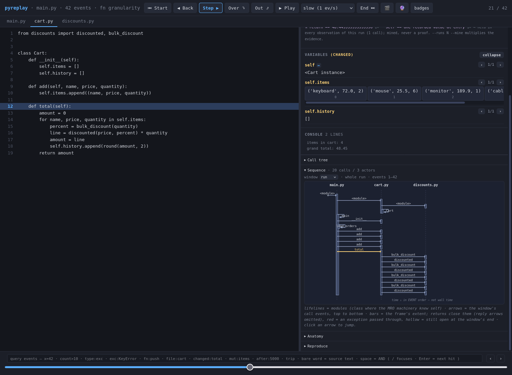](screenshots/136-sequence.png)

### 101. The motion layer — changes glide, honestly (+ presentation mode)
- **Measured:** nothing — and the feature says so. FLIP tweens ride
  the diff the views already draw: before each play-speed render the
  visible cells/bars/grid cells/dict rows/graph nodes are snapshotted
  by a HEURISTIC identity (value + occurrence for primitives, key for
  dict rows, label for graph nodes); after the render, whatever moved
  glides from its old position to its new one.
- **Displayed:** press ▶ Play and a swap's two cells slide past each
  other instead of teleporting; a queue advances; graph nodes drift
  to their new layer. Single-step stays inert by design — at step
  speed the highlight IS the change; motion exists for the eye at
  play speed, when element identity is exactly what gets lost.
  **Presentation mode** (🎬 or `P`): chrome hidden, large type, the
  code and the data side by side — a classroom projector mode. Esc
  exits.
- **Why:** state teleports between events, and at play speed the eye
  loses which element went where — precisely when watching-the-
  algorithm is the point. Motion renders a recorded change *as* a
  change, generically, for whatever the shape views already draw —
  no per-algorithm authoring, ever.
- **Use case:** bubble sort at play speed: every comparison that
  swaps sends the two cells gliding past each other — the sort
  becomes the dance the textbooks mime with cups.
- **Command:** any trace → ▶ Play (motion is automatic; stepping
  never tweens). `P` toggles presentation. Honesty, stated on the
  play button and in the presentation note: *motion between events
  is interpolation — only the endpoints are recorded truth; identity
  for primitives is heuristic.*
- **Screenshot** — presentation mode, frozen mid-glide: the 5 cell
  crossing onto the 2's slot during bubble sort's first swap, the
  interpolation note bottom-right.

  [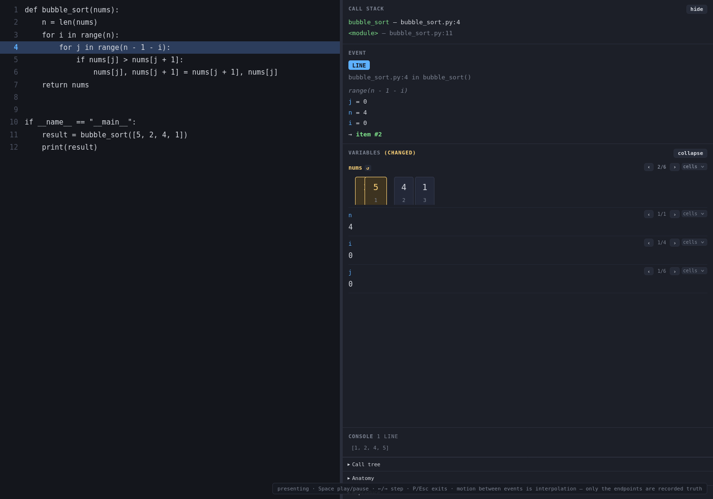](screenshots/135-motion.png)

## Part 12 — The trace as a notebook

Investigations and lessons live WITH the trace: notes, guided tours, the explain bundle, and the prediction gate.

### 102. Annotations — the trace as the notebook
- **Measured:** nothing — a pure replayer medium. Notes live in
  localStorage keyed to this exact trace (script + event count), and
  in an exportable JSON sidecar so they travel with the file.
- **Displayed:** press **N** at any event: the note bar opens
  (prefilled when a note exists) — Enter saves, empty deletes, Esc
  closes. The **Notes** panel lists every note, jumpable, with
  per-row delete; cream pins mark noted moments on the strip.
  **export sidecar** downloads `pyreplay-notes_<script>.json`
  (1-based event numbers, timestamps); **import** merges a sidecar —
  notes outside this trace's event range are skipped, never clamped,
  and a sidecar written against a different event count warns that
  its numbers may not mean the same moments.
- **Why:** a long investigation IS a set of annotated moments; today
  they live in a text file full of event numbers. The trace should
  be the notebook — and the sidecar means a teammate opens your
  trace and your notes are already pinned to the moments.
- **Use case:** "HERE raw enters — everything after this is
  downstream" pinned at event 7; "the clip fired — why 10 and not
  13?" at event 17. Reopen tomorrow (or send both files): the
  investigation resumes where thinking stopped.
- **Command:** any trace → **N**. Export/import in the Notes panel.
- **Screenshot** — two pinned notes, the panel open, the editor
  mid-thought:

  [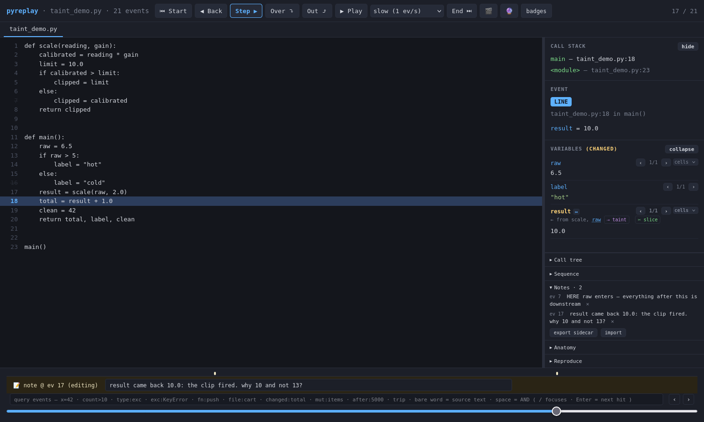](screenshots/107-annotations.png)

### 103. Guided tours — executable lessons
- **Measured:** nothing — a tour is an ordered list of stops, and a
  stop is a MOMENT plus the whole view state, captured through the
  deep-link hash (event, variable, view, overlay) with a line of
  narration and an optional 🔮 prediction flag.
- **Displayed:** the Tour panel — author mode is literally "save
  current state as stop": park anywhere, set the view you want the
  learner to see, write one line, add. Play mode walks the stops
  with a narration bar (title — stop k/N, prev/next/finish, Esc
  exits); playing a stop sets its saved hash and the restore
  machinery does the rest. A **prediction stop** arms the #105 gate
  on arrival: the learner commits a claim before stepping, and the
  walkthrough becomes an exercise with a grade. Sidecars
  export/import with the #102 contract — 1-based events,
  out-of-range stops skipped never clamped, event-count mismatches
  warned. Ships with `tours/pyreplay-tour_bubble_sort.py.json`,
  five stops over the teaching fleet's bubble sort; the check
  re-traces it and fails if the lesson drifts stale.
- **Why:** the project's teaching soul, weaponized: onboarding a
  codebase becomes handing someone three tours instead of a wiki —
  and the tour never lies, because every stop is the recorded trace
  underneath.
- **Use case:** "watch the first swap land — stop 3/5" opens in
  bars view at event 11 with the changed bars glowing; stop 4 arms
  the gate and asks the learner to predict the next line before
  stepping.
- **Command:** trace `bubble_sort.py` → open the trace → **Tour →
  import** the bundled JSON → ▶ play.
- **Screenshot** — stop 3/5 narrating the first swap over the bars
  view it restored:

  [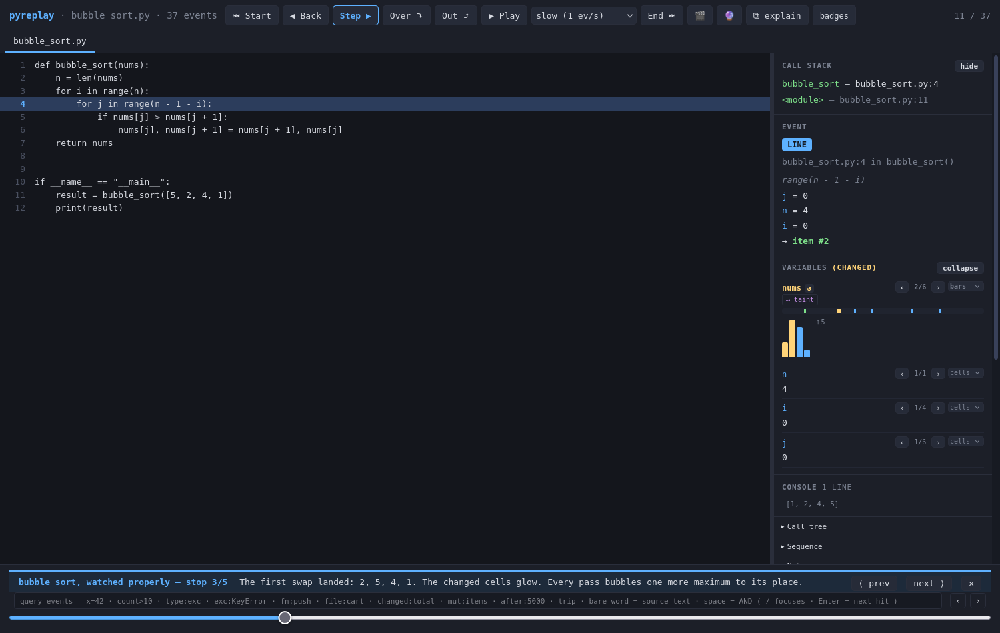](screenshots/108-tours.png)

### 104. The explain bundle — ground truth as text
- **Measured:** nothing — a serializer over what the trace already
  holds. ±25 events around the cursor become plain text: a
  self-describing header (script, granularity, engine, event span,
  the capsule's rerun command when recorded), then one block per
  event — the source line, the verdict in Python spelling, every
  changed value in compact form with its static dataflow sources
  (`← from reading, gain`), returns, exceptions, console lines,
  wakes, sub-line branch verdicts, ☢ trips. `>>` marks the cursor;
  a legend closes the file; a 20k-char cap announces itself.
- **Displayed:** the **⧉ explain** button — downloads
  `pyreplay-explain_<script>_ev<N>.txt` and copies to the clipboard;
  `PYREPLAY.explain()` exposes the builder for scripting. Every
  bundle carries the honesty line verbatim: *every value below is
  RECORDED truth as the replayer displays it (windows and caps
  apply; nothing is recomputed).*
- **Why:** the trace knows what actually happened; humans and
  models alike reason better when handed that truth as text instead
  of a screenshot or a memory of one. pyreplay stays offline — the
  bundle is a file; where it goes is the user's business.
- **Use case:** paste the failing window into an issue, a review
  comment, or an AI assistant: fifteen events of source, values,
  verdicts and provenance around the bug — no transcription errors,
  no "I think it was 13.0".
- **Command:** any trace → park the cursor → **⧉ explain**.
- **Screenshot** — the bundle itself: header with the rerun command,
  verdicts, provenance arrows, the `>>` cursor:

  [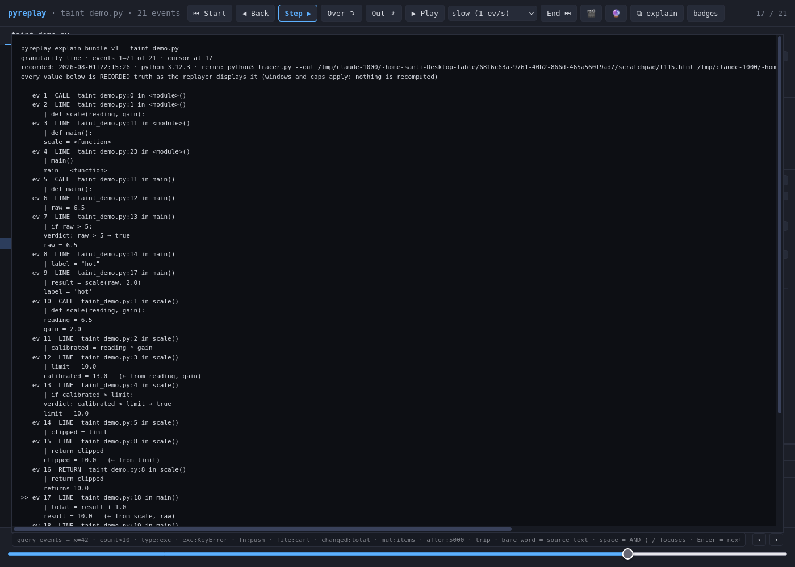](screenshots/115-explain-bundle.png)

### 105. The prediction gate — commit before you look
- **Measured:** nothing new — every claim type is scored against data
  the trace already holds: the next event's line (control flow), the
  change index (values), the recorded loop verdicts (iteration
  totals, the #68 counts). Renderer-only, zero schema change.
- **Displayed:** toggle 🔮 and the gate bar arms: three claim types —
  **next line** (which line executes next? Enter commits, the step
  reveals), **variable shows / unchanged** (the value as the panel
  would display it), **this loop runs N×** (stand on a for/while
  header; scored from the recorded verdicts immediately, no
  stepping). Each verdict comes back as ✓/✗ with both sides stated:
  "✗ claimed L6 — recorded L5". The step controls are gated — a bare
  step nudges "commit a claim first — or take the step unscored"
  (skips are counted, honestly). The ledger (hit rate by claim type,
  streak) lives per script in localStorage; export downloads the
  JSON sidecar; free navigation is never locked.
- **Why:** passive replay teaches little; the mismatch between a
  committed prediction and the recorded truth is where understanding
  is generated. The gate turns the replayer from a microscope into a
  laboratory — predict-observe-explain as a mode, a planted-bug hunt
  into a scored drill.
- **Use case:** bubble sort, cursor on the inner `for` header. Claim
  "this loop runs 4×" — ✗, the recorded verdicts say 3× (`range(n -
  1 - i)`, and *that* is how the off-by-one lesson sticks). Claim
  the next line after a comparison — ✓ or ✗ tells you whether you
  actually predicted the branch.
- **Command:** any trace → 🔮 in the header. Honesty: claims are
  scored against recorded truth only; peeking is your business —
  only committed claims count.
- **Screenshot** — the gate bar mid-session: loop claim just scored
  ("✓ claimed 3× — the recorded verdicts say 3×"), ledger reading
  line 1/1 · loop 1/1 · streak 2.

  [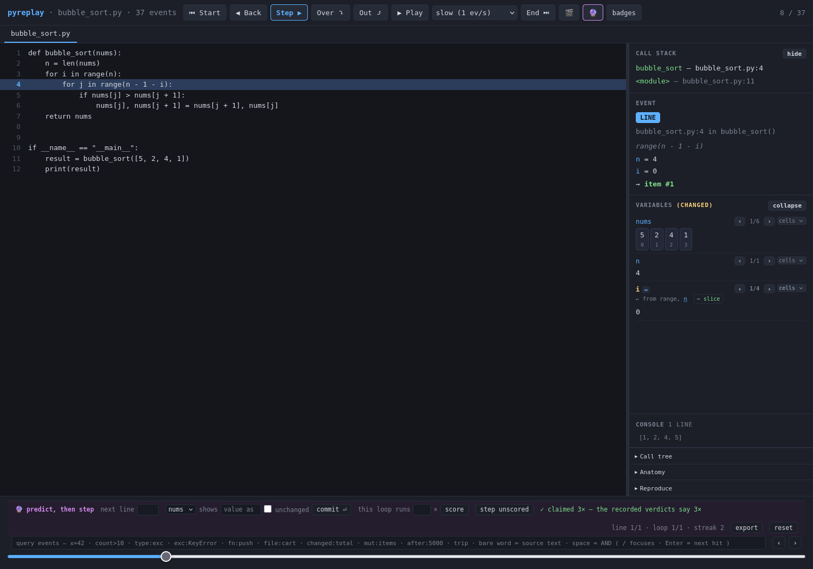](screenshots/128-prediction-gate.png)

## Part 13 — Architecture audits

The map as guardian: declared layers, the real API surface, name masking, dead code, and history as a risk lens.

### 106. Layering rules — the declared architecture, enforced visually
- **Measured:** an optional `.pyreplay-layers` file at the mapped
  root (or `--layers FILE`) declares the architecture: `layers: ui
  -> logic -> data` (order is permission — a layer may import
  downward, never upward), `layer NAME: glob, …` membership by
  fnmatch on dotted module ids (first declaration wins), `forbid A
  -> B` explicit bans. Every internal import edge is classified;
  modules matching no layer are counted as unconstrained, never
  guessed into one. A malformed rules file REFUSES to enforce —
  partial rules would pretend the architecture is safe — and says so.
- **Displayed:** violating edges are solid red with the violated
  rule in the tooltip (`⛔ data may not import ui — the chain says ui
  -> logic -> data`); the banner counts violations or states "⛔̸
  architecture holds"; the walls panel lists every violation,
  click-to-spotlight, with the assigned/unassigned tallies.
- **Why:** every codebase has an intended architecture that erodes
  silently; the map already draws every import — one config file
  turns it into the architecture's guardian. The visual half is what
  import-linter never had.
- **Use case:** the classic sin — `store.py` (data) importing
  `ui.py` for a formatting helper — is one red edge and one walls
  row naming the rule it broke, the moment the map opens.
- **Command:** write `.pyreplay-layers`, re-map. For CI:
  `python3 mapper.py --check-layers .` — exit 0 when the
  architecture holds, 4 on violations, 2 on a broken or missing
  rules file.
- **Screenshot** — layerdemo: the upward import solid red among
  blue edges, the banner counting it:

  [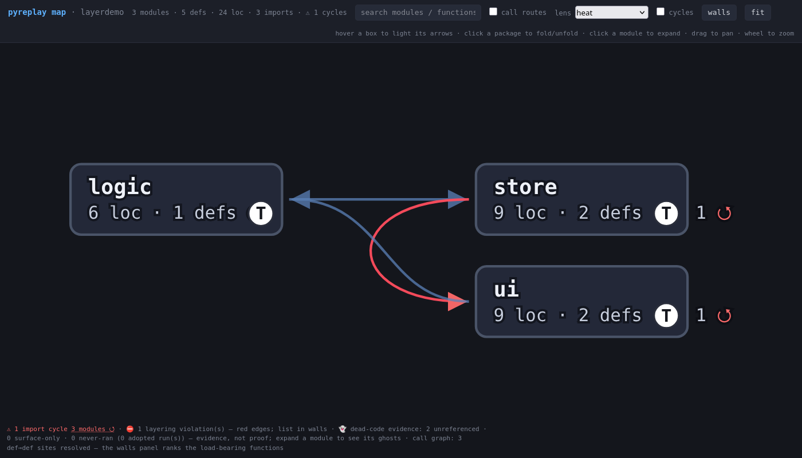](screenshots/96-layers.png)

### 107. API-surface honesty — encapsulation leaks, measured
- **Measured:** the gap between the intended interface and the real
  one. Three leak classes, pure aggregation over what the map
  already knows: **private-module reaches** — an outside module
  imports `store._internal` (privacy owner = the underscore
  component's parent package); **private-name imports** — an
  outsider does `from m import _name`; **undeclared names** — `m`
  declares a literal `__all__` and an outsider imports a public name
  not in it. Intra-package reaches are the convention working as
  intended — not counted, and the panel says so. A computed
  `__all__` stays None: no undeclared claims without a literal
  declaration. Star imports bypass the name audit and are counted,
  never ignored.
- **Displayed:** the walls panel's 🔓 audit — "store._internal ← 2
  outside module(s)", "store.api.extra ∉ __all__" — each row
  click-spotlights its module; the header gains a **🔓 leaks**
  toggle that paints every leaking import edge dashed red with 🔓
  marks in the edge tooltip; the banner counts both kinds; the
  terminal prints the top leaks.
- **Why:** the gap between intended and real interfaces is where
  refactors break the world; measuring it turns "please don't
  import private stuff" into a number that can go down.
- **Use case:** the audit reads `←2 store._internal · ←1
  store.api._prep (private) · ←1 store.api.extra ∉ __all__` — while
  `store.cli`'s import of its own package's `_internal` correctly
  doesn't appear, and neither does `solve` (it IS the interface).
- **Command:** automatic on every map; no leaks = no panel, no
  toggle. Honesty: measured at package boundaries from static
  imports only — `importlib`/`getattr` reaches are the trace's job
  (#39), and star imports are counted as unaudited.
- **Screenshot** — the audit panel over the map: three leak rows
  (the ∉ __all__ one amber), the dashed-red leak edge arcing into
  `store.api`, the 🔓 toggle checked in the header.

  [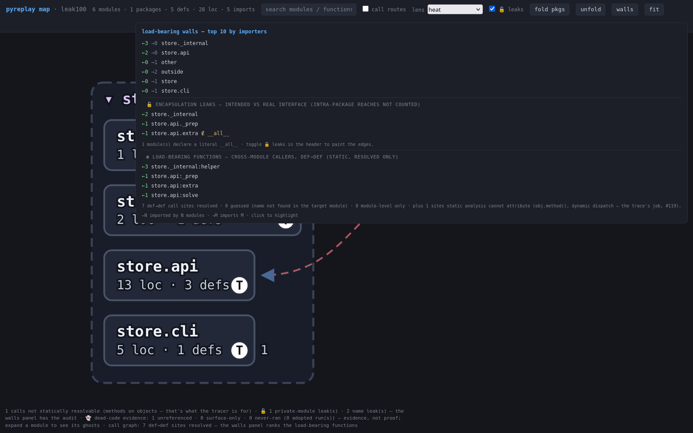](screenshots/100-api-leaks.png)

### 108. The shadowing & collision audit — names that resolve wrongly
- **Measured:** static, zero run-time cost, two tiers. Per def (in
  every line trace): locals that mask a **builtin** (`list`, `id`,
  `sum`…), a **module-level name** (with the line that bound it), or
  an **enclosing function's local** — argument names, assignments,
  loop/with/except targets, walrus bindings, local imports; nested
  scopes respected, and *reading* an enclosing name is never flagged
  (a closure read is not a shadow). Per module (on every map):
  imports rebound by later module-level assignments, module-level
  builtin masks, and the import horror — a TOP-LEVEL file named like
  a stdlib module (`random.py`, `email.py`); package-internal files
  are exempt under absolute imports, and the note says why.
- **Displayed:** the replayer wears **👥** on exactly the shadowing
  rows of the matching frame, the outer binding named in the tooltip
  ("shadows the module-level `total` (bound at L2) — the outer name
  is unreachable from this frame"). The map wears 👥 pips on flagged
  boxes with the masks in the tooltip, a banner count, and
  stdlib-filename cases called out in the terminal, first.
- **Why:** scope-collision bugs read correctly and *resolve*
  wrongly — the code looks fine because it is fine, somewhere else.
  The stdlib-filename case can break a codebase at import time in
  ways that look supernatural.
- **Use case:** `total = sum(data)` inside a function silently stops
  updating the module's `total` — the row wears 👥 naming the L2
  binding it masks, at the exact moment the frame holds both.
- **Command:** any line trace (badges) · any map (pips + terminal).
- **Screenshot** — the demo frame: `total` and `json` wearing 👥,
  the closure `count` correctly wearing ⛓ instead:

  [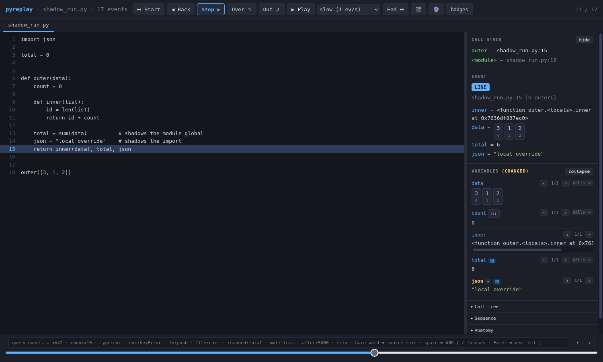](screenshots/122-shadowing.png)

### 109. Dead-code evidence — two kinds of proof it's safe to delete
- **Measured:** the join IS the feature: static unreference (#16's
  def→def call graph plus the importable surface — every name-level
  import the scanner saw) × dynamic never-ran (per-def counts from
  every adopted trace). Three tiers, strongest first: **A** — no
  static reference at all; **B** — importable surface or a live
  class's method, never called statically (obj.method dispatch is
  statically invisible, so this is exactly where it hides); **C** —
  called statically somewhere, never ran in any adopted run
  (workload-relative). A def that RAN is alive whatever the static
  graph says — dynamic dispatch, not dead code — and a class body's
  import-time execution is NOT liveness (a class lives through
  static references or a method that ran). Dunders are skipped: the
  interpreter calls them implicitly.
- **Displayed:** the terminal's ranked tier list; on the map, every
  candidate def row wears 👻 with its tier in the tooltip, modules
  carry a 👻N count in their meta line, and the banner totals the
  three tiers with the honesty clause. Capped at 500, announced.
- **Why:** deleting code is the highest-leverage refactor and the
  scariest; two independent kinds of evidence make it a decision
  instead of a bet. vulture is static-only, coverage.py dynamic-only
  — the join is what neither shows.
- **Use case:** a library maps to `[A] lib.never_ever · [A]
  lib.Ghost (+its method) · [B] lib.exported (imported, never
  called) · [C] lib.cold (guarded by a branch no run took)` — and
  `used()` is nowhere on the list because it ran.
- **Command:** automatic on every map; adopt traces (auto-heat or
  `--trace`, repeatable) for the dynamic axis — without runs the
  report keeps the static tiers and makes no workload claims.
  Honesty, verbatim everywhere it appears: evidence, not proof —
  reflection, plugins and decorators can hide callers.
- **Screenshot** — the tier list: four A's in red, the
  surface-only B, the never-ran C, the honesty line above.

  [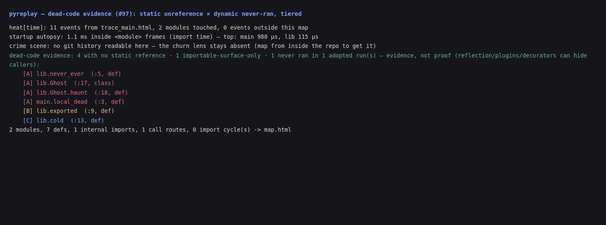](screenshots/97-dead-code.png)

### 110. The crime scene — churn × complexity (history as a lens)
- **Measured:** per-module change counts from `git log --numstat`
  over a window (default "12 months ago"; `--churn-since` takes git's
  own vocabulary), scoped to the mapped subtree, rename-naive; plus a
  stdlib complexity score from the AST already walked — decision
  points (ifs, loops, handlers, ternaries, boolean branches, match
  cases), honestly labeled *decision points*, never "McCabe". No
  readable git history → the lens is absent, never guessed.
- **Displayed:** a **lens** select beside the toggles: *heat*
  (default) · *churn × cx* — tint by √(churn·complexity), normalized
  to THIS repo's own maxima — · *risk*, ∛(churn·cx·heat), enabled
  when a trace is adopted: changes often, is complex AND carries the
  runtime. The banner names the window and commit count; tooltips
  carry the raw numbers per module; a folded package wears its WORST
  member's score (a fold must never hide the top offender); the
  terminal prints the top offenders.
- **Why:** structure is one axis, a run's behavior the second —
  history is the third, and churn × complexity is the strongest bug
  predictor known (Tornhill's crime-scene method; Nagappan & Ball's
  defect studies). "Changed 18 times this year, 1081 decision points"
  is where review effort goes first.
- **Use case:** pyreplay mapped on itself: `tracer` scores 0.93 (18
  commits · 1081 decision points) and burns red, `checks` 0.67,
  everything else cold. Any pyreplay developer would have named the
  same offender — now the map does.
- **Command:** automatic on any mapped git repo — flip the lens in
  the header. `--churn-since "24 months ago"` widens the window;
  `--no-churn` skips git entirely.
- **Screenshot** — pyreplay's own crime scene: tracer red-hot, checks
  glowing, the quiet fleet cold, the banner naming the window.

  [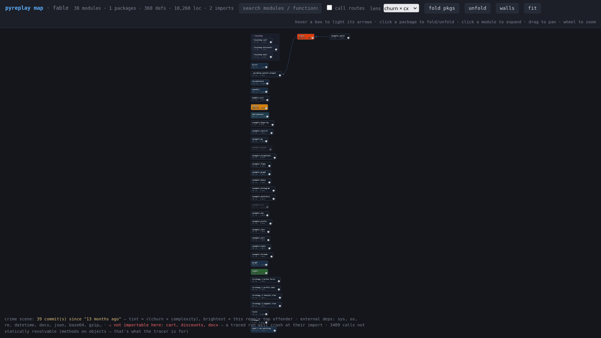](screenshots/95-crime-scene.png)

## Part 14 — The reliability lab

Statistics over many runs: rates instead of anecdotes, divergences instead of guesses, oracles built from symmetries, chaos that makes the race fire.

### 111. The N-run harness (`--runs N`)
- **Measured:** the target executed N times — each a fresh child
  tracer fed IDENTICAL stdin bytes (the measurement protocol). Per
  run: outcome, classified by exception type + crash site read from
  the child's own payload; wall time (labeled tracer-inclusive —
  comparable to each other, not to bare runtime); event count.
- **Displayed:** `runs_<name>.html` — an outcome bar, a per-class
  wall-time distribution (min/median/p95/max), a clickable per-run
  strip in run order, stderr/stdout tails for the first run of each
  failing class, and replay links into the kept traces. The terminal
  shows the same table live, run by run.
- **Why:** *sometimes-code* is the worst code: it passes your one run
  and fails in the field. A run set converts a hidden flake into a
  measured rate — with a replayable specimen of each behavior.
- **Use case:** `example_flaky.py` depends on set iteration order by
  accident. `--runs 20` → "13× clean · 7× RuntimeError at
  example_flaky.py:31", one kept trace of each — open the failing one
  and step to the crash.
- **Command:** `python3 tracer.py --runs 20 example_flaky.py` — fn
  granularity by default; ONE trace kept per outcome class (first
  seen), the rest measured, classified, deleted. Exit 0 only if every
  run was clean, so `git bisect run` consumes it directly; Ctrl-C
  reports the runs completed so far.
- **Screenshot** — the whole experiment on one page: outcome bar (10× clean · 2× RuntimeError), per-class timings, the run strip, a failing run's stderr tail, the suspects.

  [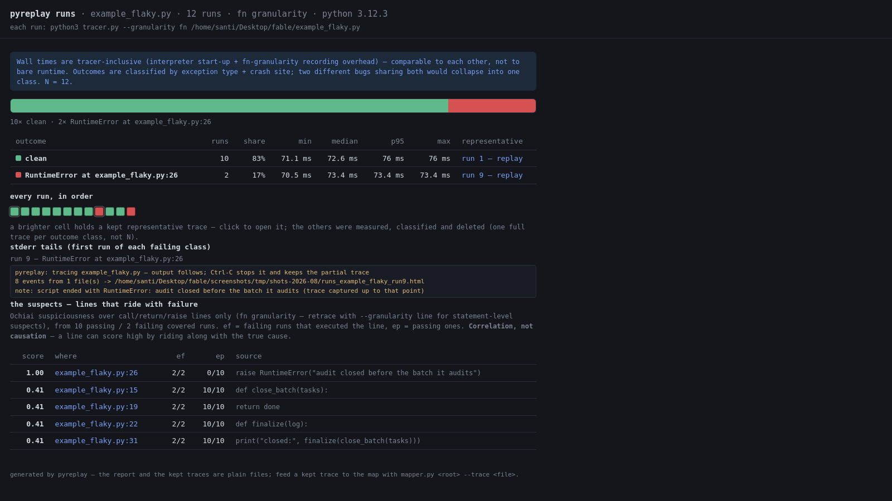](screenshots/63-runs-harness.png)

### 112. The divergence finder (`--diverge A B`)
- **Measured:** two traces' event streams, canonicalized — timestamps
  and `0x…` memory addresses inside reprs stripped, exactly what
  differs between any two healthy runs — then aligned by identical
  prefix (v1). The first mismatch is found at two depths: STATE (the
  same line runs on both sides, its values differ) and CONTROL (a
  different line runs).
- **Displayed:** a terminal report: how long the two runs agreed; the
  state divergence with each differing variable named and both values
  shown; the control divergence with both source lines; and deep
  links (#49) that open BOTH traces at the divergence. Exit 0
  identical · 1 diverged.
- **Why:** "why did THIS run fail?" reduces to "where did it first
  leave the good path?" — and state usually diverges before control:
  the cause, then the symptom.
- **Use case:** after `--runs` on `example_flaky.py`, diverge the kept
  clean trace against the kept failing one:

  ```
  pyreplay diverge: …run1.html (6 events) vs …run5.html (8 events)
    identical for the first 1 event.
    STATE diverges first, at event 2 (the same line runs on both
    sides — its values differ):
      …run1.html: call example_flaky.py:15 in close_batch
      …run5.html: call example_flaky.py:15 in close_batch
        tasks:  {ship, audit, bill}  vs  {audit, ship, bill}
    control flow follows at event 5:
      …run1.html: return example_flaky.py:27 in finalize
      …run5.html: exc example_flaky.py:26 in finalize [RuntimeError]
  ```

  The set-iteration accident — the actual cause — named at the call
  boundary, three events before the crash it produces.
- **Command:** `python3 tracer.py --diverge runs_x_run1.html
  runs_x_run5.html`. Refuses mismatched granularities; a run that is a
  strict prefix of the other diverges at its end. (Report is text —
  no screenshot needed.)

### 113. The suspects — spectrum-based fault localization
- **Measured:** during `--runs`, per-run coverage is collected before
  the non-kept traces are deleted. When the run set contains BOTH
  outcomes, every executed line is scored with Ochiai: how exclusively
  do failing runs execute it?
- **Displayed:** THE SUSPECTS — in `runs_<name>.html` and the
  terminal: rank, score, `file:line`, executed-in counts (failing ·
  passing), each suspect deep-linked (#49) into a kept failing trace.
  The report says what the math is: correlation, not causation.
- **Why:** statistics do the boring half of debugging before you read
  a line of code — the lines only failing runs touch are where to
  look first, and here they arrive ranked, clickable, attached to a
  replayable specimen.
- **Use case:** dogfooding caught a real one: SBFL flagged a line
  inside the runs harness itself — an undefined variable swallowed by
  a broad `except`. The top suspect was the bug.
- **Command:** `python3 tracer.py --runs 20 example_flaky.py` —
  automatic whenever runs both pass and fail. At fn granularity the
  units are call/return/raise lines; line granularity gives
  statement-level suspects.
- **Screenshot** — the suspects table: the planted raise at 1.00, executed by 2/2 failing runs and 0/10 passing ones.

  [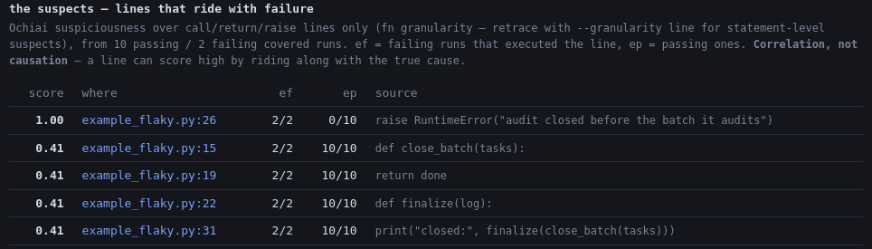](screenshots/65-sbfl-suspects.png)

### 114. Behavioral bisect (`--check EXPR`)
- **Measured:** EXPR is watched two ways in one run: per line against
  the frame's variables (like `--start-when`: `"total < 0"`), and
  once at end-of-run against the run FACTS — `error`, `exc`, `events`,
  `output` (the console text as a queryable fact), `hit`, `hits`,
  `tests_failed`, `truncated`.
- **Displayed:** an exit code, by design: **1** the moment either side
  says yes, **0** clean, **3** never-evaluable — a typo'd expression
  must never look like a clean run. Overrides the usual
  exit-0-when-the-target-crashes rule, and passes through `--runs`
  (a child's hit becomes an outcome class — you can measure a rate).
- **Why:** `git bisect` is the most powerful debugging tool that
  nobody feeds well: it wants a yes/no oracle. `--check` turns any
  traceable question — about state, output, exceptions, test
  counts — into exactly that.
- **Use case:** which commit introduced the deprecation warning?
  `git bisect run python3 tracer.py --check "'deprecated' in output"
  main.py` — no test to write, the console lane is the oracle. Flaky
  version: wrap it in `--runs 10` and bisect the rate change.
- **Command:** `python3 tracer.py --check "total < 0" script.py` —
  state test, facts test (`--check "tests_failed > 0"` with
  `-m pytest`), or both in one expression. (Terminal instrument — no
  screenshot.)

### 115. Input shrinking — ddmin to the failing core (`--shrink`)
- **Measured:** Zeller's delta debugging over the piped stdin: split
  into lines (default), whitespace tokens or bytes, remove chunks,
  re-test, recurse — every probe a real child run under the tracer.
  The oracle: with `--check EXPR`, "the check hits"; without one,
  "the target crashes with the SAME exception type as the full
  input" — the failure being preserved, never swapped for another.
  Attempts capped (`--shrink-cap`, default 200) and the cap is
  announced when it bites: best-so-far, not a claimed minimum.
- **Displayed:** the terminal narrative — units before → after,
  bytes before → after, attempts, "1-minimal: removing any single
  line un-fails it" — plus three files: the minimal input
  (`shrunk_*.txt`), a LINE-level trace of the minimal case
  (`trace_shrunk_*.html`), and the ready-to-paste rerun command.
- **Why:** a 2 MB input that crashes is a chore; the 3-line core
  that still crashes is a diagnosis — and minimal inputs make
  minimal traces, which makes every other instrument sharper.
- **Use case:** 78 ledger lines crash an audit assertion. Fifteen
  probes later: `refund 999` + `audit` — the entire failure, two
  lines, auto-traced at line level with the assertion recorded.
- **Command:** `python3 tracer.py --shrink app.py < big_input.txt`
  (+ `--check EXPR` for non-crash oracles, `--shrink-model
  lines|tokens|bytes`, `--shrink-cap N`). Honesty: a full input
  that doesn't fail is refused ("the failure must reproduce BEFORE
  it can be shrunk"); 1-minimality is per-unit, not global
  minimality.
- **Screenshot** — the two-line core: oracle named, 78 → 2 lines in
  15 attempts, the minimal input printed below.

  [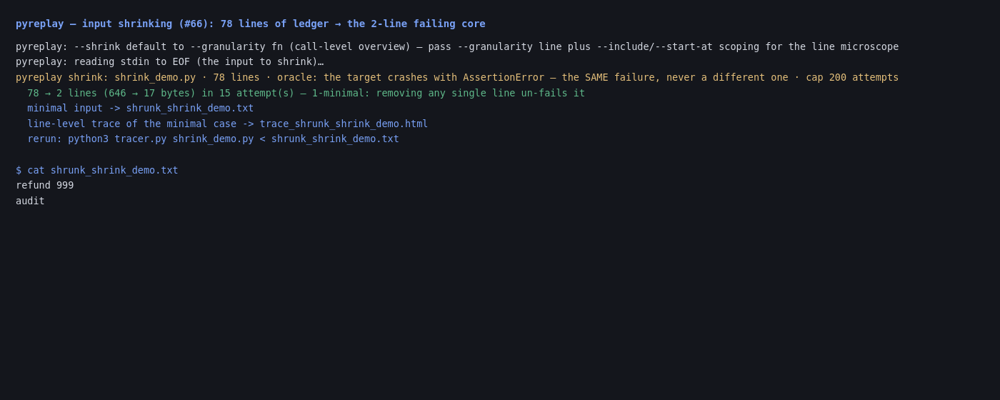](screenshots/66-shrink.png)

### 116. Schedule fuzzing — concurrency chaos (`--chaos-schedule SEED`)
- **Measured:** seeded perturbation injected at every traced event
  boundary — mostly bare GIL yields, sometimes 50–500 µs stalls —
  plus switch-interval jitter re-rolled as the run goes, and, under
  asyncio, a seeded shuffle of each loop tick's ready queue. The seed
  drives a private random stream (the target's own `random` is
  untouched), and every injection is counted. Chaos biases WHICH
  legal interleavings the run explores; it never edits the code.
- **Displayed:** the trace banner wears **⚡ PERTURBED** with the seed
  and the injected counts; a chaos run set says PERTURBED in its
  report header; the map's auto-heat refuses to adopt chaos traces
  (fuzzed heat, and it says so). Same seed = same injected decision
  stream — the OS still owns the schedule, so this is biased
  exploration, honestly labeled, not replay.
- **Why:** race conditions are probability distributions, and the
  natural schedule samples one tiny corner of the space. A few random
  perturbation points flush most races (PCT, Burckhardt et al.) —
  "works on my machine" collapses into a measured rate.
- **Use case:** `example_race.py` moves money between two accounts
  with no lock. Twelve natural line-granularity runs: 12× clean.
  Under `--chaos-schedule 1`: 11× "conservation broken: 978 != 1000 —
  a lost update", one kept trace per class, the suspects led by the
  conservation raise — and the failing child's Reproduce box carries
  the exact seed that broke it.
- **Command:** `python3 tracer.py --runs 12 --granularity line
  --chaos-schedule 1 example_race.py` — under `--runs`, run i gets
  seed SEED+i−1 (diverse exploration, every child reproducible).
  `--export-perfetto` is refused under chaos: perturbed time is not
  performance truth.
- **Screenshot** — the chaos run set: 11× broken · 1× clean, ⚡
  PERTURBED in the header, the CHAOS announce in the stderr tail, the
  suspects led by the raise.

  [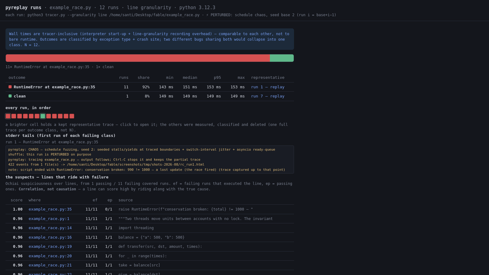](screenshots/68-chaos-runs.png)

### 117. The property/fuzz entry — find the failing input while you sleep (`--fuzz GEN.py`)
- **Measured:** the N-run experiment aimed at INPUTS instead of
  schedules. GEN.py defines `gen(rng)` → the run's stdin (str/bytes)
  or its argv (a list); `rng` is a `random.Random` seeded
  `fuzz-seed + i − 1` for run i (`--fuzz-seed` pins the base, default
  1234), so every generated input is reproducible forever. Each run
  is a fresh child tracer; outcomes classify exactly as in the N-run
  harness, and the suspects, `--mine` and `--chaos-schedule` all
  compose (inputs × schedules explored together, both seeds
  recorded).
- **Displayed:** the report header wears 🎲 with the generator and
  the base seed; every run's cell carries its seed; each class's
  FIRST input is saved beside its kept trace and linked from the
  class table (clean included — the known-good for diffing). The
  first failure prints its seed, gets a line-level microscope trace
  of exactly that input, and composes the ready-to-paste `--shrink`
  command — the funnel hands you the next instrument, it never
  auto-runs it.
- **Why:** every other lab instrument assumes you HAVE a failing
  case. This one finds it: the runs-statistics idea (code that looks
  reliable can hide an error that only sometimes shows) pointed at
  the input space — keep the seed, save the case, minimize it.
  Property-based testing's discipline (Hypothesis; AFL's keep-the-
  seed philosophy) as one flag on the harness you already trust.
- **Use case:** `example_fuzz.py` is a ledger with a planted boundary
  bug that carries its own input model (one file, both roles: target
  and generator). Twenty runs at the default seed: 13× clean, 7×
  "books negative" — the suspects crown the assert (1.00, 7/7 vs
  0/13), the first failing ledger is on disk, and pasting the
  composed shrink cuts it to its 2-line core: `refund 8` + `audit`.
- **Command:** `python3 tracer.py --fuzz example_fuzz.py --runs 20
  example_fuzz.py` (without `--runs` it defaults to 20, announced).
  A `gen()` that raises or returns the wrong shape is a counted run
  outcome, never a silent skip; a `gen(value, seed)` file is named
  as the `--sweep`/`--relation` protocol and refused, not just
  rejected. Honesty: finding no failure is an observation over these
  seeds, never a proof.
- **Screenshot** — the fuzz run set: 🎲 header with the seed rule,
  the 7×/13× split with per-class input links, the suspects led by
  the assert.

  [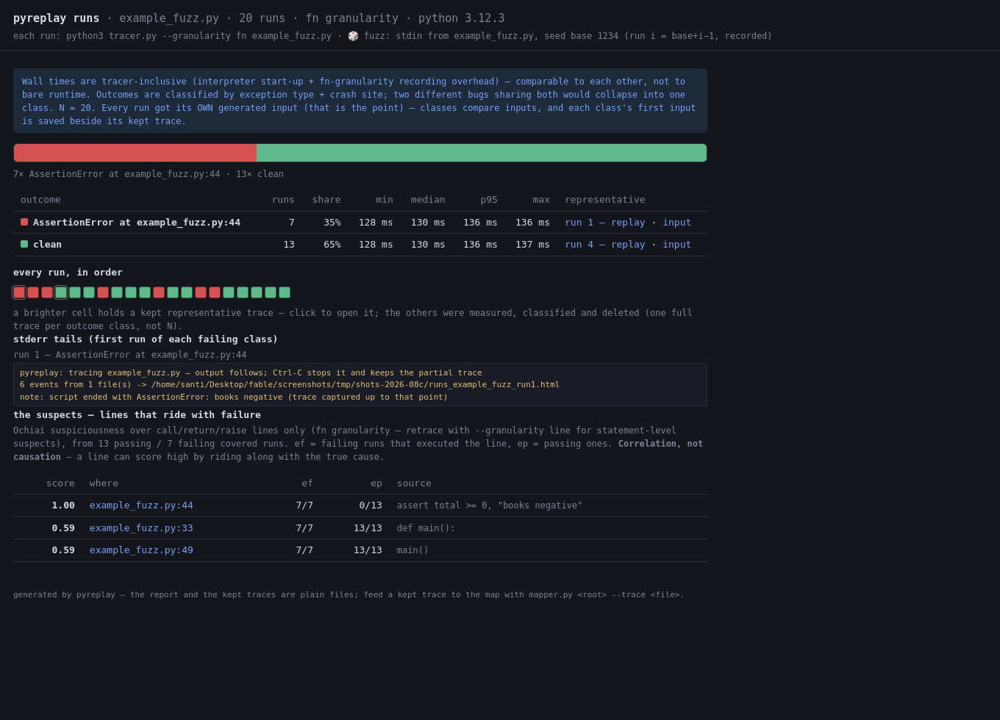](screenshots/r1-fuzz-runs.png)

### 118. The differential oracle — the brute force is the specification (`--oracle REF.py`)
- **Measured:** differential testing, the AtCoder workflow automated:
  the target and a reference implementation run on the SAME input —
  piped stdin for one trial, or `--fuzz GEN.py --runs N` for N
  seeded trials — and their stdouts are compared judge-style
  (per-line trailing whitespace and trailing blank lines ignored),
  both read from the recorded **console lane**, the faithful
  channel. Crashes are verdicts too: the same exception type on both
  sides is agreement at a domain edge (noted, outputs not compared);
  a target-only crash is a mismatch; a crashed REFERENCE is named
  loudly — the spec cannot answer.
- **Displayed:** the terminal verdict per trial. A mismatch prints
  both outputs, keeps the input and BOTH traces, and composes the
  ready-to-paste `--shrink --oracle` command — input shrinking
  gained the disagreement oracle: ddmin minimizes WHILE the two
  implementations still disagree, then leaves line-level traces of
  BOTH sides on the minimal case. `--diverge` is deliberately NOT
  composed: it aligns two runs of the same code, and these are two
  different programs — the minimized input is the explanation here.
  Exit 0 iff every trial agreed (git-bisect-ready).
- **Why:** when the right answer is expensive to state, a slow
  correct program states it. `strategy_1_brute_force.py …
  strategy_4_segment_tree.py` sit in this repo because the
  competitive-programming workflow IS differential testing done by
  hand; this closes the loop. The verdict never picks a side — a
  mismatch is a bug in ONE of them, and the traces don't say which.
- **Use case:** a prefix-sums RSQ with an off-by-one (`pre[r] -
  pre[l]`) against the brute force: 3/3 seeded trials mismatch, each
  keeping its pair + input; the composed shrink hands back the
  smallest disagreeing ledger. The same command with the Fenwick
  tree: 5/5 agreed — "an observation, never a proof (and the
  reference itself is unproven)."
- **Command:** `python3 tracer.py --oracle strategy_1_brute_force.py
  --fuzz gen.py --runs 30 strategy_3_fenwick_tree.py` (or pipe one
  input with no `--fuzz`). Gates with reasons: `--check` is a second
  oracle (pick one); `--runs` without `--fuzz` would measure
  nondeterminism, not the implementations; `--black-box` rings can
  rotate the console lane out; `-m` module targets are not bound.
- **Screenshot** — the planted off-by-one caught 3/3 with kept pairs
  and the composed shrink line; below it, the Fenwick tree certified
  5/5 against the same reference.

  [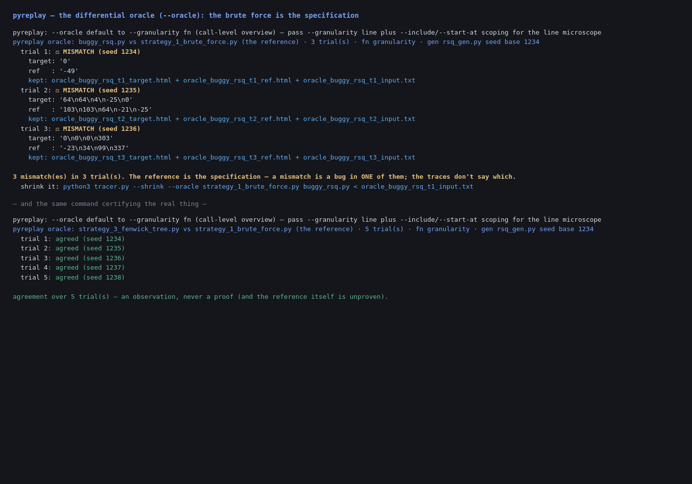](screenshots/r3-oracle.png)

### 119. Fault injection — break it on the bench, not in the air (`--inject`)
- **Measured:** chaos engineering for one process:
  `--inject "shop.pay:raises=TimeoutError:on_call=3"` (repeatable)
  forces a named callable to raise (an "injected by pyreplay"
  instance), return a sentinel (`returns=LITERAL`,
  `ast.literal_eval` — nothing evaluates, ever) or stall
  (`stall=MILLISECONDS`), on the Nth call or every call. Wrappers
  arm the moment the target's module lands (meta-path hook;
  already-imported targets like `json.loads` arm immediately);
  `__main__` defs are refused with the reason. Every PERFORMED
  injection is recorded as a first-class event at the call site
  that received the fault — the trace never lies about what really
  ran.
- **Displayed:** the banner wears **💉 PERTURBED** with performed/
  armed counts (constitution rule 4); the injection moment gets a
  red badge, a panel line stating what was forced ("the real
  callable never ran"), red pins on the tripwire strip, and
  `type:inj` in the query bar. The forced raise rides the existing
  exception machinery, so the propagation chain and whatever
  CAUGHT it are ordinary recorded truth. The map's auto-heat skips
  injected traces; a spec that never resolved is loud in the
  terminal and the payload — a wrong name must never look like a
  survived fault.
- **Why:** error-handling paths are the least-executed, least-tested
  code in any codebase, and injection is the only way to *see* them
  run. The stall variant asks the other question — what happens to
  everything downstream when this dependency gets slow?
- **Use case:** tinyshop with
  `discounts.bulk_discount:raises=TimeoutError:on_call=2` — calls 1
  and 2 are counted, the second raises at `cart.py:15`, the
  propagation walks `total()` → `main()` with no handler anywhere,
  and the banner arithmetic reads "2 call(s) seen, 1 injected".
  Swap to `returns=0` and the run "succeeds" with a wrong total —
  the quieter, nastier failure mode, now visible.
- **Command:** `python3 tracer.py --inject
  "discounts.bulk_discount:raises=TimeoutError:on_call=2"
  tinyshop/main.py`. Composes with `--runs` (same faults every run —
  the catch rate) and `--chaos-schedule`; refuses `--sweep`,
  `--relation`/`--oracle`, `--shrink` and `--export-perfetto` with
  reasons (perturbed time is not performance truth).
- **Screenshot** — the injection moment: 💉 PERTURBED banner,
  INJECTED badge at the exact call site in `total()`, the panel
  naming what was forced, red pins on the strip.

  [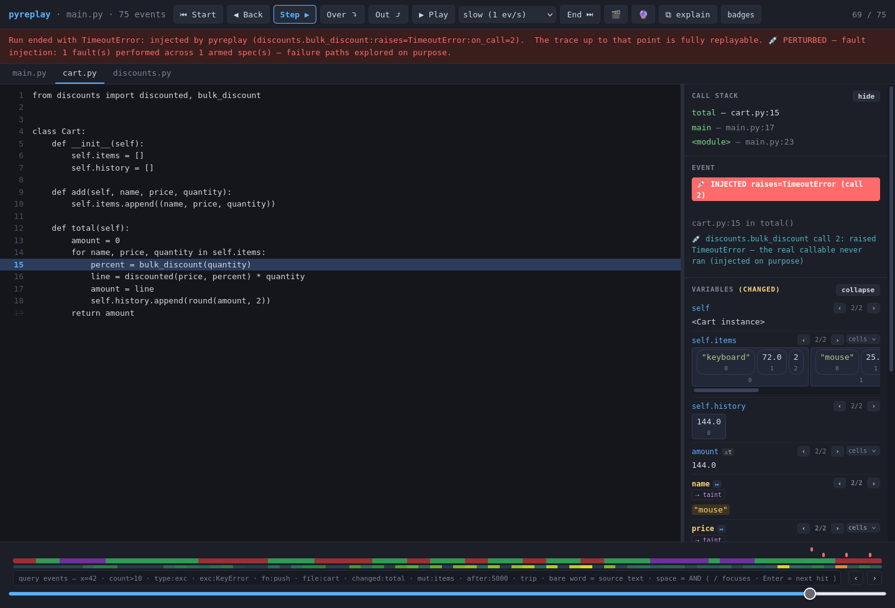](screenshots/r2-inject.png)

### 120. The I/O lane — what did this program touch? (`--io`)
- **Measured:** `sys.addaudithook` records the operations that cross
  the boundary of your process — file opens, socket connects and DNS
  lookups, subprocess spawns, `exec`/`eval`, and the imports your own
  code wrote — as first-class events tied to the frame that caused
  each one. Audit hooks are stdlib, near-free, and fire regardless of
  granularity, so the lane works in `fn` mode too. Only operations
  with your code on the stack are recorded: a library opening a socket
  on your behalf is kept and attributed to the line that triggered
  it, while the dozens of transitive stdlib imports (and the module
  bodies importlib `exec`s) are filtered out — direct imports and
  dynamic code are yours, the rest is plumbing. File coverage is
  every flavor, not just the bare `open()` name: `os.open`, `io.open`
  and `pathlib` all surface (they share the `open` audit event);
  bytecode-cache (`.pyc`) reads are excluded as mechanism, not data.
- **Displayed:** a **⇄ I/O lane** banner with per-kind counts and the
  leak verdict; each operation gets its own event (badge, a panel
  line spelling it out, `type:io` in the query bar) and a pin on a
  dedicated color-coded strip — file/net/proc/code/import each a hue,
  unclosed files glowing red. Opened files are paired with their
  closes through a wrapped `open()`; any handle still open at exit is
  named as a leak at its exact open site (a file GC'd earlier was
  closed by its finalizer, so only a provably-still-open handle is
  flagged — partial is unmarked).
- **Why:** two questions answered from one flag. "What did this
  program touch?" — every file, host and command, from the trace, a
  light supply-chain audit where an import that opens a socket stands
  out. And the Stroustrup-lens question, "who owns this resource and
  did they release it?" — the leak, named.
- **Use case:** a config-loader demo that opens three files (two via
  `with`, one leaked), runs a subprocess and `exec`s a string:
  `⇄ I/O lane — 6 operation(s): 2 code, 3 file, 1 proc · ⚠ 1 file(s)
  UNCLOSED at exit`, the leak pinned to `leak_a_file()` at its `open`
  line, and the two `with`-blocks correctly NOT flagged.
- **Command:** `python3 tracer.py --io tinyshop/main.py`. Off by
  default (audit hooks are cheap but not free). Honesty: the audit
  layer sees Python-level operations, not raw C syscalls; endpoint
  addresses are captured but payload capture stays external
  (mitmproxy et al. — we bridge specialists, we don't clone them);
  "no operations" is an observation, not a guarantee.
- **Screenshot** — the leak moment: ⇄ banner with the counts and the
  UNCLOSED verdict, the LEAK badge at `leak_a_file()`'s open line,
  the panel naming the unclosed file, the red pin on the I/O strip.

  [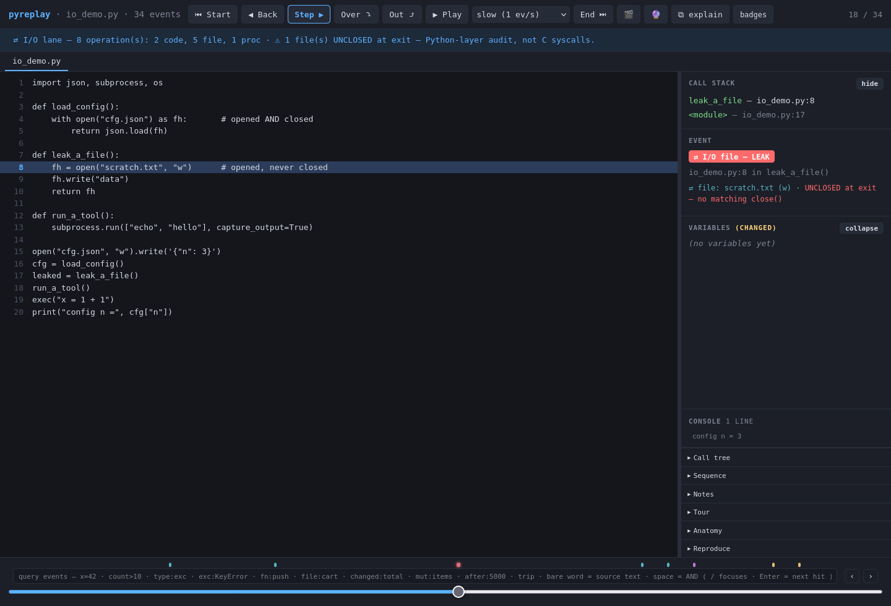](screenshots/r5-io-lane.png)

### 121. Metamorphic relations — the symmetry is the oracle (`--relation`)
- **Measured:** the oracle problem's cheapest instrument: the right
  answer may be unknown, but its symmetries are not.
  `--relation "TRANSFORM => RELATION"` declares an input transform
  (an expression over `x`, the stdin text) and an output relation
  (over `out0` and `out`, the two runs' stdouts — read from the
  recorded **console lane**, the faithful channel; tracer chatter
  never enters it). Each trial runs the target twice — original
  input, transformed input — and checks the relation. Inputs come
  from the piped stdin (one trial) or the `--gen` protocol
  (`gen(trial, seed)`, N trials). Helpers `num()`/`nums()` parse
  outputs; a crash on either side is a violation with the crash
  named.
- **Displayed:** the terminal verdict per (relation × trial). A
  violation prints both outputs, KEEPS both traces, and composes the
  ready-to-paste `--diverge` command — the funnel hands you the
  microscope, it never auto-runs it. Exit 0 iff everything held
  (git-bisect-ready). Building this exposed and fixed a #112 gap:
  console text is now part of diverge's state token, so a pair that
  differs only in what it *printed* diverges instead of reading as
  identical.
- **Why:** the oracle problem is the hard wall of testing numerical
  and scientific code — you often can't say what the right answer
  is, but you always know its invariances. Conservation laws as
  tests: the physicist's instinct, as a flag.
- **Use case:** `sum` over ints: permutation invariance
  (`reversed => out == out0`) holds ×3; homogeneity
  (`double each token => num(out) == 2*num(out0)`) holds ×3. A
  first-token-wins bug violates all three permutation trials, and
  the composed diverge lands on the guilty `print` line with deep
  links into both traces.
- **Command:** `python3 tracer.py --relation "' '.join(reversed(
  x.split())) => out == out0" --gen gen.py algo.py` (repeatable;
  `--relation-trials N`, `--relation-seed`). Honesty: a violation
  under `PYTHONHASHSEED=random` may be nondeterminism, not
  asymmetry — the report says to pin it (or `--runs` first); held
  trials are an observation, never a proof. A violating input can
  be handed to input shrinking (#115) to find its failing core.
- **Screenshot** — three violated permutation trials: both outputs
  per trial, kept pairs, composed diverge commands, and the diverge
  output below pointing at the exact print that broke the symmetry.

  [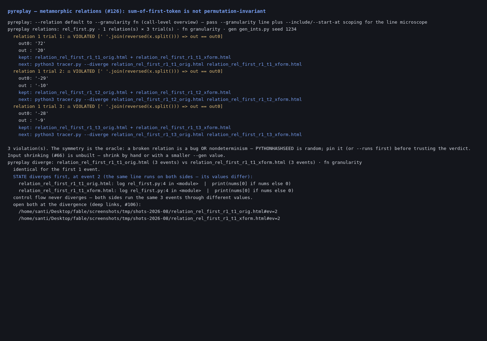](screenshots/126-relations.png)

### 122. Memory calorimetry — where the run RETAINED (`--memory`)
- **Measured:** time-heat says where the run computed; memory-heat
  says where it *retained*. `--memory` samples `tracemalloc` through
  the run — cheap current/peak totals every stride events build a
  growth curve, and a full snapshot at a coarser cadence attributes
  bytes to the modules that hold them — keeping the distribution of
  the snapshot where **your code's** in-scope bytes were largest
  (decoupled from the tracer's own event buffer, which is out of
  scope and grows to the end). The exact peak may fall between
  snapshots; the report says which one it kept.
- **Displayed:** a **📈 memory** banner with the peak and the module
  that held the most at your code's peak; a growth strip-chart under
  the scrubber —
  a filled area for current traced bytes with the peak (a monotonic
  high-water mark) as a line above it, click-to-jump to the nearest
  sample. A leak announces itself as a rising floor *while it grows*,
  instead of at the OOM kill; the per-module distribution and the
  peak print at exit.
- **Why:** the 38 GB brian2 incident, announced as it climbs rather
  than discovered at the kill. Retention bugs — leaks, caches gone
  wrong, a list that never gets freed — are invisible to a time
  profile and obvious on a growth curve.
- **Use case:** a demo that accumulates 25 batches then trims to 5:
  the curve climbs as batches pile up and the peak line records the
  high-water mark; `peak 43.6 MB traced`, the in-scope allocations
  attributed to the demo module, the two `print`s on the console
  lane.
- **Command:** `python3 tracer.py --memory main.py` (works at `fn`
  granularity too — the sampler is granularity-independent). Honesty
  on every surface: recorded UNDER tracemalloc (real ~2× allocation
  overhead); process totals include the tracer's own event buffer
  while the per-module bytes are your code's allocations; and
  tracemalloc sees **Python-level allocations only** — a numpy/torch
  tensor allocated in C reads ~zero here while system RSS climbs
  (Memray is the native-allocation specialist in the funnel). Gates:
  `--black-box` (the ring would drift the sample indices) and
  `--backend monitoring` (the sampler rides the settrace dispatcher)
  are refused with reasons.
- **Stated v1 remainder:** the map's third palette (BYTES ALLOCATED
  per module) — the per-module distribution already ships in the
  trace payload and prints at exit; painting it onto the map is the
  follow-up.
- **Screenshot** — the growth curve under the scrubber and the 📈
  banner with the peak and the top module at your code's peak.

  [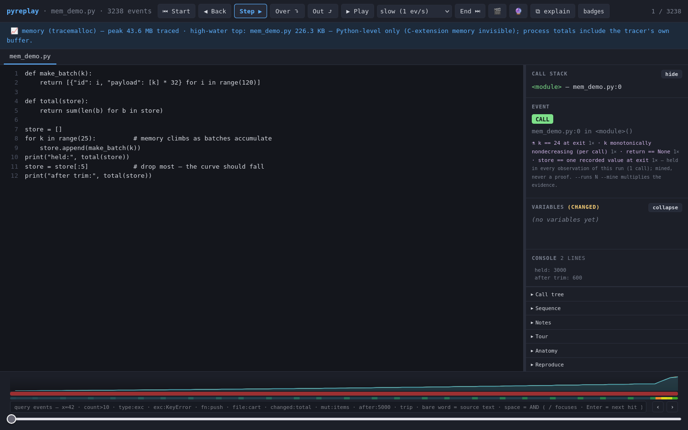](screenshots/r6-memory.png)

### 123. Mutation-survivor forensics — why did this mutant live?
- **Measured:** the bridge uses **mutmut as-is** (never rebuilt): the
  survivor list from `mutmut results`, the nearest covering test
  from mutmut's own coverage mapping (`mutants/mutmut-stats.json`),
  the mutation diff from `mutmut show`. Then the forensics: the diff
  is applied to a **patched shadow copy** of the project (strict
  unique-context match — ambiguity refused, never guessed) and the
  nearest test is traced TWICE at line level — original vs mutant —
  on structurally identical files, so #112's alignment lands exactly
  on the behavioral difference.
- **Displayed:** per survivor: the diff, the nearest test, and the
  divergence report — "STATE diverges at event 17: `base: 1 vs 2`"
  with deep links into both kept traces — closed by the verdict:
  *the traces DIVERGE and every assertion still passed — the
  divergence above is the assertion you forgot to write.* When the
  traces are identical: *no behavioral divergence found on this
  test; possibly an equivalent mutant — never invented, either way.*
- **Why:** in a no-reading regime the mutation score is the only
  direct measurement of the test suite itself, and survivors are
  exactly where the suite is blind. Killing one used to mean reading
  the diff and guessing; a traced divergence turns it into a
  mechanical fix.
- **Use case:** `base = 1 → base = 2` survives because the test only
  asserts `rate(5) >= 1`. The forensics names the un-asserted value
  at its exact event. And `x < lo → x <= lo` survives test inputs
  that take the same branch either way — traced identical, honestly
  labeled possibly-equivalent.
- **Command:** run `mutmut run` in your project, then
  `.venv/bin/python tracer.py --forensics [SURVIVOR_ID …]` from the
  same directory (no ids = first 5 survivors, announced). Honesty:
  needs mutmut importable (the error says so); unmapped tests and
  unappliable diffs are SKIPPED with their reasons, never faked.
- **Screenshot** — two survivors: one diverging (`base: 1 vs 2`, the
  missing assertion named), one traced-identical
  (possibly-equivalent, said plainly).

  [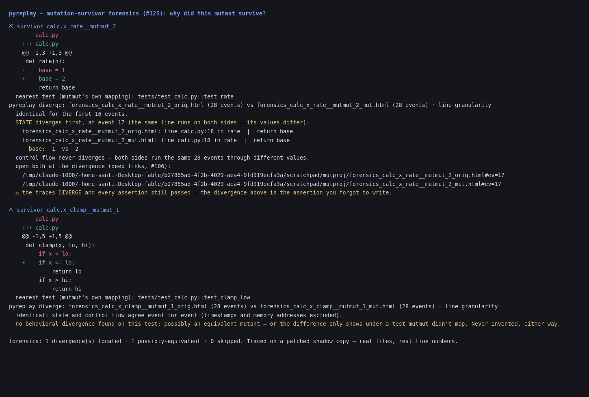](screenshots/125-forensics.png)

### 124. The scaling bench — `--sweep`, the doubling experiment as a command
- **Measured:** the target is run once per rung of a value ladder
  (`--sweep "n=1000,2000,4000,8000"`, or `alpha=3.0..5.0:5` for a
  knob), each child a fresh tracer run whose stdin comes from the
  minimal generator protocol: `--gen GEN.py` defines
  `gen(value, seed) → str|bytes`; with no `--gen` the value itself,
  one per line, is the stdin. Per rung: the EVENT COUNT (exact,
  deterministic, immune to timing noise — the honest cost model) and
  the traced wall time where time is true (fn granularity). Then
  least squares on log–log: the observed growth exponent with R²,
  plus consecutive-rung ratios — Sedgewick's doubling experiment read
  directly. A `--predict "n^2"` claim (names `n` and `log()` only —
  nothing else evaluates) is scored scale-free: R² of the claim's
  *shape* against the data.
- **Displayed:** the terminal table (value · events · ratio · time ·
  ratio) with the fit lines and the claim verdict, plus a
  self-contained `sweep_*.html` report: log-log charts where a power
  law is a straight line — measured points, fitted line, claim curve
  dashed — and the rung table. Crashed or cap-truncated rungs are
  excluded from the fit and named; rung traces are deleted after
  measurement (the report says so).
- **Why:** nothing else in the lab varies input SIZE — `--runs`
  repeats one input, fuzzing hunts failures. "What is the observed
  exponent" is the question the whole algorithms shelf trains, and
  the doubling experiment separates n log n from n^1.2 where
  eyeballing cannot.
- **Use case:** a nested-loop classifier sweeps 8→64: ratios 3.89,
  3.97, 3.99 — the n² signature — exponent n^1.98 at R² 1.0000,
  claim `n^2` CONSISTENT. Mergesort at fn granularity measures
  n^1.00 — *calls* are linear; sweep again at `--granularity line`
  and `n*log(n)` is CONSISTENT at R² 0.998: the cost model is what
  you count, and the tool says which one you counted.
- **Command:** `python3 tracer.py --sweep "n=8,16,32,64" --predict
  "n^2" algo.py` (+ `--gen gen.py`, `--sweep-seed`). Honesty, in the
  banner and the terminal: counts are Python-level events, not
  machine operations — constants live in the C layer; a poor fit is
  reported as a poor fit, never forced to a line.
- **Screenshot** — the quadratic's report: green CONSISTENT verdict,
  events dead on the fitted line with the claim dashed over it, the
  time chart honestly wobbling (startup noise at tiny n), ratios
  marching to 4.

  [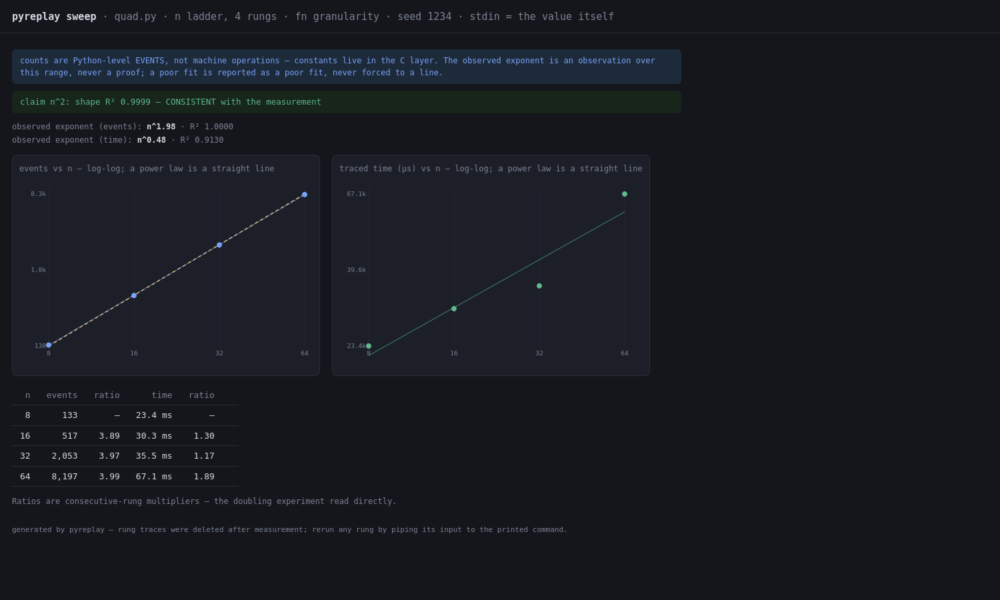](screenshots/127-scaling-bench.png)

## Part 15 — Infrastructure

What keeps all of the above honest.

### 125. `checks.py` — the regression suite
68 data-level checks (no browser): the tracer re-runs the permanent
example suite and the mapper its fixtures, the embedded JSON is
extracted from each generated HTML (chunked or not), and the honesty
invariants are asserted in plain Python — windowed-change correctness,
set-membership honesty, recursive partial flags, exception propagation
chains, conditional verdicts, object encoding, mapper
module/edge/class counts, settrace↔monitoring exception parity, and
the 2026-08 wave: runs-harness outcome classification + SBFL suspects,
divergence depths, NaN-trip transitions, chart and query machinery,
deep links, per-test chapters, `--check` exit codes, the black-box
ring, capsule contents, console-lane attribution, whyline guards,
boundary schemas, schedule-chaos determinism and honesty labels,
happens-before edge causality and Perfetto flow pairing, dark-edge
diffing and crime-scene churn (each with its absence honesty), the
backward slice's dataflow contract and golden closure.
Every subprocess the suite spawns pins its stdin, so
the result cannot depend on how the suite was invoked. Run before and
after every change, always.
- **Command:** `python3 checks.py` — prints the green table, exits
  non-zero on any red.

### 126. The teaching fleet
`example_{sort,prefix,histogram,dp,graph,exceptions,control,machinery,
mro,tasks,threads,watch,dunder,bigarray,heavy,nan,flaky,race}.py` — one small script per feature family, each with its
pre-built `trace_*.html`; `tinyshop/` — a multi-file teaching project
with a planted silent bug; `bubble_sort.py`, `graph.py`, real AtCoder
code. TUTORIAL.md is the user guide; these are also the screenshot
material for this catalog.
- **Command:** `python3 tracer.py example_<name>.py` for any of them;
  `python3 tracer.py tinyshop/main.py` for the teaching project.

---

## Appendix — the manual test plan

Work through the catalog top to bottom, ticking each feature after
exercising it by hand. Almost everything runs on in-repo material:

1. **A real foreign codebase** (e.g.
   `git clone https://github.com/artificial-scientist-lab/PyTheus`)
   exercises Parts 1, 3 and 13 at scale — map, folding, cycles,
   walls, heat, the ⌖ handoff, and the audits.
2. **tinyshop/** and the `example_*.py` fleet cover Parts 2–12 —
   every recorder and replayer feature has a natural home there,
   including the planted silent bug for the exception features.
3. `example_tasks.py` covers Part 10 (asyncio + Perfetto);
   `example_race.py` under `--runs 12 --granularity line
   --chaos-schedule 1` runs the chaos lab; `example_flaky.py` runs
   the rest of Part 14 (`--runs 20`, the suspects, `--diverge` on
   the kept pair, `--check` on the failure).
4. Any trace at all shows the capsule, deep links, the query bar,
   the console lane and the boundary schemas; a `tinyshop/main.py`
   line trace answers the whyline; `-m pytest` on a small suite
   shows chapters; `--black-box` on `example_heavy.py` plus
   `kill -USR1` shows the flight recorder; any run past 100k events
   shows chunking.
