# pyreplay — the feature catalog

Every shipped feature of the two tools, one entry each. Five fields per
feature, always the same five:

- **Measured** — the mechanism: where the information comes from, what
  data is recorded.
- **Displayed** — where and how it appears in the replayer or the map.
- **Why** — what understanding it buys.
- **Use case** — one concrete situation where you reach for it.
- **Command** — the exact invocation (and, for viewer features, the
  gesture inside the page) that produces the feature.

Plus a **Screenshot** under each feature (click to enlarge), captured
from a real run. Features 01–41 use the in-repo examples (tinyshop and
the `example_*.py` fleet). The map screenshots (42–60) use larger
**external** open-source codebases — not bundled here, to keep the repo
small; clone them if you want to reproduce those shots:
[PyTheus](https://github.com/artificial-scientist-lab/PyTheus),
[nengo](https://github.com/nengo/nengo),
[brian2](https://github.com/brian-team/brian2),
[pymdp](https://github.com/infer-actively/pymdp). Features 61–62 are
infrastructure and carry no shot; the 2026-08 additions (63, 64, 79,
80, 106) await their shots from the next manual pass.

The two tools, one contract:

- `tracer.py` records a real execution into a self-contained
  `trace_*.html` (the **replayer** — open in any browser, no server).
- `mapper.py` reads source with `ast` — nothing executes — into a
  self-contained `map_*.html` (the **map**), which adopts traces as a
  heat overlay (the **cockpit**).
- The event log embedded in the HTML is the contract between them.

House rule everywhere (**the honesty contract**): mark exactly what is
known; partial = unknown = unmarked; degrade gracefully, never show a
dead or invented panel; every cap and truncation is announced.

---

## A. Tracer — the recording engine

### 01. Line-level recording
- **Measured:** `sys.settrace` hooks every line execution, call, return
  and exception in project files; each variable's value is fingerprinted
  per line so changes are detected element-by-element. ~8k events/s
  worst case; the target runs ~100× slower than normal at this level.
- **Displayed:** the whole run becomes a scrubbable film in the
  replayer: current line highlighted in the source, event badge
  (CALL/LINE/RETURN/EXCEPTION), live call stack, all frame variables.
- **Why:** the ground truth. Nothing is sampled or skipped — a complete,
  gapless record of what Python actually did, replayable forever.
- **Use case:** an AtCoder solution gives a wrong answer on sample 2;
  trace it with the sample piped to stdin and watch the exact iteration
  where the state diverges from your mental model.
- **Command:** `python3 tracer.py example_sort.py` → open
  `trace_example_sort.html` (line level is the default for scripts).
- **Screenshot** — replayer open on `trace_example_sort.html`, mid-run, all three panels visible.

  [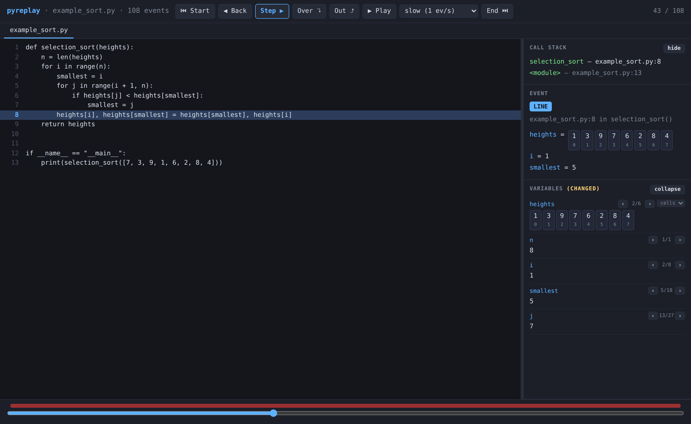](screenshots/01-line-recording.png)

### 02. Project scoping (automatic)
- **Measured:** the tracer traces the entry script **plus every file
  imported from its own directory tree**; stdlib and site-packages are
  never traced (their frames are filtered at `call` time).
- **Displayed:** one source tab per traced file; foreign code simply
  doesn't appear — a call into numpy is one event, not ten thousand.
- **Why:** the trace stays about *your* code and stays small; tracing
  the stdlib would bury the signal and multiply the cost.
- **Use case:** tracing `tinyshop/main.py` records `main.py`, `cart.py`,
  `discounts.py` — and none of the `json` module internals.
- **Command:** `python3 tracer.py tinyshop/main.py` — no flag needed;
  the scope is the entry's directory tree (see 11 for `--root`).
- **Screenshot** — the file tabs of a tinyshop trace: project files only.

  [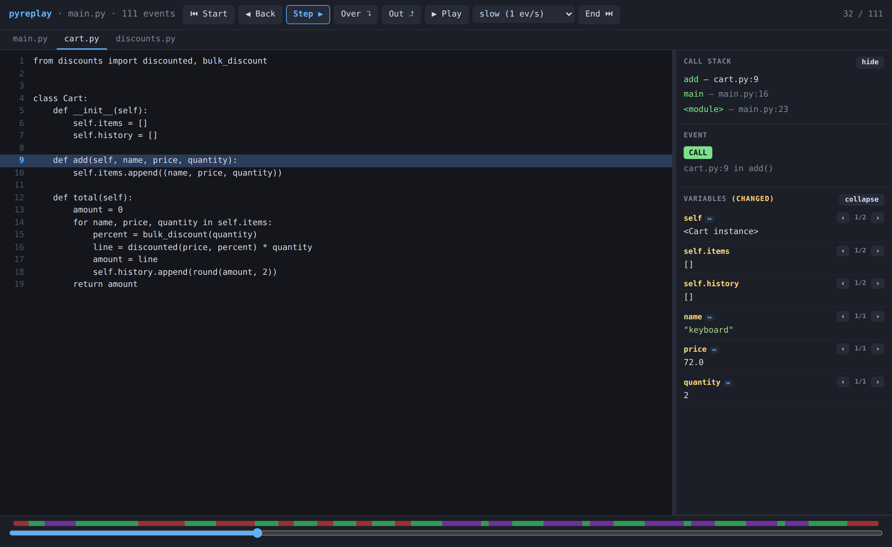](screenshots/02-project-scoping.png)

### 03. `--include` / `--exclude` scoping globs
- **Measured:** glob patterns matched against project-relative paths in
  the tracer's `call` filter; the mapper accepts the same vocabulary for
  its skip logic, so both tools speak one scoping language.
- **Displayed:** excluded files never produce events or tabs; an
  `--include` microscope records only the named files.
- **Why:** turns a whole-codebase trace into a targeted one — the
  difference between 2M events and 50k.
- **Use case:** the map shows `custom_loss.py` is hot; re-trace with
  `--include 'custom_loss.py'` at line level to see it breathe without
  paying for the rest of the codebase.
- **Command:** `python3 tracer.py --include 'cart.py' tinyshop/main.py`
  · `python3 tracer.py --exclude 'tests/*' main.py` · same flags on
  `mapper.py`. Repeatable; patterns are relative to the trace root.
- **Screenshot** — terminal command plus the resulting single-tab trace.

  [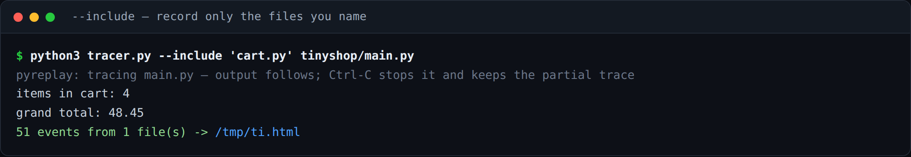](screenshots/03-include-exclude.png)

### 04. Function granularity (`--granularity fn`)
- **Measured:** call/return/exception events only — no line events, no
  locals fingerprinting (shallow call arguments and return values are
  recorded). Near-free compared to line tracing.
- **Displayed:** same replayer; stepping moves call-to-call, returns
  show values and durations.
- **Why:** this is how a 200k-line codebase becomes traceable end-to-end
  in seconds — and it's the honest home of wall-clock time (see 05).
- **Use case:** first contact with a foreign library: fn-trace its test
  suite, load the heat onto the map, see which 5 of 300 modules did the
  work.
- **Command:** `python3 tracer.py --granularity fn tinyshop/main.py`
  (`-m` entries default to fn already — see 11).
- **Screenshot** — fn trace of tinyshop: the whole run in a few hundred events.

  [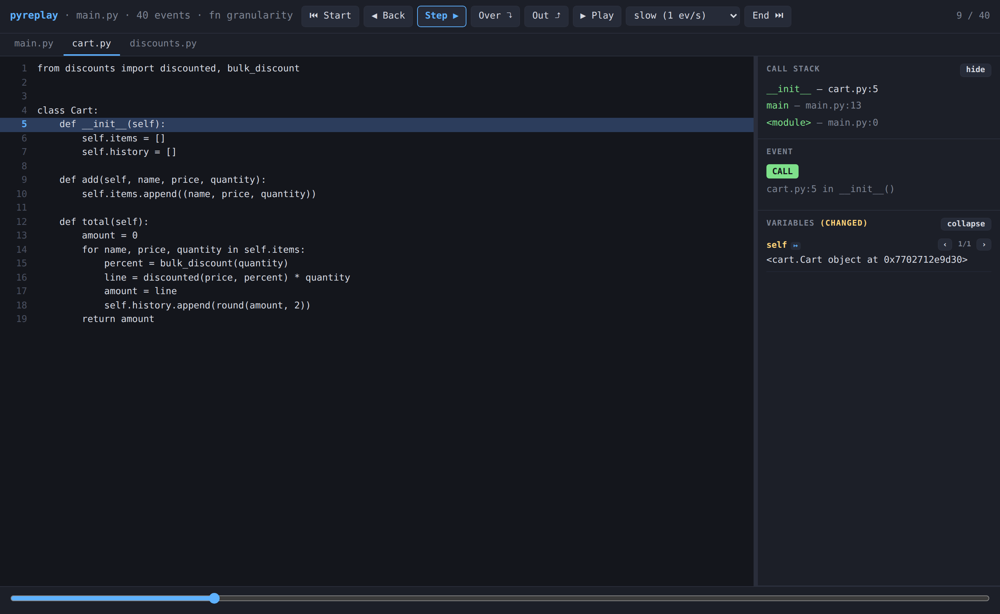](screenshots/04-fn-granularity.png)

### 05. Microsecond timestamps — only where time is true
- **Measured:** µs timestamps on call/return/exception events at fn
  granularity. **Honesty rule:** line-level traces carry *no*
  timestamps — under ~100× slowdown, wall times would be fiction.
- **Displayed:** every return shows "took 1.24 ms"; asyncio slices show
  per-slice and active-across-slices times; heat on the map becomes
  TIME (self) instead of event counts.
- **Why:** time attribution you can trust — and the explicit absence of
  numbers that would lie.
- **Use case:** "is the loss function or the graph setup eating the
  run?" — fn trace, read the cumulative times on the returns.
- **Command:** `python3 tracer.py --granularity fn example_tasks.py` →
  step to any RETURN event (timestamps come free with fn mode; there is
  no flag to add them to line traces, on purpose).
- **Screenshot** — a RETURN event with its "took … ms" annotation.

  [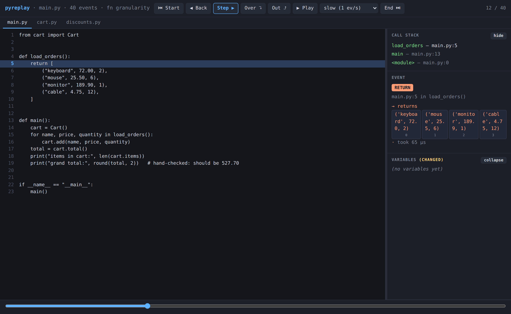](screenshots/05-timestamps.png)

### 06. `sys.monitoring` backend (`--backend monitoring`, 3.12+)
- **Measured:** the same fn-level events recorded through PEP 669
  `sys.monitoring` instead of `settrace`; code outside the project is
  switched off at its first event and never pays again (~3× less
  overhead, more on stdlib-heavy runs). Exception parity with settrace
  is verified event-for-event in the regression suite (reraise,
  StopIteration, generator unwind — all byte-identical).
- **Displayed:** identical trace, identical viewer — the flag changes
  the engine, not the product.
- **Why:** speed on big runs today; the future-proof engine (suspensions
  arrive as first-class interpreter events there).
- **Use case:** fn-tracing a test suite that imports half of scipy —
  monitoring stops paying for scipy after one event per function.
- **Command:** `python3 tracer.py --granularity fn --backend monitoring
  script.py` (fn-only; needs Python ≥ 3.12).
- **Screenshot** — two terminal timings of the same run, settrace vs monitoring.

  [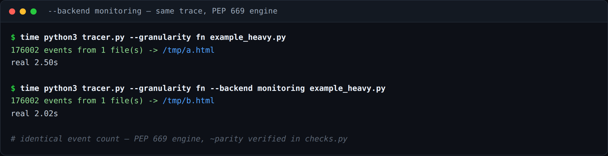](screenshots/06-monitoring-backend.png)

### 07. Event cap (`--max-events`, default 200k)
- **Measured:** a hard counter; at the cap the recording *and the run*
  stop (CLI) — the film is gapless from the start, it just ends early.
  Input validated; ~2M events is the practical browser ceiling.
- **Displayed:** a banner in the replayer announces the truncation;
  Ctrl-C likewise keeps a valid partial trace and says so.
- **Why:** a runaway loop can't produce an unopenable 40 GB file; and a
  capped trace never silently pretends to be complete.
- **Use case:** tracing an optimizer that would run for hours — cap at
  200k, study the first phase, then use a trigger (08) to film a later
  one.
- **Command:** `python3 tracer.py --max-events 1000000 script.py`
  (default 200000; ~2M practical max). To see the banner cheaply:
  `python3 tracer.py --max-events 500 example_sort.py`.
- **Screenshot** — the truncation banner at the top of a capped trace.

  [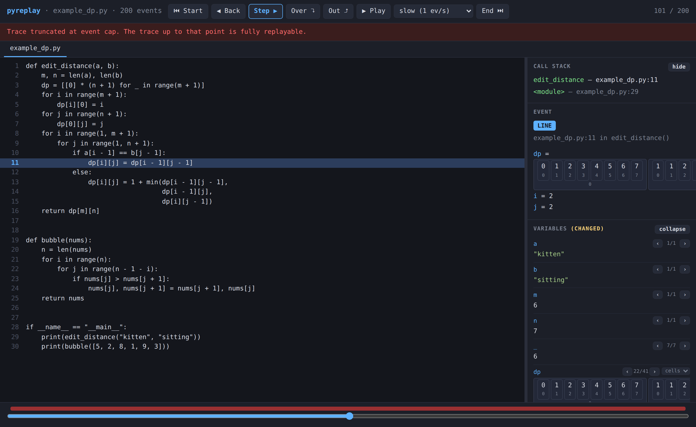](screenshots/07-max-events.png)

### 08. Triggers — conditional recording
- **Measured:** `--start-at file.py:LINE`, `--start-count N`,
  `--start-when "EXPR"` (a Python expression over the frame's
  variables; combinable). Watching for the trigger is ~100× cheaper
  than recording; when it fires, the live call stack and all current
  variables are reconstructed as the first events.
- **Displayed:** the trace begins at the interesting moment with full
  context already populated; a banner reminds you pre-trigger execution
  is not in the film. If the trigger never fires, the tracer says so.
- **Why:** the "red dot that starts the camera" — skip millions of
  boring events for almost nothing, keep line-level detail where it
  matters. (Triggers need line events, so they don't combine with fn
  mode.)
- **Use case:** `--start-when "current_sum > 6000"` to begin filming at
  the exact moment a running total goes wrong, hours of loop later.
- **Command:** `python3 tracer.py --start-at solution.py:30 solution.py`
  · `--start-at solution.py:30 --start-count 57` (its 57th execution) ·
  `--start-when "x < 0"` (anywhere) · combined:
  `python3 tracer.py --start-at sol.py:13 --start-when "d[k] > q[k]"
  --start-count 2 sol.py`. The label is `filename:line` — it names an
  imported file when the trigger lives there
  (`--start-at helpers.py:42 main.py`).
- **Screenshot** — trace starting mid-program: stack already deep, trigger banner visible.

  [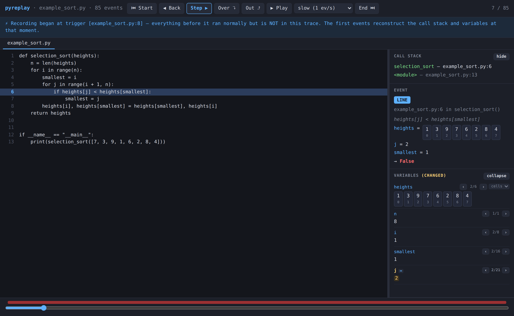](screenshots/08-triggers.png)

### 09. Threads
- **Measured:** all Python threads are traced (one process;
  `multiprocessing` children are a documented limit).
- **Displayed:** the call-stack panel is per-thread; events say which
  thread drove them.
- **Why:** interleaving is where the nastiest bugs live; per-thread
  stacks keep each story straight.
- **Use case:** a worker thread mutates a shared list while the main
  thread reads it — step through the interleaving and watch both stacks
  alternate.
- **Command:** `python3 tracer.py your_threaded_script.py` — automatic;
  no flag. (The permanent examples are single-threaded; use any
  `threading` script.)
- **Screenshot** — two thread stacks in the stack panel of a threaded trace.

  [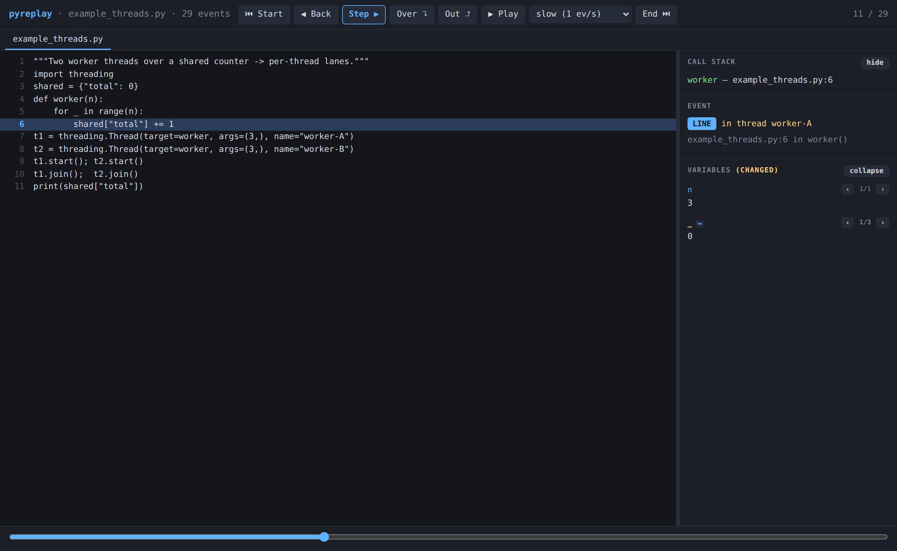](screenshots/09-threads.png)

---

## B. Tracer — entries & environment (running other people's code)

### 10. Script entry — behaves exactly like `python3 script.py`
- **Measured:** the script runs with its own `__main__` guard firing,
  its own argv (pass arguments after the path), stdin piped through
  (`< input.txt`); output paths are anchored absolute at startup, so a
  target that `chdir`s can't misplace the trace.
- **Displayed:** output is `trace_<scriptname>.html` in the launch
  directory; re-runs never overwrite (`_2`, `_3`, …); `--out NAME.html`
  picks an explicit name (that one does overwrite). A hint prints when
  the program is probably waiting on stdin.
- **Why:** zero ceremony and zero surprises — if the script runs under
  python, it runs under the tracer.
- **Use case:** `python3 tracer.py solution.py < sample1.txt` — the
  competitive-programming loop, one command.
- **Command:** `python3 tracer.py solution.py arg1 arg2 < sample1.txt`
  · explicit name: `python3 tracer.py --out trace_run1.html solution.py`.
- **Screenshot** — terminal: the command and the "wrote trace_….html" line.

  [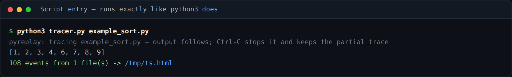](screenshots/10-script-entry.png)

### 11. Module & pytest entry (`-m MODULE`, `--root DIR`)
- **Measured:** `-m MODULE [args…]` runs modules via
  `runpy.run_module`; `--root DIR` decouples the traced scope from the
  entry's folder. `-m pytest` traces a library's own test suite — the
  natural entry for code nothing runnable imports. Un-importable
  modules are refused up front with the full dotted name; with no test
  path named, pytest discovery is scoped to `--root` (not the CWD).
- **Displayed:** same trace/replayer; `-m` runs default to fn
  granularity (an explicit flag or a trigger keeps line level).
- **Why:** library code has no `main.py` — its tests are the honest
  entry point. This was the unlock for tracing foreign libraries.
- **Use case:** trace a research library through its own tests, scoped
  to its repo only.
- **Command:** `python3 tracer.py --root pymdp -m pytest
  pymdp/test/test_inference.py -n0 -q` (fn is the `-m` default) ·
  plain module: `python3 tracer.py --root pkg -m pkg.tool --its-args`.
- **Screenshot** — terminal: a `-m pytest` trace command completing with the trace path.

  [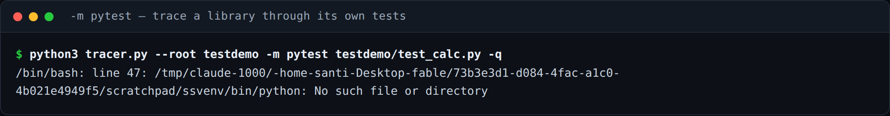](screenshots/11-pytest-entry.png)

### 12. In-process `watch()` — trace without the CLI
- **Measured:** `from tracer import watch` — `with watch():` brackets a
  block; `@watch()` records a function's first call (`once=False`:
  every call). The caller's frame is hand-registered so the block's own
  lines record; a block exception is recorded *and* re-raised; hitting
  the cap stops recording but **the host program runs on**; nested
  watch no-ops with a message; any prior debugger's `settrace` is
  restored on exit; `root=` overrides scope (notebooks).
- **Displayed:** the same self-contained `trace_watch*.html`, line
  granularity and provenance by default.
- **Why:** notebook cells, servers, long scripts — places you can't
  relaunch under a CLI — get the same film.
- **Use case:** wrap one suspicious cell of a Jupyter analysis in
  `with watch():` and get a full replayable trace of just that cell.
- **Command:** in the code itself —
  `from tracer import watch` then `with watch(): …` or `@watch()` on a
  def (`@watch(once=False)` for every call; `watch(root="…")` in
  notebooks); run the host normally: `python3 host.py`.
- **Screenshot** — a script with the `with watch():` block and the trace it produced.

  [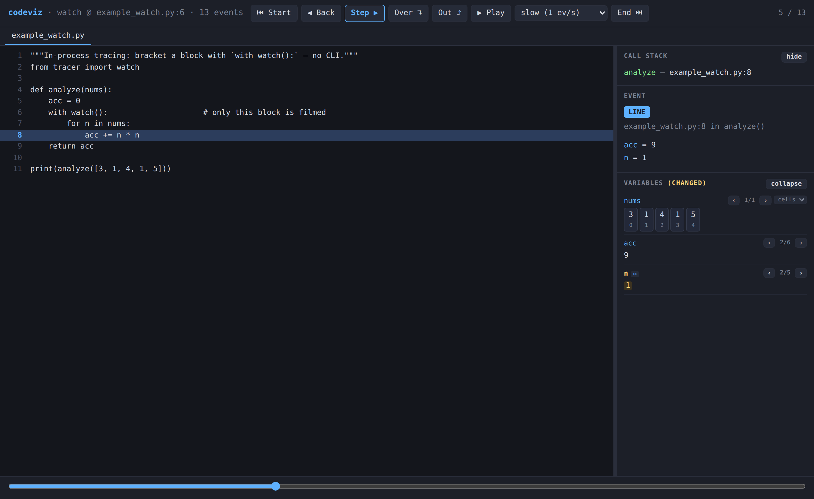](screenshots/12-watch.png)

### 13. Trace doctor — reactive guards (in every run)
- **Measured:** before running, the entry's imports are preflighted —
  a missing module is announced with the exact `pip install …` line;
  the same hint reappears after a `ModuleNotFoundError` crash; running
  the system python with a `.venv` present prints the activate line; a
  30-second stderr heartbeat reports elapsed time and events recorded
  (`PYREPLAY_HEARTBEAT=seconds` tunes it, `0` disables).
- **Displayed:** stderr, before/during/after the run — the trace itself
  stays clean.
- **Why:** the four first-run failure modes on a foreign codebase, each
  converted from a mystery into an instruction. "Frozen or working?"
  is never a guess again.
- **Use case:** first run of a cloned repo dies on imports — the
  message already contains the pip line to paste.
- **Command:** automatic on every run — no flag. Tune the heartbeat:
  `PYREPLAY_HEARTBEAT=10 python3 tracer.py script.py` (`0` disables).
- **Screenshot** — terminal: the preflight pip hint (or the 30s heartbeat lines).

  [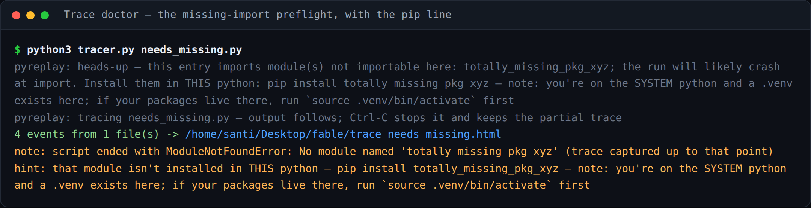](screenshots/13-trace-doctor.png)

### 14. `--doctor` — proactive environment report
- **Measured:** prefix any invocation with `--doctor`: runs nothing,
  writes nothing. Reports python/venv state (+ activate line), entry
  blockers (un-importable module/script → exit 3), codebase-wide
  missing dependencies with the recipe (`pip install -e <root>` when
  the root is a pip package, else the pip list), and pytest `addopts`
  traps — multi-line TOML parsed, forced xdist detected ("append
  `-n0`").
- **Displayed:** a plain-text setup report in the terminal, instead of
  the run.
- **Why:** tomorrow's crash announced today, without executing a line
  of foreign code.
- **Use case:** before tracing pymdp: `--doctor` flags that its
  pyproject forces `pytest-xdist` workers (which a tracer can't
  follow) and tells you to append `-n0` — verified on the real case.
- **Command:** `python3 tracer.py --doctor --root pymdp -m pytest
  pymdp/test/test_inference.py` — the exact run you intend, with
  `--doctor` prefixed; nothing executes.
- **Screenshot** — the full `--doctor` report for a codebase with a missing dep.

  [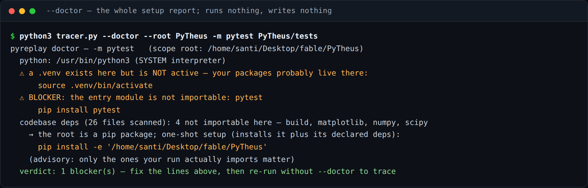](screenshots/14-doctor.png)

---

## C. Replayer — navigation

### 15. Playback controls & scrubber
- **Measured:** every event is indexed; the scrubber maps the whole
  timeline; play speeds are events/second (crawl 0.5 · slow 1 · normal
  3 · fast 12 · turbo 66).
- **Displayed:** `⏮ ◀ Step▶ Over⤵ Out⤴ ▶Play speed ⏭` plus the
  bottom scrubber; keyboard `←/→`, `Space`, `Home/End`.
- **Why:** a debugger only walks forward; a film scrubs both ways at
  any speed — and "let it play" is a real way to *watch* an algorithm.
- **Use case:** play a sort at speed 3 and watch the bars organize
  themselves; scrub back when something odd flashes by.
- **Command:** any trace; in the viewer: `←`/`→` step, `Space`
  play/pause, `Home`/`End` jump, drag the scrubber, pick a speed.
- **Screenshot** — the control bar and scrubber under a trace.

  [](screenshots/15-playback.png)

### 16. Step-over / step-out
- **Measured:** O(1) jumps on the frame-id index: *over* = next event
  in the same frame; *out* = the caller's next event.
- **Displayed:** `Over ⤵` / `Out ⤴` buttons, keys `O` / `U`.
- **Why:** a 500-event helper call becomes one click — the single
  biggest navigation upgrade for deep traces.
- **Use case:** stepping through `main()` without drowning in a
  `parse()` you already trust: `O`, `O`, `O`.
- **Command:** in the viewer: `O` (over) / `U` (out), or the `Over ⤵` /
  `Out ⤴` buttons.
- **Screenshot** — before/after an `Over` on a call line (event counter jumped past the callee).

  [](screenshots/16-step-over-out.png)

### 17. Bookmarks
- **Measured:** `B` marks the current event; the jump list persists in
  browser localStorage per trace.
- **Displayed:** cyan marks above the scrubber; `[` / `]` jump between
  them; marks survive a page reload.
- **Why:** long study sessions become resumable; "the three moments
  that matter" stay one keypress away.
- **Use case:** mark the setup, the first anomaly and the crash, then
  bounce between them while forming a hypothesis.
- **Command:** in the viewer: `B` to mark/unmark, `[` / `]` to jump
  between marks; reload the page to confirm they persist.
- **Screenshot** — scrubber with three cyan bookmark ticks.

  [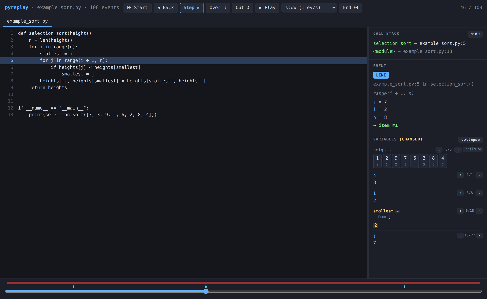](screenshots/17-bookmarks.png)

### 18. Density strip — the trace's shape at a glance
- **Measured:** events bucketed along the timeline, colored by source
  file.
- **Displayed:** a thin colored band above the scrubber; click any
  region to jump there.
- **Why:** the macro-structure of a big trace *before* scrubbing — you
  see the phases of the run like geological strata.
- **Use case:** red band then green band = "main ran, then cart took
  over" — click the boundary to land exactly at the handoff.
- **Command:** automatic on every trace (informative on multi-file
  ones): `python3 tracer.py tinyshop/main.py` → click a colored region
  of the strip.
- **Screenshot** — a multi-file trace (tinyshop) showing distinct colored phases.

  [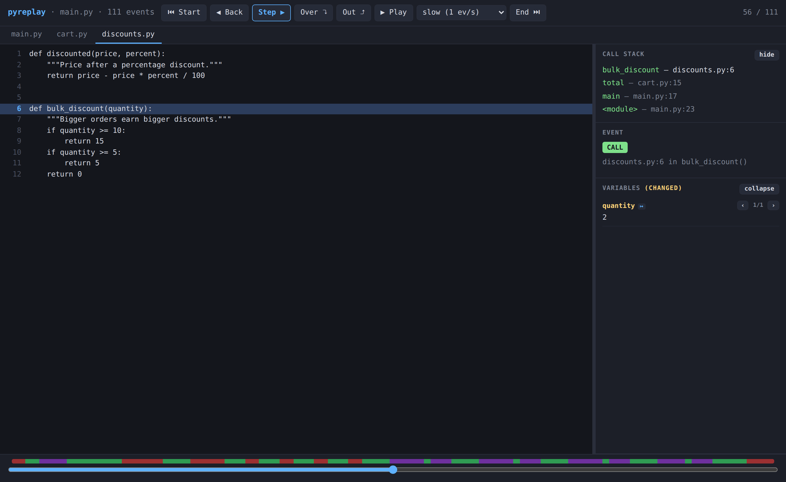](screenshots/18-density-strip.png)

### 19. Collapse mode & layout controls
- **Measured:** at each event the set of just-changed variables is
  known (same diff machinery as highlighting).
- **Displayed:** `C` (or the collapse button) shows only the variables
  changing *now* and hides the call stack (which also has its own
  hide/show); drag the code/sidebar divider to resize, double-click to
  reset.
- **Why:** functions with many locals push the action off-screen;
  collapse keeps the change in view.
- **Use case:** a solver with 15 locals — collapse, press play, and
  only the moving parts remain visible.
- **Command:** in the viewer: `C` (or the collapse button in the
  Variables panel); drag the divider, double-click it to reset.
- **Screenshot** — same event, normal vs collapsed variables panel.

  [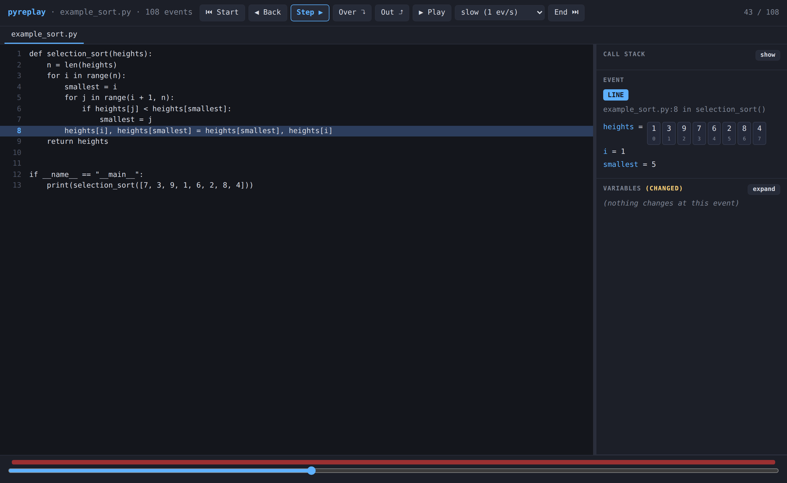](screenshots/19-collapse.png)

### 20. Status banner — the trace tells you its own caveats
- **Measured:** run outcome recorded at write time: crashed (trace kept
  up to the crash), event cap hit, trigger used, trigger never fired.
- **Displayed:** a banner across the top of the replayer stating
  exactly which caveat applies.
- **Why:** the honesty contract at file level — a partial film never
  masquerades as a complete one.
- **Use case:** opening a trace from last week: the banner alone tells
  you it stopped at the cap and where.
- **Command:** produce any caveated trace, e.g.
  `python3 tracer.py --max-events 500 example_sort.py` (cap banner) or
  `python3 tracer.py example_exceptions.py` (crash banner).
- **Screenshot** — a crashed run's banner ("trace kept up to the crash").

  [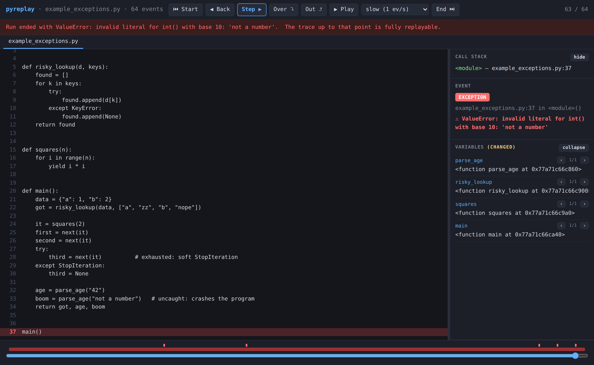](screenshots/20-banner.png)

---

### 106. Deep links — a URL that opens a moment
- **Measured:** nothing new — the viewer state (event index, open
  variable, view choice, graph overlay) is serialized into the URL
  fragment on every navigation (debounced `replaceState`; history and
  the back button stay clean).
- **Displayed:** the address bar follows the replay:
  `trace_x.html#ev=8412&var=dist&view=graph&ov=seen`. Pasting such a
  link into a fresh page — or editing the hash of an open one — lands
  exactly there: event, life strip open, view set, overlay tinted.
- **Why:** debugging is collaborative; a screenshot shows a moment, a
  deep link IS the moment. A trace file plus a fragment is a pointer
  into an execution.
- **Use case:** reviewing a BFS with a friend: send the trace plus
  `#ev=81&var=adj&view=graph&ov=dist` — they open it mid-frontier,
  graph view on, distance tint applied, zero clicks.
- **Command:** any trace; navigate, then copy the address. Out-of-range
  events clamp; unknown variables/views degrade to cells — no dead
  panel. Every feature below that names a moment composes with this.
- **Screenshot** — pending the next manual pass; live in any trace:
  append `#ev=20&var=<name>` to the address.

## D. Replayer — variables & data structures

### 21. Semantic rendering by type
- **Measured:** each value is encoded structurally (type, elements,
  keys, nesting, real length), not as a repr string.
- **Displayed:** lists/tuples as rows of indexed cells (tuples rounded,
  sets dashed), dicts as key→value rows, nesting recursive; hover any
  value for its Python type and real container size. Reprs are
  truncated (~120 chars, 20 items) — truncation always visible.
- **Why:** you read the *structure*, not a string; the same glance
  works for a matrix and a queue.
- **Use case:** a dict of lists in `example_histogram.py` reads as a
  table of rows instead of a 300-character repr.
- **Command:** `python3 tracer.py example_histogram.py` → hover values
  in the Variables panel for type + real size.
- **Screenshot** — variables panel with a list, a dict and a set side by side.

  [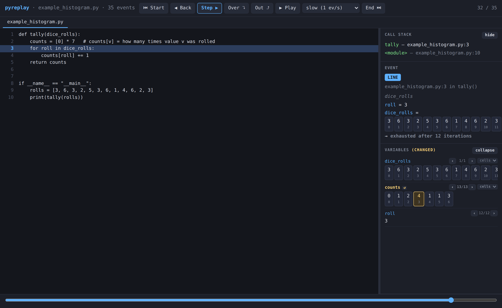](screenshots/21-semantic-rendering.png)

### 22. Surgical change highlighting
- **Measured:** per-element fingerprint diffing between consecutive
  events — down to the deepest changed leaf; sets diff by membership
  (only truly-added elements), never by position.
- **Displayed:** only the changed thing lights up: the one swapped
  cell, the one dict entry, the one leaf in a nested structure.
- **Why:** "what did this line actually change?" answered visually,
  with no false flashes to chase.
- **Use case:** a swap in bubble sort lights exactly two cells; if a
  third lights up, you just found the bug.
- **Command:** `python3 tracer.py example_sort.py` → step across a swap
  line; automatic, no flag.
- **Screenshot** — a list with exactly two cells lit after a swap.

  [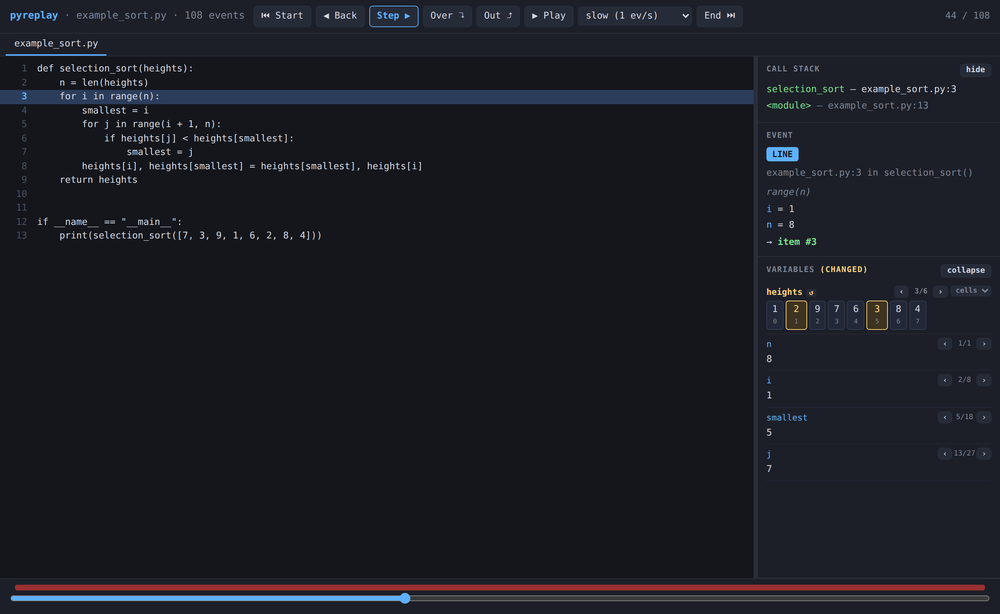](screenshots/22-change-highlight.png)

### 23. Alternate views: grid · bars · graph · edges
- **Measured:** shape detection on the encoded value: list-of-lists →
  grid; numeric list → bars; adjacency structures → graph; list of
  [u, v] pairs → edges. The choice is remembered per variable per
  script (localStorage).
- **Displayed:** a dropdown next to the variable name; change
  highlighting carries over (the updated grid cell, the swapped bars,
  the just-added edge glow).
- **Why:** a DP table *is* a grid, a sort *is* bars — rendering the
  shape the algorithm thinks in makes the algorithm visible.
- **Use case:** `example_dp.py`: watch the DP table fill diagonally in
  grid view — the recurrence pattern is suddenly obvious.
- **Command:** `python3 tracer.py example_dp.py` (grid) ·
  `python3 tracer.py example_sort.py` (bars) → pick the view in the
  dropdown next to the variable's name.
- **Screenshot** — the same list shown as cells and as bars (or the DP grid mid-fill).

  [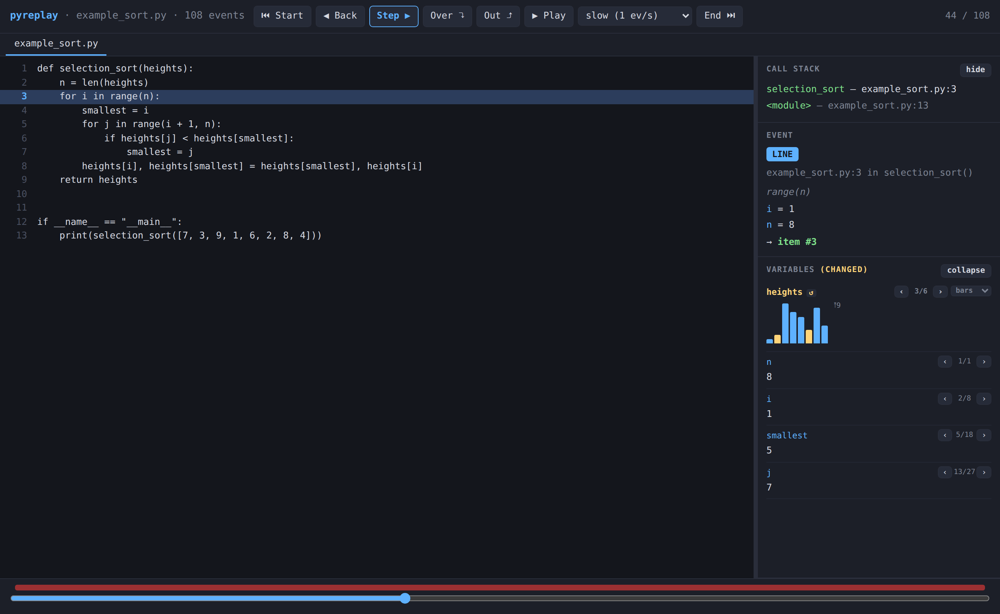](screenshots/23-alt-views.png)

### 24. Graph view — generic shape recognition
- **Measured:** five adjacency shapes recognized with zero algorithm
  knowledge: `{node: [neighbors]}`, weighted `{u: {v: w}}` (weights on
  edges), index-based `adj[i] = [j, k]`, weighted index-based
  `[(nbr, w), …]` (neighbor position auto-detected), and `[[u, v], …]`
  edge lists (ambiguous with adjacency — both options offered).
- **Displayed:** real nodes and directed arrows; reciprocal pairs as
  two offset arrows; self-loops as arcs. Offered only up to 60 nodes —
  beyond that a node-link diagram is a hairball and the tool declines
  honestly.
- **Why:** graph algorithms stop being lists of numbers and become
  graphs.
- **Use case:** `example_graph.py`: `adj` drawn as the actual network
  while BFS walks it.
- **Command:** `python3 tracer.py example_graph.py` → choose `graph` in
  the dropdown next to `adj` (or `edges` on a `[[u, v], …]` list).
- **Screenshot** — an adjacency dict rendered as a directed graph.

  [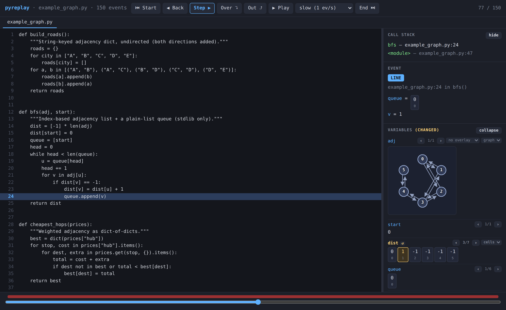](screenshots/24-graph-view.png)

### 25. Traversal overlay — tint a graph by another variable
- **Measured:** the frame's other variables are candidate overlays; per
  node the overlay value is resolved by membership (set/list) or lookup
  (dict/array).
- **Displayed:** a second dropdown ("tint: …") on a graph-viewed
  variable: a `visited` set turns members green (new ones flash), a
  distance array badges every node with its current value (changes
  flash amber), a queue/path highlights its members.
- **Why:** this is how you *watch* BFS/DFS/Dijkstra traverse — the
  algorithm's state painted onto the structure it walks.
- **Use case:** graph view on `adj`, tint by `dist`, press play: watch
  Dijkstra's frontier advance node by node.
- **Command:** `python3 tracer.py example_graph.py` → graph view on
  `adj`, then pick `visited` (or `dist`) in the second "tint:"
  dropdown, then `Space` to play.
- **Screenshot** — the graph mid-BFS: green visited region, amber just-updated badge.

  [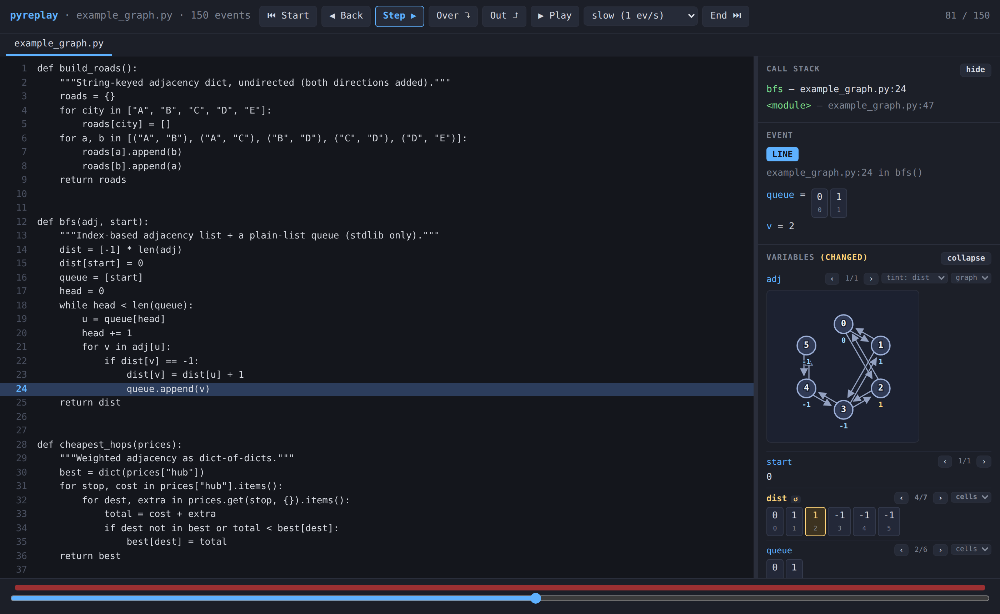](screenshots/25-traversal-overlay.png)

### 26. Object transparency (`__dict__` and `__slots__`)
- **Measured:** instance attributes from `__dict__` and `__slots__`
  are encoded as first-class values; nested objects recurse; cycles
  terminate.
- **Displayed:** `self.adj_list`, `g.N` appear as their own rows, each
  with its own view selector. On a method-entry event, an attribute
  flags as changed only if it differs from the object's **last
  observation** — static config attrs stay quiet instead of re-flagging
  on every call (on the object's first appearance everything is
  honestly new and shows in full) — a graph stored inside an object gets
  the graph offer right where it lives; nested objects render as
  attribute tables.
- **Why:** OOP code stops being opaque `<Cart object at 0x…>` blobs.
- **Use case:** tinyshop's `Cart` shows its `items` dict live —
  watching it *not* change on a supposed add is the planted bug.
- **Command:** `python3 tracer.py tinyshop/main.py` → step into a
  method; the object's attributes are rows automatically, each with
  its own view dropdown.
- **Screenshot** — an object expanded into attribute rows, one attr in graph view.

  [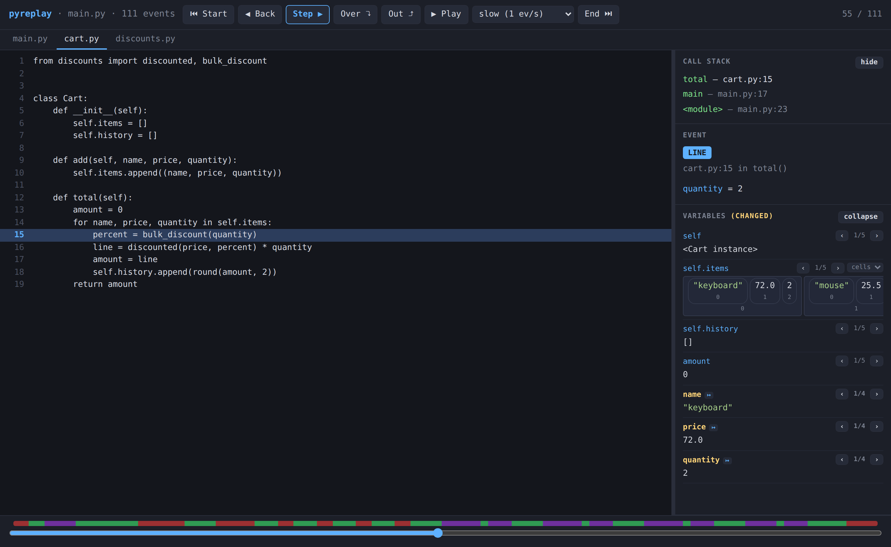](screenshots/26-object-transparency.png)

### 27. Large containers — honest windows
- **Measured:** the first 30 elements are encoded, plus a "+K"
  remainder; when a change lands beyond the head, the encoding windows
  around it (±10 elements with real indices). Containers up to ~4096
  elements are change-tracked; beyond that (and for deep mutations
  inside dict values) changes past the head may go unseen — a
  documented cost/honesty trade-off, and anything unknown is unmarked
  rather than guessed (`chi`/`na` flags in the event data).
- **Displayed:** "…before / +after" edge cells around the window;
  change element 1500 of a 2000-list and you see cells 1490–1510 with
  1500 lit.
- **Why:** big data without lying about it — you always know what
  you're not seeing.
- **Use case:** a 2000-element sieve array — the view jumps to the
  region being written, real indices intact.
- **Command:** automatic — trace any script writing past index 30 of a
  big list (e.g. a sieve); the window follows the change with no flag.
- **Screenshot** — a windowed list showing real indices ~1500 with the changed cell lit.

  [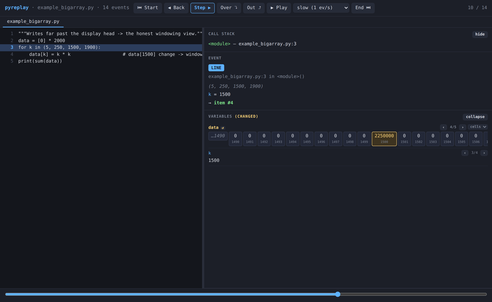](screenshots/27-windowing.png)

### 28. Per-variable life navigation
- **Measured:** every change to every variable is indexed per frame
  invocation (recursion-safe: each invocation tracked separately).
- **Displayed:** each row shows `‹ 3/6 ›` — its change ordinal/total;
  `‹`/`›` jump to the previous/next change event. Clicking the count
  unfolds the **life strip**: one clickable tick per change on the
  trace axis, birth in green, current position in amber.
- **Why:** "when did this variable change?" becomes navigation instead
  of hunting.
- **Use case:** the debugging move: click a red crash marker, then walk
  the suspicious variable's history *backward* to the moment it went
  wrong.
- **Command:** any line-level trace → `‹`/`›` on a variable's row;
  click the `3/6` count to unfold its life strip.
- **Screenshot** — a variable row with its life strip unfolded.

  [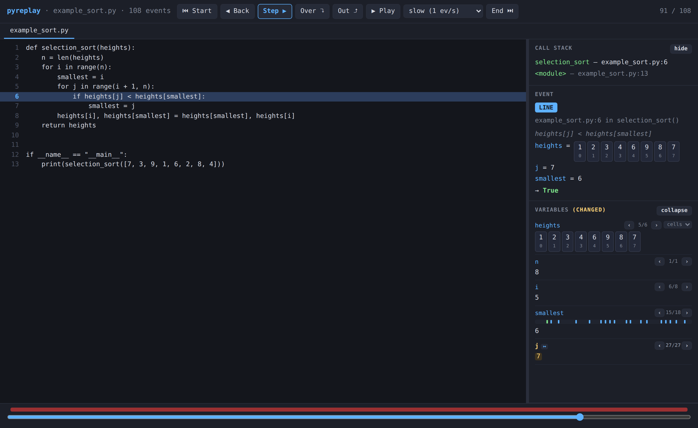](screenshots/28-life-strip.png)

### 29. Provenance panel — "why is this value what it is?"
- **Measured:** two halves. Static: `build_dataflow()` extracts
  target←sources per line from the ast (positional tuple unpack
  understood: `a, b = b, a` reads a←b, b←a; attribute/subscript
  targets honestly skipped). Dynamic: the change index locates where
  each source variable was last set (reading the *previous* same-frame
  line, because settrace reports a change on the line after the
  statement that made it).
- **Displayed:** under a changed variable: "← from a, b" — each source
  is a link; click to jump to where it was last set, then repeat: you
  walk the value's ancestry backwards through the trace.
- **Why:** the causal chain behind a value, without bytecode tricks
  (the Cyberbrain idea, minus its version-fragile value-stack).
- **Use case:** a wrong prefix sum: click ← through `b[i] ← b[i-1], a[i]`
  ancestors until you land on the one addition that used a stale value.
- **Command:** `python3 tracer.py example_prefix.py` → step to a change;
  the "← from …" links appear under the changed variable (automatic at
  line level, including inside `watch()` traces).
- **Screenshot** — a changed variable with its "← from …" links visible.

  [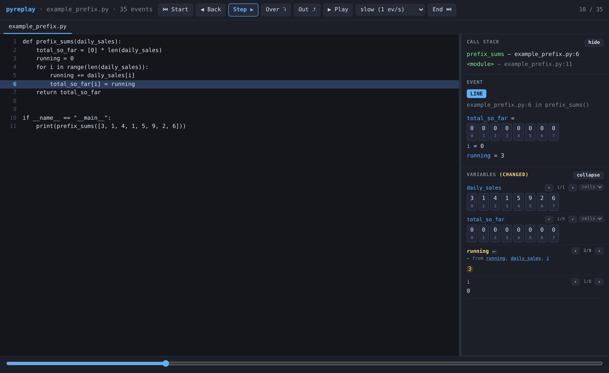](screenshots/29-provenance.png)

---

### 80. The oscilloscope — strip-charts & phase portraits
- **Measured:** nothing new — the per-frame change index already holds
  every value a numeric variable took; the chart is a pure projection
  of it (numpy-style float subclasses recognized by class-name suffix).
- **Displayed:** a `chart` entry in the view dropdown of any numeric
  scalar: value vs event-axis drawn as the STEP function a variable
  really is (it holds its value between changes). Change points are
  clickable (jump to the moment); NaN/±Inf get edge ticks, never fake
  positions; non-numeric changes break the line as counted gaps; crash
  (red) and trip (amber ☢) moments tick the top edge, time-aligned;
  the cursor splits past (solid) from future (dim). `log` scale is
  offered honestly — refused with a note unless every value > 0.
  Choosing a partner variable ("vs …") turns the panel into a PHASE
  PORTRAIT: the x-vs-y trajectory, opacity fading into the past, the
  bright dot where the replay stands.
- **Why:** the life strip shows WHEN a value changed; the chart shows
  HOW it evolved — drift, plateaus, oscillation, blow-up. A phase
  portrait shows a RELATIONSHIP: convergence spirals, limit cycles,
  the moment two quantities decouple. The physicist's instrument
  panel, aimed at code.
- **Use case:** `example_prefix.py`: `running` charts as a staircase;
  "vs i" turns accumulation into a clean diagonal. On
  `example_nan.py`, the chart of `total` shows the exact step where
  finite becomes −∞ becomes NaN.
- **Command:** `python3 tracer.py example_prefix.py` → variable
  `running` → view `chart`; the partner select makes the portrait.
  Composes with deep links: `#ev=30&var=running&view=chart`.
- **Screenshot** — pending the next manual pass; live via the command
  above.

## E. Replayer — control flow & truth

### 30. Event panel — the line's own cast, before it acts
- **Measured:** per line, the variables that line mentions, with their
  values as of *before* the line executes (a line's effect appears on
  the next event); return values ride on RETURN events.
- **Displayed:** the Event panel lists them next to the badge — read
  the inputs, predict, then step. An object mentioned only through
  specific attributes (`self.G`) shows just those attribute rows, not
  the whole object; a bare mention (or anything the static pass can't
  see) keeps the full object — and the badges menu's "full objects in
  line panel" toggle restores the old behavior.
- **Why:** matches how you reason about a line: what does it see, what
  will it do.
- **Use case:** before stepping an `if`, read the operands it's about
  to compare and call the verdict in your head first.
- **Command:** automatic on every LINE event of any line-level trace —
  read the Event panel before pressing `→`.
- **Screenshot** — a LINE event showing the mentioned variables' pre-values.

  [](screenshots/30-event-panel.png)

### 31. Conditional verdicts — every branch tells its outcome
- **Measured:** verdicts inferred from the branch the execution
  actually took (always correct, no expression re-evaluation):
  `if`/`while` → True/False; `for` → "item #N" / "exhausted after N
  iterations" / "exhausted — 0 iterations"; `except Type:` → "caught
  here" / "not this handler"; `match` cases → "matched" / "no match".
  Sub-line branching (ternaries, short-circuits) is invisible to
  line-level tracing — and says so.
- **Displayed:** the expression and its verdict in the Event panel on
  every branching line.
- **Why:** the loop that silently never ran, made loud — the classic
  invisible bug class, visible.
- **Use case:** `example_control.py`: a filter loop shows "exhausted —
  0 iterations" — the input was empty and nothing downstream ever
  executed.
- **Command:** `python3 tracer.py example_control.py` → step onto any
  `if`/`while`/`for`/`except`/`match` line; automatic.
- **Screenshot** — a for-line with "exhausted — 0 iterations".

  [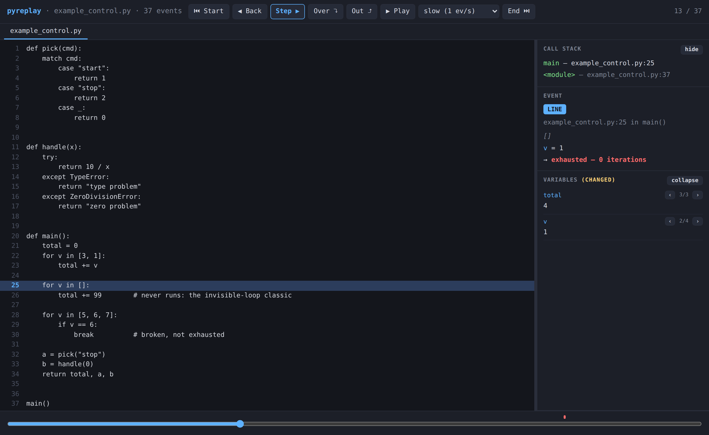](screenshots/31-verdicts.png)

### 32. Exceptions as first-class events
- **Measured:** every raise is recorded — including ones an `except`
  catches; an uncaught exception records one EXCEPTION event per frame
  it unwinds through, from raise to crash. Generator/iterator
  control-flow raises (StopIteration etc.) are flagged soft.
- **Displayed:** red EXCEPTION badge with type and message; the raising
  line turns red; soft raises are dimmed, not red; red markers above
  the scrubber flag every hard exception — click one to jump straight
  to it.
- **Why:** silently caught exceptions are the classic "why is this
  None?" — no longer silent; propagation paths become walkable.
- **Use case:** `example_exceptions.py` (or tinyshop's planted bug): a
  swallowed KeyError appears as a red badge exactly where a value
  quietly became a default.
- **Command:** `python3 tracer.py example_exceptions.py` → click the
  red markers above the scrubber; automatic in every trace.
- **Screenshot** — a caught exception's red badge + the scrubber's crash markers.

  [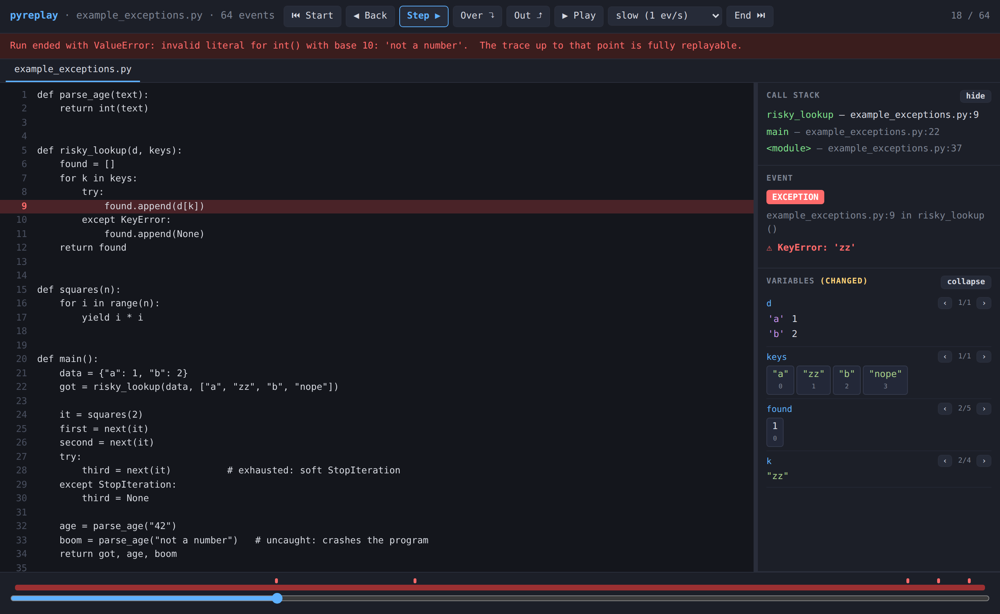](screenshots/32-exceptions.png)

---

### 79. NaN/Inf tripwire — where the poison was born
- **Measured:** with `--trip nan`, the encoder's own bounded output is
  scanned for NaN/Inf leaves. An event records a trip when a
  variable's poison KIND changes (clean→inf, clean→nan, and inf→nan —
  an inf collapsing to nan IS a first NaN), when a recovered variable
  relapses, and when a return value carries poison out of a frame
  (visible even if the caller never assigns it). A sleeping generator
  keeps its poison memory across yields — no false rebirth on resume.
- **Displayed:** a banner naming the FIRST birth (click to jump),
  amber ☢ pins over the scrubber for every birth, and a ☢ glyph on
  exactly the rows whose displayed value carries the poison at that
  event (an object trip lands on the poisoned attribute, not every
  attribute).
- **Why:** for numerical code the question is never "is there a NaN" —
  the crash (if any) tells you — but WHERE IT WAS BORN, usually
  thousands of operations upstream. The provenance panel then answers
  "from what".
- **Use case:** `example_nan.py` prints `mean signal: nan` and never
  raises. The banner: first Inf born in `amplify()`'s return value at
  event 18; the ☢ trail walks the spread through `detrend`'s mean into
  every downstream value — the report was a lie four functions before
  it was printed.
- **Command:** `python3 tracer.py --trip nan example_nan.py`. Line
  granularity only (values live in line events). Honesty: only what
  encoded values visibly show is judged — beyond a cap or window is
  unknown = unmarked; C-object internals (arrays) stay invisible.
- **Screenshot** — pending the next manual pass; live via the command
  above.

## F. Replayer — the interpreter's hidden machinery

### 33. Generators & coroutines tell the truth
- **Measured:** `co_flags` identifies generator/coroutine/async-gen
  frames; suspension and wake-up are recorded as YIELD (with the
  yielded value) and RESUME on the *same* frame identity — not as fake
  returns and fresh calls.
- **Displayed:** purple **YIELD** badge ("⇢ yields 0"), **RESUME**
  re-shows the frame's full live state (quietly — fresh info is not
  "changed"); life navigation and step-over follow the frame across
  naps.
- **Why:** one sleeping frame no longer masquerades as five separate
  invocations — the actual lifecycle of lazy code, visible.
- **Use case:** `example_machinery.py`: `squares(5)` replays as one
  frame sleeping and waking five times, locals intact between naps.
- **Command:** `python3 tracer.py example_machinery.py` → step through
  the generator section; automatic.
- **Screenshot** — a YIELD badge and the same frame's later RESUME.

  [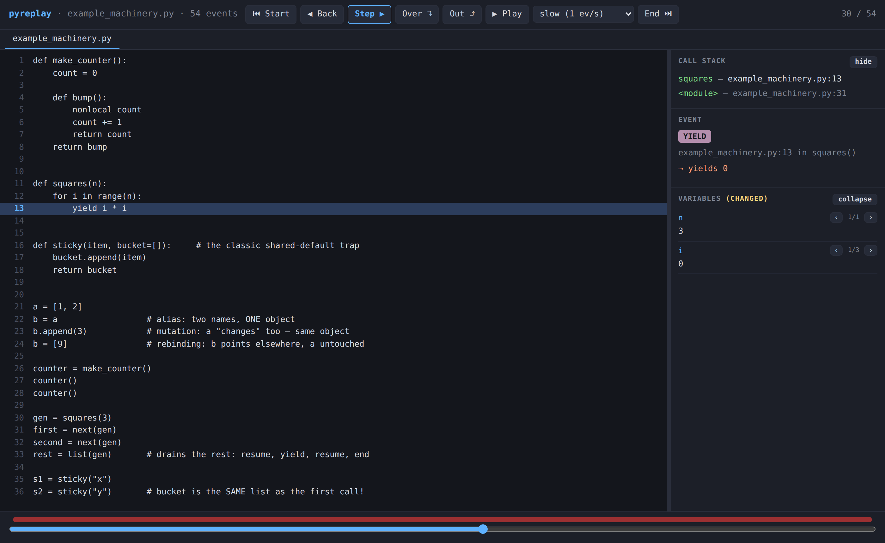](screenshots/33-yield-resume.png)

### 34. Mutation vs rebinding + aliasing
- **Measured:** `id()` recorded beside each fingerprint; the diff
  distinguishes a name pointing at a new object from an object changed
  in place, and detects two names holding the same object.
- **Displayed:** **↦** = name rebound (old object untouched); **↺** =
  object mutated (every alias changed too); **🔗** on variables that
  are the same object under different names (hover lists the aliases).
  Toggleable in the viewer's badges menu (on by default).
- **Why:** kills the "why did `a` flash when I touched `b`" confusion
  at the root — the single most common Python mental-model gap.
- **Use case:** `b = a; b.append(x)` — both variables flash with 🔗 and
  ↺: one object, two names, now provable at a glance.
- **Command:** `python3 tracer.py example_machinery.py` → the aliasing
  section; hover 🔗 to list the aliases. Automatic in every line trace.
- **Screenshot** — two rows sharing 🔗, both lit with ↺ after one append.

  [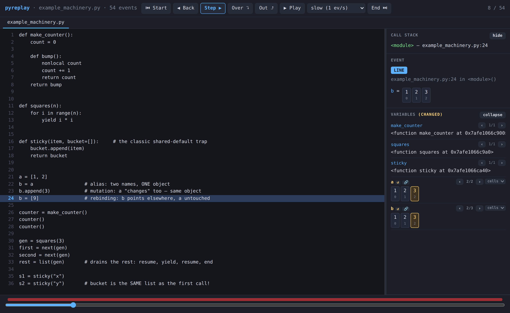](screenshots/34-alias-mutation.png)

### 35. Closure cells
- **Measured:** `co_freevars` / `co_cellvars` identify variables shared
  between enclosing and inner frames.
- **Displayed:** **⛓↑** = lives in the enclosing frame (nonlocal);
  **⛓↓** = shared with inner functions defined here (hover names the
  partner frame).
  Toggleable in the viewer's badges menu (on by default).
- **Why:** decorators, factories, callbacks — and the late-binding
  loop-of-lambdas trap — depend on cells nobody can see. Now visible.
- **Use case:** the classic loop-of-lambdas bug: every lambda shows ⛓↑
  to the *same* cell, so "they all print 4" stops being a mystery.
- **Command:** `python3 tracer.py example_machinery.py` → the closure
  section; automatic.
- **Screenshot** — a counter factory: maker's ⛓↓ and inner function's ⛓↑.

  [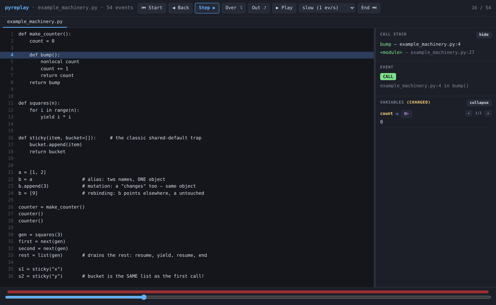](screenshots/35-closure-cells.png)

### 36. Mutable-default-argument detector
- **Measured:** call arguments compared by identity against the
  function's default objects.
- **Displayed:** **⚠def** on an argument that *is* the shared mutable
  default (`def f(x, acc=[])`).
  Toggleable in the viewer's badges menu (on by default).
- **Why:** the def-time-evaluation trap persists state across calls and
  is invisible in source; the badge makes it jump out.
- **Use case:** a "fresh" accumulator arrives already holding last
  call's items — ⚠def is sitting right on it.
- **Command:** `python3 tracer.py example_machinery.py` → the second
  call to the defaulted function; automatic.
- **Screenshot** — second call to `f`: `acc` pre-filled and wearing ⚠def.

  [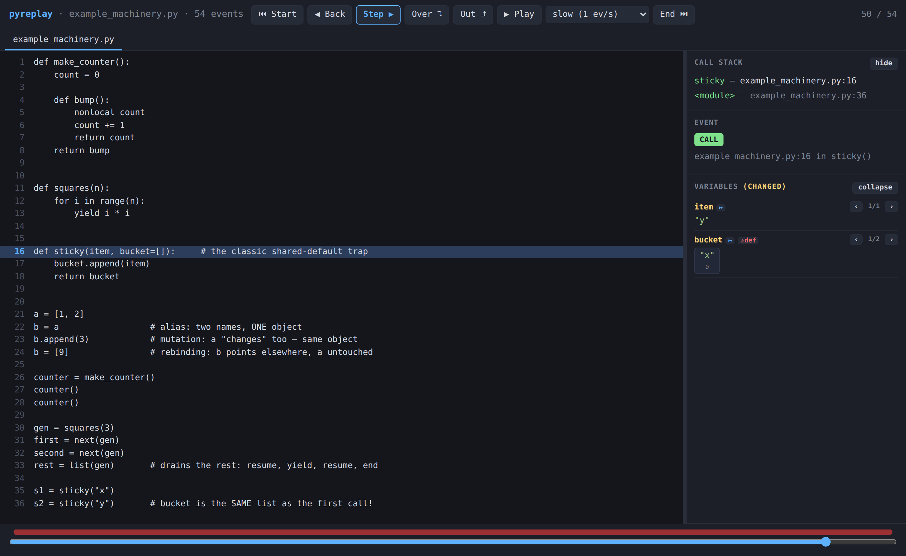](screenshots/36-mutable-default.png)

### 37. Import-time context badge
- **Measured:** events executing beneath a `<module>` frame of another
  module's import are flagged.
- **Displayed:** **⚙ import time** next to the event badge while inside
  import execution.
  Toggleable in the viewer's badges menu (on by default).
- **Why:** the interpreter's two lives — loading vs running — kept
  permanently distinct; explains "why did this run before main?".
- **Use case:** a module-level `registry.append(...)` fires during
  import of a neighbor — the ⚙ badge says *when* you are, not just
  where.
- **Command:** `python3 tracer.py tinyshop/main.py` → the first events
  (imports executing); automatic.
- **Screenshot** — an event wearing ⚙ while a module body executes.

  [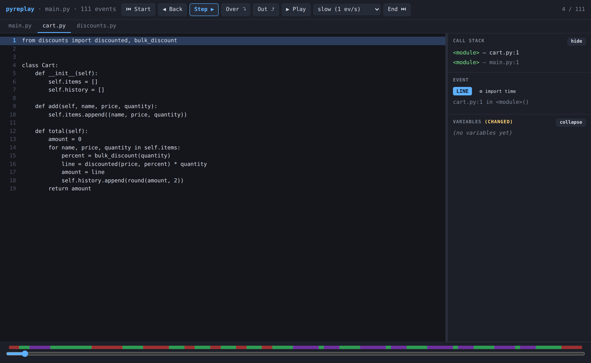](screenshots/37-import-badge.png)

### 38. Dunder-call labeling
- **Measured:** name-based recognition of `__lt__`/`__eq__`/
  `__getitem__`/… frames (approximate and labeled as such).
- **Displayed:** a hint on the call: "invoked implicitly by Python — <".
  Off by default — enable it in the viewer's badges menu.
- **Why:** operators secretly calling methods is core Python; the hint
  connects `a < b` to the `__lt__` frame that appears.
- **Use case:** sorting a list of custom objects — each comparison
  visibly enters `__lt__` with the hint naming the operator.
- **Command:** `python3 tracer.py example_machinery.py` → a comparison
  entering `__lt__`; automatic.
- **Screenshot** — a `__lt__` CALL with its "invoked implicitly" hint.

  [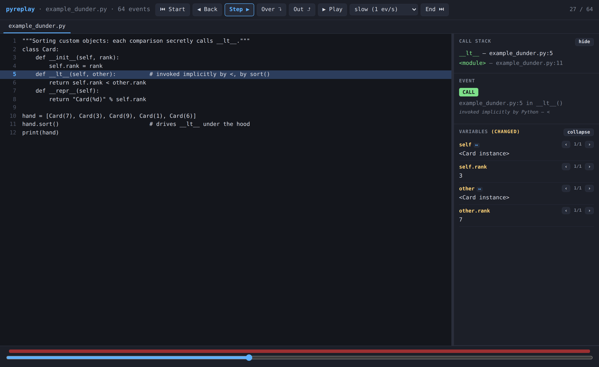](screenshots/38-dunder-hint.png)

### 39. MRO panel — method resolution made visible
- **Measured:** on method calls with `self`/`cls` bound:
  `type(obj).__mro__`, the supplier found by locating the frame's code
  object in the chain (cached per class+code); the event carries
  {chain, supplier}.
- **Displayed:** the class chain in the Event panel: searched-and-passed
  classes struck through, the supplier lit green — "started at
  Exporter, passed ZipMixin and JsonMixin, found export on Serializer".
  Cooperative `super()` chains show successive suppliers walking the
  chain.
  Off by default — enable it in the viewer's badges menu.
- **Why:** multiple inheritance stops being folklore — you watch C3
  resolution happen call by call.
- **Use case:** `example_mro.py`: successive `super().speak()` calls
  light successive classes down the chain.
- **Command:** `python3 tracer.py example_mro.py` → step onto any
  method CALL; automatic when inheritance is involved.
- **Screenshot** — the chain with two passed classes struck through and the supplier green.

  [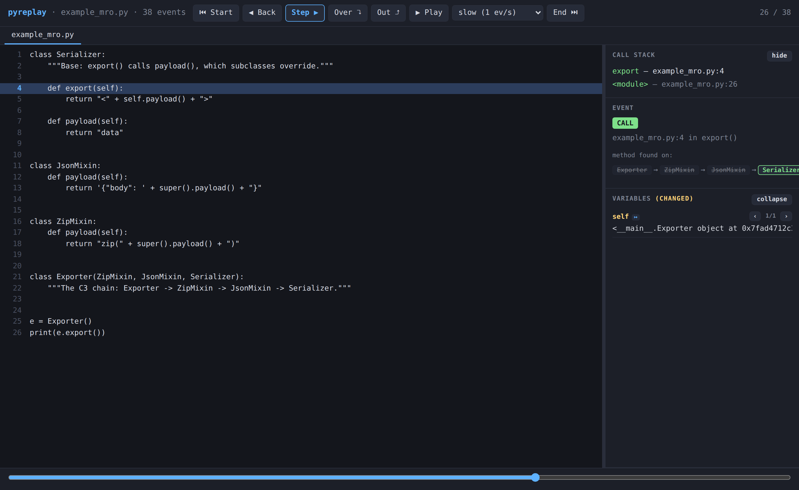](screenshots/39-mro.png)

---

## G. Concurrency & time

### 40. asyncio task lanes — tasks as pseudo-threads
- **Measured:** when asyncio is loaded, every event records the driving
  task; `await` suspensions reuse the YIELD/RESUME machinery, so a
  suspended coroutine is ONE sleeping frame that re-emits its full
  state on resume (never stale after another task's mutations).
- **Displayed:** each task gets its own lane with its own call stack;
  the badge says `in task producer`; task names from
  `asyncio.create_task(coro, name="worker-A")` label the lanes
  (unnamed → Task-1, Task-2…); a task frame's Out button honestly
  stays put (its caller is the event loop, not your code). At fn
  granularity a yield reports "slice took X" and the final return
  "last slice X · active Y across N slices".
- **Why:** cooperative concurrency is invisible in source order; lanes
  show the event loop actually switching.
- **Use case:** `example_tasks.py`: two tasks over shared state — step
  and watch the stacks alternate at each await.
- **Command:** `python3 tracer.py example_tasks.py` (line level) or
  `python3 tracer.py --granularity fn example_tasks.py` (slice
  durations); automatic when asyncio is loaded.
- **Screenshot** — two task lanes with alternating stacks mid-trace.

  [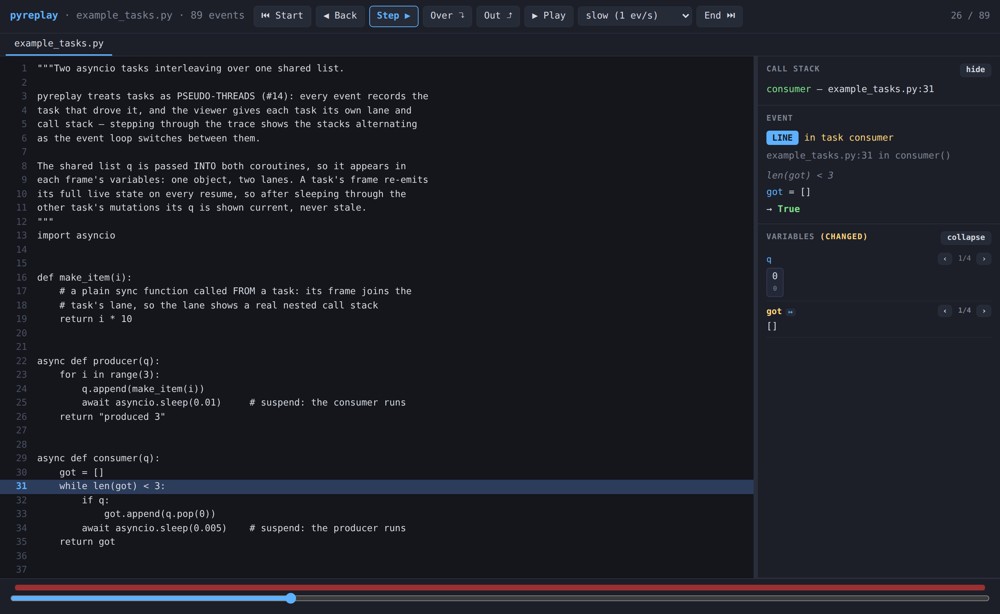](screenshots/40-task-lanes.png)

### 41. Perfetto export (`--export-perfetto out.json`)
- **Measured:** fn-granularity call/return pairs converted to Chrome
  Trace Event Format begin/end slices; exceptions become instant
  markers; thread·task lanes become timeline rows; an awaiting
  coroutine's slice closes at the yield and reopens on resume —
  suspension is a real gap. Refuses to run without `--granularity fn`
  (line traces carry no timestamps — the honesty rule again).
- **Displayed:** open https://ui.perfetto.dev and drag the JSON in (the
  trace is processed locally, it never leaves your machine): a
  professional million-event timeline with slice durations, args and
  return summaries.
- **Why:** hands your trace to an industrial timeline UI for free —
  Phase 5's first bridge to external tooling.
- **Use case:** an asyncio pipeline that stalls: the Perfetto row shows
  a 2-second gap in exactly one task's lane.
- **Command:** `python3 tracer.py --granularity fn --export-perfetto
  out.json example_tasks.py` → drag `out.json` into ui.perfetto.dev.
- **Screenshot** — ui.perfetto.dev showing the exported lanes and gaps.

  [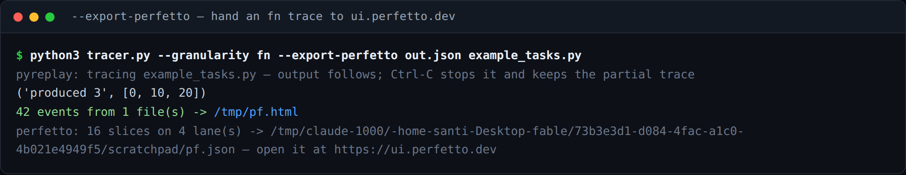](screenshots/41-perfetto.png)

---

## H. The static map — structure without executing anything

### 42. The map — a codebase's geography from pure `ast`
- **Measured:** every `.py` file parsed with `ast` — **nothing is
  executed, no dependencies needed**; imports resolved to project
  modules (relative imports included); layout by import depth.
- **Displayed:** `map_<name>.html`: modules as boxes in dependency
  layers, arrows toward dependencies, drag to pan, wheel to zoom,
  `fit` frames everything; a stats bar summarizes the codebase.
- **Why:** the wide, cheap end of the funnel — orientation in a foreign
  codebase for the price of a parse.
- **Use case:** first minute with a cloned repo: map it and see its
  layers before reading a single file.
- **Command:** `python3 mapper.py PyTheus` → open `map_PyTheus.html`
  (`--out NAME.html` names it explicitly).
- **Screenshot** — a whole-codebase map (PyTheus), zoomed to fit.

  [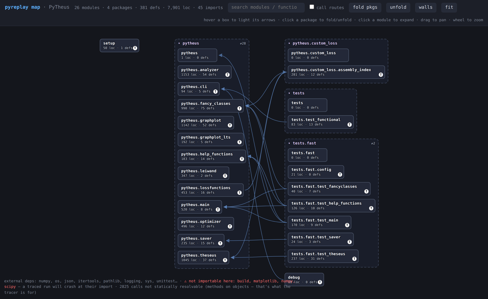](screenshots/42-map.png)

### 43. Module expand — inventories on demand
- **Measured:** per module: top-level functions with their line
  numbers, classes with methods and bases.
- **Displayed:** click a box: function list plus classes drawn as a
  grid of chips; click again to fold back.
- **Why:** semantic zoom — the map answers "what's in here?" without a
  file open.
- **Use case:** hover the hot module the heat exposed, expand it, and
  pick the function to microscope — without leaving the map.
- **Command:** in the map: click any module box (click again to fold).
- **Screenshot** — an expanded module: function rows + class chips.

  [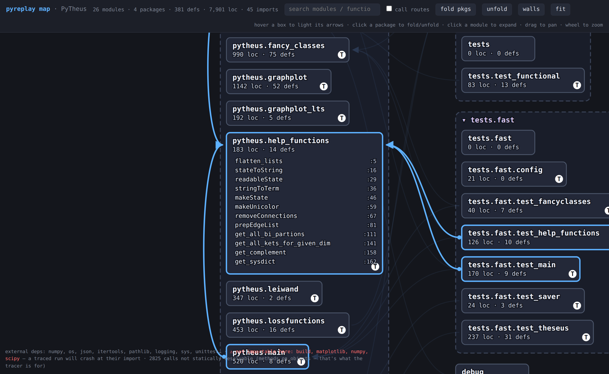](screenshots/43-module-expand.png)

### 44. Class ancestry view
- **Measured:** base-class names extracted per class; local ancestry
  resolved inside the file/project.
- **Displayed:** click a class chip: its whole local ancestry lights
  green with inheritance edges; a panel lists the selected class's
  bases and methods.
- **Why:** in a monolith ("2000 lines of base classes + 50 subclasses
  in one file") this *is* the architecture view.
- **Use case:** tinyshop: click a cart class chip and see the
  inheritance spine light up to its root.
- **Command:** in the map: expand a module → click a class chip.
- **Screenshot** — a selected chip with its green ancestry and the bases/methods panel.

  [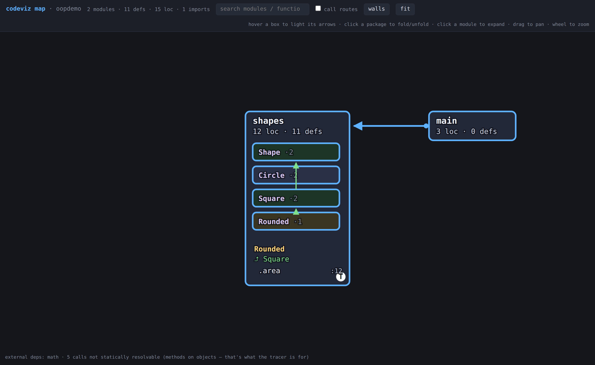](screenshots/44-class-ancestry.png)

### 45. Override map via search
- **Measured:** method names indexed across all classes.
- **Displayed:** searching a method name highlights every class that
  defines or overrides it.
- **Why:** "who overrides `save()`?" answered in one keystroke — the
  question that otherwise needs an IDE and N clicks.
- **Use case:** search `export` and instantly see the three classes
  offering their own version.
- **Command:** in the map: type the method name in the header search
  box.
- **Screenshot** — a searched method lighting several class chips at once.

  [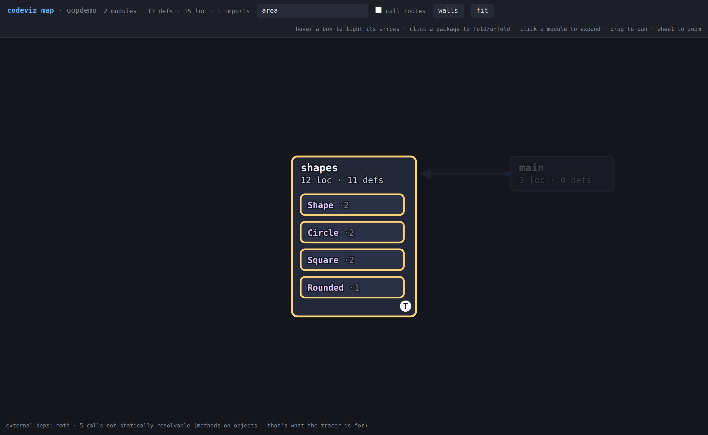](screenshots/45-override-map.png)

### 46. Intra-file call graph
- **Measured:** static call extraction inside each file: direct calls
  resolved between its functions; entry points = functions called at
  module level (import time or under `__main__`); recursion detected.
  Calls through variables (`obj.method()`, dispatch tables) are not
  statically resolvable — the bottom note reports how many, always.
- **Displayed:** click a function name in an expanded module: **green**
  arrows fan out to its callees (rows light green), **amber dashed**
  arrows come in from its callers; **▸** marks entry points, **↺**
  marks recursion. Click the name again to clear; click the `:line`
  number instead for the scoped tracer command (see 60).
- **Why:** turns a single 900-line script from a dead list into its
  actual structure.
- **Use case:** atcoderhard.py: click `solve` and see exactly which
  helpers it drives and what calls *it*.
- **Command:** `python3 mapper.py .` (or any root) → expand a module →
  click a function *name* (the `:line` number composes the tracer
  command instead).
- **Screenshot** — a focused function with green callees and amber callers.

  [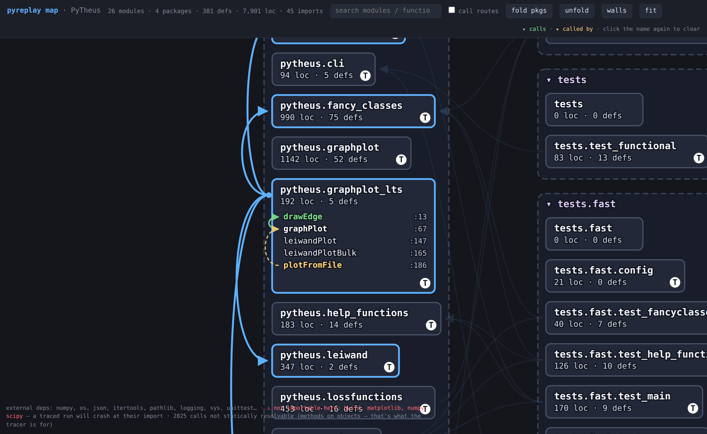](screenshots/46-call-graph.png)

### 47. Module-level call routes
- **Measured:** static calls that cross module boundaries, with
  call-site counts.
- **Displayed:** toggleable dashed arrows between modules, labeled with
  counts.
- **Why:** import arrows say "knows about"; call routes say "actually
  uses" — different questions.
- **Use case:** two modules import `utils`; the routes show one calls
  into it 40 times, the other once.
- **Command:** in the map: tick the call-routes checkbox in the header.
- **Screenshot** — dashed call routes over the import arrows, counts visible.

  [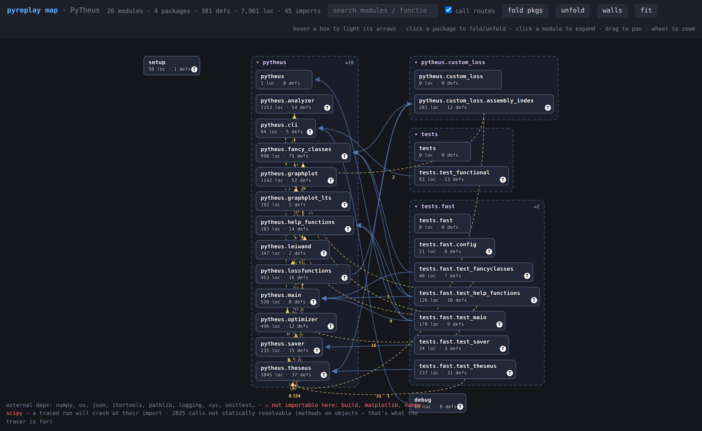](screenshots/47-call-routes.png)

### 48. Package folding — semantic zoom v2
- **Measured:** package membership from directory structure; folded
  metrics rolled up: module count, loc, heat share (summed, same
  palette), ⚠N exceptions, parse errors; edges into hidden modules
  re-attach to the package box and aggregate.
- **Displayed:** maps over 50 modules start folded (brian2's 309
  modules arrive as 49 readable boxes); click to unfold (members then
  behave like normal boxes); `fold pkgs` / `unfold` work the whole
  map; aggregated edges are thicker, tooltip lists the member-level
  imports; search sees inside folded packages.
- **Why:** the difference between "readable at first sight" and a
  hairball — scale without loss (roll-ups keep folded truth visible).
- **Use case:** map brian2: 49 package boxes tell the story; unfold
  only the subsystem you care about.
- **Command:** `python3 mapper.py brian2/brian2` (any >50-module root
  starts folded) → click a package box; `fold pkgs` / `unfold` in the
  header work the whole map.
- **Screenshot** — a big map folded, one package unfolded.

  [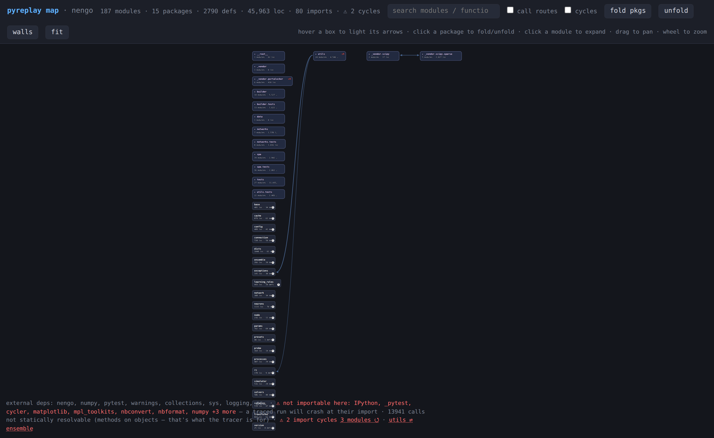](screenshots/48-package-folding.png)

### 49. Import cycles — found and spotlit
- **Measured:** strongly connected components (Tarjan) on the static
  import graph.
- **Displayed:** three ways: the stats bar counts cycles; folded boxes
  hiding cycle edges carry a red **⭯N** pip; the bottom note lists
  every cycle — click one to spotlight it (members highlighted, edges
  red, all else dimmed). A header checkbox paints *every* cyclic edge
  red at once — off by default, because a codebase whose core is one
  big SCC would drown in red, and red must mean "look here".
- **Why:** cycles are the classic hidden architecture debt; detail on
  demand keeps the signal meaningful.
- **Use case:** the bottom note lists a 3-module cycle you didn't know
  about; one click isolates it on the map.
- **Command:** in the map: click a cycle in the bottom note (spotlight),
  or tick the `cycles` checkbox in the header (paint all).
- **Screenshot** — a spotlit cycle: red edges, dimmed surroundings.

  [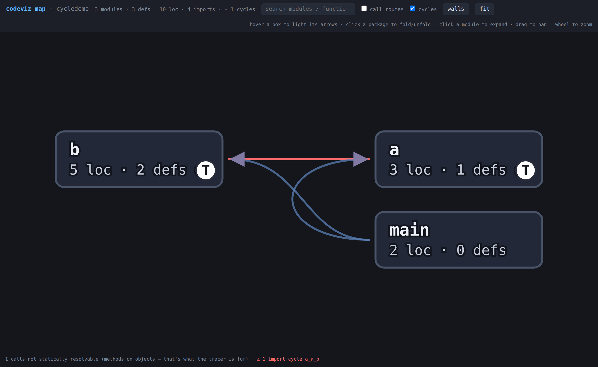](screenshots/49-cycles.png)

### 50. Sibling-edge suppression (⇄N)
- **Measured:** imports between two modules of the same package —
  the densest noise on a big map — counted instead of drawn.
- **Displayed:** an unfolded package shows an honest **⇄N** in its
  header; the edges appear exactly when you care: expand a member,
  search, click a cycle, or flip the cycles toggle. Cross-package
  edges always draw.
- **Why:** killed the "edge river" that made big unfolded packages
  unreadable — without hiding the truth (the count stays).
- **Use case:** unfold nengo's core package: readable boxes and "⇄41"
  instead of forty-one crossing arrows.
- **Command:** in the map: unfold a package and read the ⇄N in its
  header; expand a member module to make its sibling edges appear.
- **Screenshot** — an open package header with its ⇄N count.

  [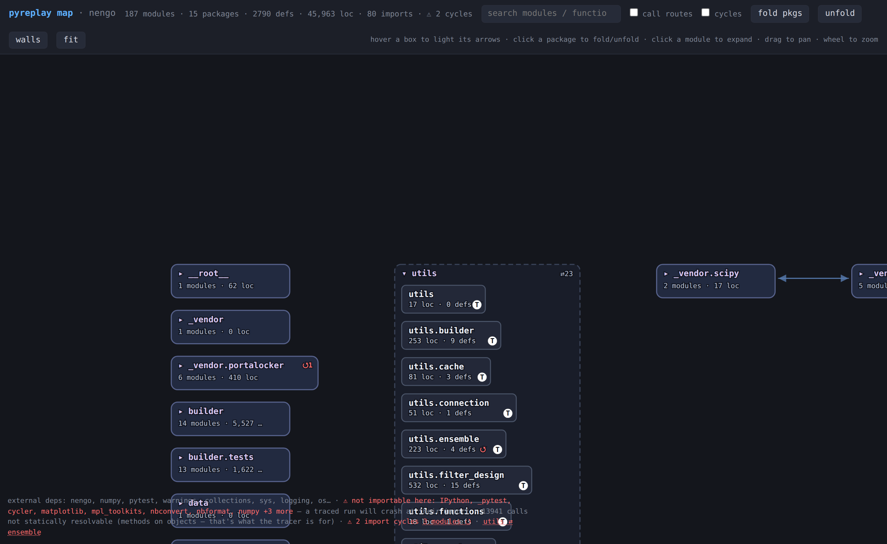](screenshots/50-sibling-edges.png)

### 51. Hover & expand edge focus
- **Measured:** each box's incident edges are indexed.
- **Displayed:** hovering any box — module or package, folded or open —
  lights its arrows instantly on a top layer (tail dot, bright head,
  fattened) while the rest recede; no click needed. Expanding a module
  selects its edges the same way, with `.rel` outlines on both endpoint
  boxes.
- **Why:** on a map with hundreds of edges, "whose arrows are whose"
  must be answerable by pointing.
- **Use case:** hover a suspicious module and see, in one motion,
  everything it touches and everything that touches it.
- **Command:** in the map: hover any box (no click); expanding a module
  selects its edges the same way.
- **Screenshot** — a hovered box with its edges lit and the rest faded.

  [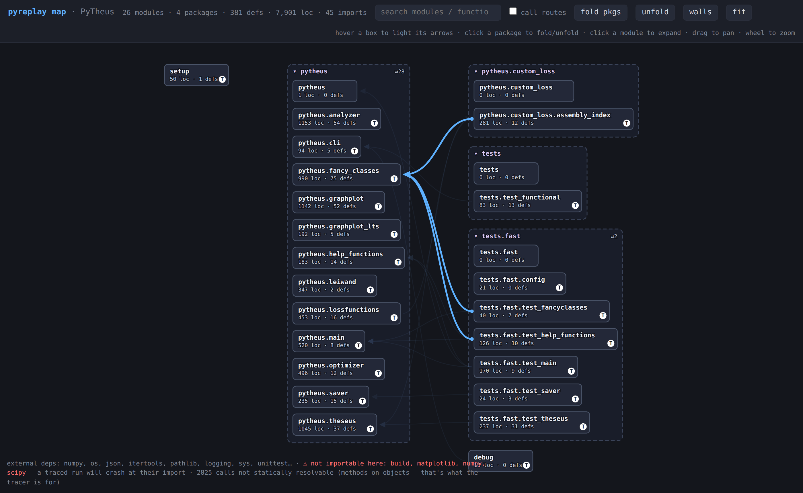](screenshots/51-hover-focus.png)

### 52. Walls — the load-bearing modules
- **Measured:** fan-in / fan-out per module from the static import
  graph (how many modules import me ←N vs how many I import →M).
- **Displayed:** a header-button panel: top-10 by fan-in; click a row
  to highlight that module on the map.
- **Why:** how you find a codebase's load-bearing walls before touching
  anything.
- **Use case:** brian2: `brian2/__init__` ←164, `utils.logger` ←55 —
  now you know what *everything* depends on.
- **Command:** in the map: click the `walls` header button; click a row
  to highlight that module.
- **Screenshot** — the walls panel with a clicked row highlighted on the map.

  [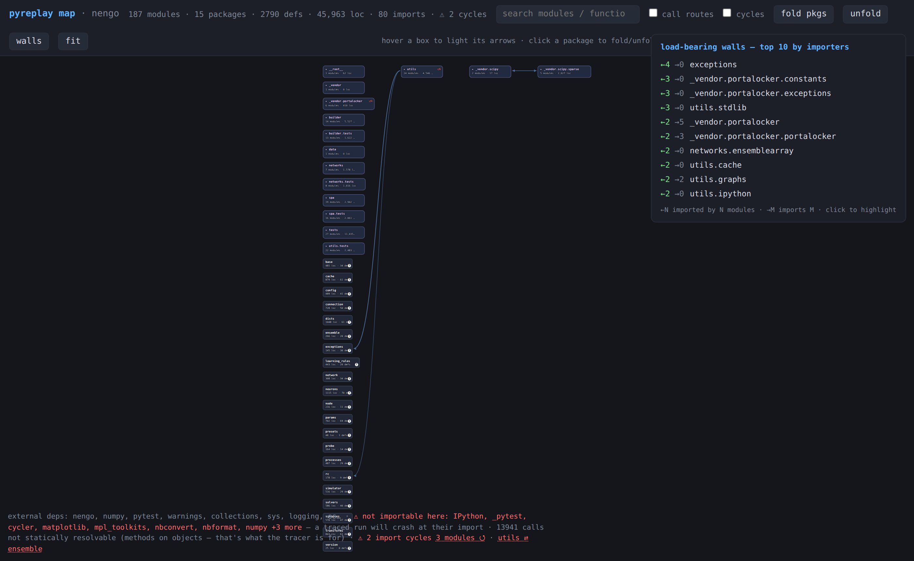](screenshots/52-walls.png)

### 53. Search / spotlight
- **Measured:** all module, function and class names indexed —
  including inside folded packages.
- **Displayed:** the search box highlights matches on the map; a match
  living in a folded package lights the package box.
- **Why:** "where does sleep live?" is one keystroke on a 300-module
  map.
- **Use case:** search `canonicalize` on the PyTheus map and land on
  the right module without opening a file.
- **Command:** in the map: type any module/function/class name in the
  header search box.
- **Screenshot** — a search hit lighting a module (or a folded package).

  [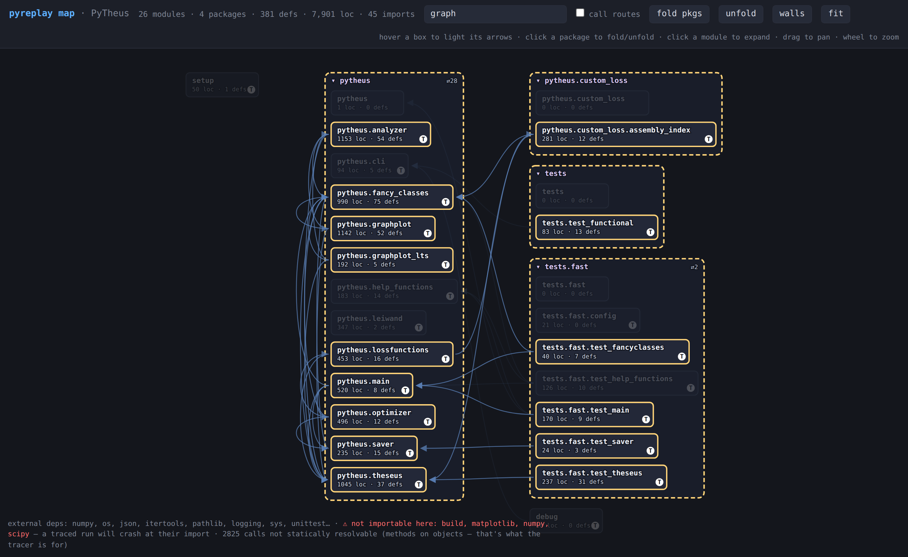](screenshots/53-search.png)

### 54. Parse-error tolerance & mixed-language honesty
- **Measured:** only `.py` files are read; a Python file that fails to
  parse (Python 2, templates) is recorded as an error, with
  `ast.parse(filename=…)` so warnings name the real file.
- **Displayed:** a red-dashed "parse error" box instead of a dead map;
  non-Python halves of a hybrid codebase are simply absent, stated in
  the notes.
- **Why:** real codebases are messy; one bad file must never kill the
  map, and what the map can't see it must say it can't see.
- **Use case:** mapping a repo with vendored Python-2 scripts: two red
  boxes, everything else maps normally.
- **Command:** `python3 mapper.py <repo-with-a-py2-file>` — automatic;
  the bad file becomes a red-dashed box, the run survives.
- **Screenshot** — a map containing a red-dashed parse-error box.

  [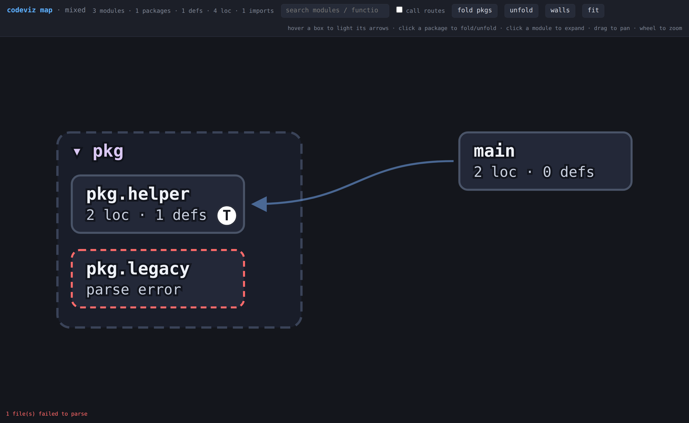](screenshots/54-parse-errors.png)

### 55. External-dependency preflight
- **Measured:** every external import statically collected, then
  checked with `importlib.util.find_spec` — nothing executes; stdlib
  names (e.g. platform-guarded `msvcrt`) skipped.
- **Displayed:** a bottom-note line: "⚠ not importable here: numpy, …"
  — re-map inside the venv and the line disappears.
- **Why:** tomorrow's crash, announced today, for free.
- **Use case:** it predicted 2 of PyTheus's 3 first-run failures before
  any code ran.
- **Command:** `python3 mapper.py PyTheus` from *outside* the venv →
  read the ⚠ line in the bottom note; re-map inside the venv and it
  disappears.
- **Screenshot** — the ⚠ line on a map made outside the venv.

  [](screenshots/55-dep-preflight.png)

---

## I. The cockpit — heat & the funnel handoff

### 56. Heat overlay — the trace drawn onto the map
- **Measured:** a trace is aggregated per module: event counts (line
  traces) or self-time (fn traces), first-touch order, exception
  counts, per-function counts and times.
- **Displayed:** modules tinted on a weather-radar palette by their
  ABSOLUTE share of the run (0% no tint → faint blue → teal → green →
  yellow → orange → red at 100%); the exact % printed on every box;
  the bottom note names the metric honestly — **EVENT COUNTS** or
  **TIME (self)** — plus a legend; untouched modules fade; **#1, #2…**
  badges show execution order; **⚠N** pips mark modules where hard
  exceptions fired; expanded function rows show **×N** calls and
  cumulative time (self/cum in the tooltip); class chips tint by their
  methods' heat; a `heat` checkbox toggles the overlay.
- **Why:** one glance answers "which part of this codebase actually
  executes, in what order, and where do time and exceptions
  concentrate?" — honest details included (imports execute top-level
  code, so "cold" modules legitimately show a few events).
- **Use case:** PyTheus: the heat verdict was
  `custom_loss.assembly_index` = 6.28 s = 94% of the run — the whole
  investigation aimed itself.
- **Command:** `python3 tracer.py --granularity fn app/main.py` then
  `python3 mapper.py app` (auto-heat adopts the trace — see 57); the
  `heat` checkbox toggles the overlay.
- **Screenshot** — a heated map: palette, #order badges, ⚠ pips, one expanded module with ×counts.

  [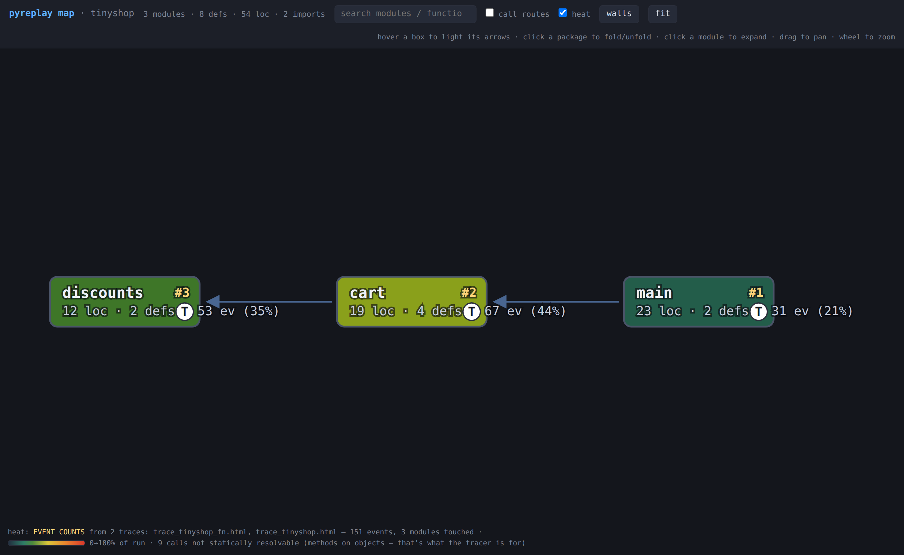](screenshots/56-heat.png)

### 57. Auto-heat — the map finds its own trace
- **Measured:** with no `--trace` flag, the mapper scans for the newest
  `trace_*.html` (working dir + mapped root) whose traced files belong
  to the codebase being mapped — suffix-aware, never guessed across
  codebases; microscope traces (`--include`, 1-module) and duds are
  skipped so they can't swamp the colors.
- **Displayed:** adoption announced on stdout; `--trace FILE` picks
  explicitly; `--no-trace` refuses automation.
- **Why:** the funnel becomes self-contained: trace once, and every
  later map of that codebase carries heat and complete ⌖ commands by
  itself.
- **Use case:** trace once, then map — two commands, heated map, no
  plumbing.
- **Command:** `python3 mapper.py repo` (adopts automatically, announced
  on stdout) · `python3 mapper.py --trace trace_run.html repo`
  (explicit) · `python3 mapper.py --no-trace repo` (off).
- **Screenshot** — mapper stdout announcing which trace(s) it adopted.

  [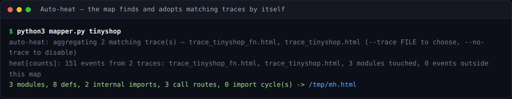](screenshots/57-auto-heat.png)

### 58. Multi-trace heat aggregation
- **Measured:** `--trace` is repeatable; `aggregate_heat()` sums
  per-module events, self-time, exceptions and per-function stats
  across runs; auto-heat adopts ALL matching broad traces.
- **Displayed:** one combined heat overlay; the note reflects the
  aggregate.
- **Why:** heat is workload-relative — a unit test over-weights imports
  (measured on brian2: a module 0.3% under one test vs 11.3% under a
  real simulation). The tool can't guess a representative workload,
  but it *can* combine the runs you make.
- **Use case:** trace the test suite AND a real simulation, map once —
  the palette now reflects both workloads.
- **Command:** `python3 mapper.py --trace trace_tests.html --trace
  trace_sim.html repo` (or just `python3 mapper.py repo` — auto-heat
  adopts all matching broad traces).
- **Screenshot** — mapper adopting two traces; the combined overlay.

  [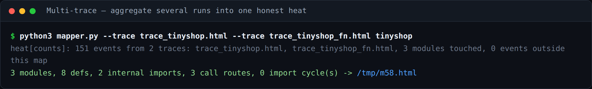](screenshots/58-multi-trace.png)

### 59. Heat as data (`--heat-out agg.json`)
- **Measured:** the same per-module/per-function aggregate the overlay
  uses.
- **Displayed:** written as plain JSON next to the map — layer-2
  contract discipline: the aggregate is an artifact, not just pixels.
- **Why:** downstream analysis (diff two aggregates, plot, feed CI)
  without scraping HTML.
- **Use case:** save `agg.json` before and after an optimization and
  diff the module shares.
- **Command:** `python3 mapper.py --heat-out agg.json repo`.
- **Screenshot** — the JSON file opened beside the heated map.

  [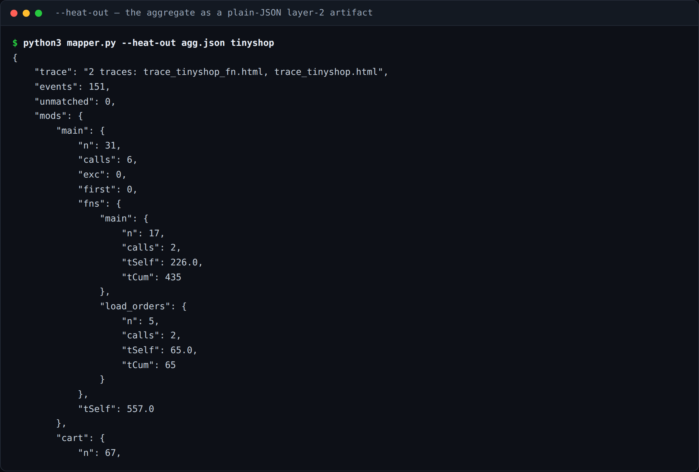](screenshots/59-heat-out.png)

### 60. ⌖ funnel handoff — the map writes your next command
- **Measured:** composition logic per box: a module with an
  `if __name__ == "__main__"` block gets a complete self-run command;
  a library module **borrows** the nearest runnable importer as entry
  (import graph walked backwards); test-reachable modules get real
  `--granularity fn --root … -m pytest <testfile>` commands; only true
  orphans show a `YOUR_SCRIPT.py` placeholder — honestly labeled, with
  a note when pytest-style tests import the module. Entry paths are
  absolute; function rows add `--include` scoping and `--start-at` at
  the def's line.
- **Displayed:** a white **T** disc on boxes with real code (never on
  parse-error or empty scaffolding boxes); clicking it — or any
  function row's `:line` — fills a copy box with the exact runnable
  tracer command.
- **Why:** the map tells you WHERE; the ⌖ writes the HOW. The funnel's
  steps teach themselves, and composed commands default to fn — a
  line-level whole-suite trace once cost 7 minutes and 663 MB before
  this lesson.
- **Use case:** click ⌖ on a PyTheus module, paste the command, get the
  scoped microscope trace — no manual flag archaeology.
- **Command:** in the map: click the white **T** disc on a module box
  (whole-module command), or a function row's `:line` (adds `--include`
  + `--start-at`); paste from the copy box into a terminal.
- **Screenshot** — the copy box showing a composed command for a clicked module.

  [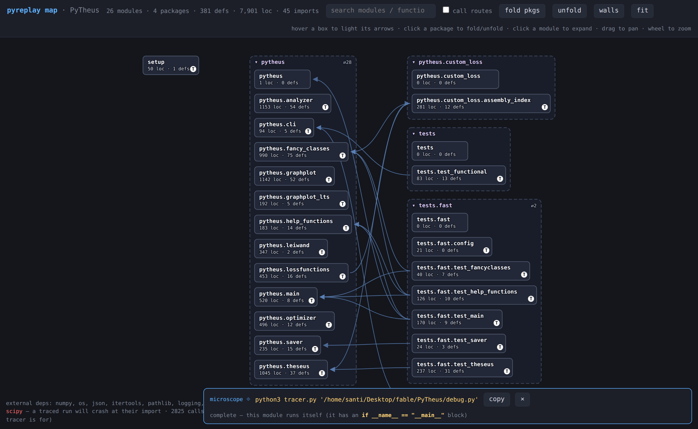](screenshots/60-funnel-handoff.png)

---

## J. Infrastructure (no screenshots needed)

### 61. `checks.py` — the regression suite
35 data-level checks (no browser): the tracer re-runs the permanent
example suite and the mapper its fixtures, the embedded JSON is
extracted from each generated HTML, and the honesty invariants are
asserted in plain Python — windowed-change correctness, set-membership
honesty, recursive partial flags, exception propagation chains,
conditional verdicts, object encoding, mapper module/edge/class counts,
settrace↔monitoring exception parity. Run before and after every
change, always.
- **Command:** `python3 checks.py` — prints the green table, exits
  non-zero on any red.

### 62. The teaching fleet
`example_{sort,prefix,histogram,dp,graph,exceptions,control,machinery,
mro,tasks,threads,watch,dunder,bigarray,heavy,nan,flaky}.py` — one small script per feature family, each with its
pre-built `trace_*.html`; `tinyshop/` — a multi-file teaching project
with a planted silent bug; `bubble_sort.py`, `graph.py`, real AtCoder
code. TUTORIAL.md is the user guide; these are also the screenshot
material for this catalog.
- **Command:** `python3 tracer.py example_<name>.py` for any of them;
  `python3 tracer.py tinyshop/main.py` for the teaching project.

---

## K. The reliability lab — statistics over many runs

One run is an anecdote; N runs are an experiment. This section treats
program behavior as a distribution to be measured.

### 63. The N-run harness (`--runs N`)
- **Measured:** the target executed N times — each a fresh child
  tracer fed IDENTICAL stdin bytes (the measurement protocol). Per
  run: outcome, classified by exception type + crash site read from
  the child's own payload; wall time (labeled tracer-inclusive —
  comparable to each other, not to bare runtime); event count.
- **Displayed:** `runs_<name>.html` — an outcome bar, a per-class
  wall-time distribution (min/median/p95/max), a clickable per-run
  strip in run order, stderr/stdout tails for the first run of each
  failing class, and replay links into the kept traces. The terminal
  shows the same table live, run by run.
- **Why:** *sometimes-code* is the worst code: it passes your one run
  and fails in the field. A run set converts a hidden flake into a
  measured rate — with a replayable specimen of each behavior.
- **Use case:** `example_flaky.py` depends on set iteration order by
  accident. `--runs 20` → "13× clean · 7× RuntimeError at
  example_flaky.py:31", one kept trace of each — open the failing one
  and step to the crash.
- **Command:** `python3 tracer.py --runs 20 example_flaky.py` — fn
  granularity by default; ONE trace kept per outcome class (first
  seen), the rest measured, classified, deleted. Exit 0 only if every
  run was clean, so `git bisect run` consumes it directly; Ctrl-C
  reports the runs completed so far.
- **Screenshot** — pending the next manual pass; live via the command
  above.

### 64. The divergence finder (`--diverge A B`)
- **Measured:** two traces' event streams, canonicalized — timestamps
  and `0x…` memory addresses inside reprs stripped, exactly what
  differs between any two healthy runs — then aligned by identical
  prefix (v1). The first mismatch is found at two depths: STATE (the
  same line runs on both sides, its values differ) and CONTROL (a
  different line runs).
- **Displayed:** a terminal report: how long the two runs agreed; the
  state divergence with each differing variable named and both values
  shown; the control divergence with both source lines; and deep
  links (#106) that open BOTH traces at the divergence. Exit 0
  identical · 1 diverged.
- **Why:** "why did THIS run fail?" reduces to "where did it first
  leave the good path?" — and state usually diverges before control:
  the cause, then the symptom.
- **Use case:** after `--runs` on `example_flaky.py`, diverge the kept
  clean trace against the kept failing one:

  ```
  pyreplay diverge: …run1.html (6 events) vs …run5.html (8 events)
    identical for the first 1 event.
    STATE diverges first, at event 2 (the same line runs on both
    sides — its values differ):
      …run1.html: call example_flaky.py:15 in close_batch
      …run5.html: call example_flaky.py:15 in close_batch
        tasks:  {ship, audit, bill}  vs  {audit, ship, bill}
    control flow follows at event 5:
      …run1.html: return example_flaky.py:27 in finalize
      …run5.html: exc example_flaky.py:26 in finalize [RuntimeError]
  ```

  The set-iteration accident — the actual cause — named at the call
  boundary, three events before the crash it produces.
- **Command:** `python3 tracer.py --diverge runs_x_run1.html
  runs_x_run5.html`. Refuses mismatched granularities; a run that is a
  strict prefix of the other diverges at its end. (Report is text —
  no screenshot needed.)

## Appendix A — the manual test plan

Agreed flow: work through the catalog top to bottom, ticking each
feature after exercising it by hand. Two codebases cover everything:

1. **tinyshop/** (in-repo, pure Python, built for this): features
   01–39 — every replayer feature has a natural home here, plus the
   planted silent bug for 32. The `example_*.py` scripts give the
   cleanest single-feature shots (each screenshot suggestion names
   one).
2. **PyTheus/** (a real foreign pure-Python library — external, not
   bundled; `git clone https://github.com/artificial-scientist-lab/PyTheus`):
   features 42–60 at real scale — map, folding, cycles, walls,
   preflight, heat (the 94% assembly_index verdict), ⌖ handoff, and
   the `-m pytest` entry (11). `pymdp` is the optional third target:
   `--doctor` (14) shows its addopts trap live; use the non-jax tests
   with `-n0`.
3. `example_tasks.py` for 40–41 (asyncio + Perfetto).
